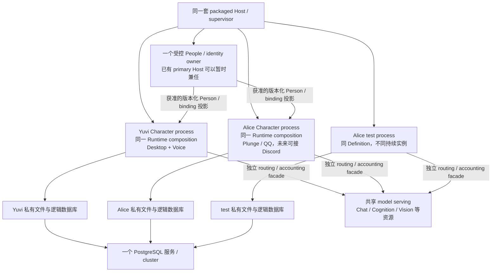

# YUVI Multi-Character / Multi-Instance 架构研究

研究日期：2026-10-07 UTC。研究对象是 YUVI Core / Harness。Plunge 是验收 consumer，不是抽象来源。本轮没有修改 YUVI 源码，没有连接真实 QQ；原型与测量脚本均在独立研究目录。

**推荐：把“一个 Runtime composition 承载一个持续 Character”确立为 Core 契约；近期以独立 Character 进程部署，复用同一套 Harness、同一个模型服务和数据库服务。不要让一个 RuntimeOrchestrator 成为管理所有人格的容器。**

需要新增的是很小的、不可变的实例身份/人格输入，以及明确的存储与 authority 绑定。已有 P8 address 足以作为起点，不需要一个同时拥有 Memory、People、Provider、scheduler 和 plugins 的大型 CharacterInstance 类。

这个方案不是“现在启动两份 server 就完成”。当前生产装配仍有固定 Yuvi 人格、全局环境、未隔离的 conversation/recovery 查询及可变回调。尤其不能把“多个进程可用”误解成“两个现有 server 可以共用全部文件、表和 Registry”。

## 1. 研究基线与证据边界

重新 fresh-fetch 全部分支/tags，并再次核验远端：

| 对象 | 固定版本 |
| --- | --- |
| 重点开发分支 | `codex/v0.1.3-platform-completion-20260922` |
| 开发 HEAD | `94e20d0ceb63b127781ed66f60337ac655820001` |
| main | `4278eb36b1a01acde82dde27b806dca996739972` |
| Core RuntimeOrchestrator | 8013 行 |
| server context composition | 1413 行 |

使用独立 detached worktree；源码状态干净。版本、外部项目版本及检查记录见 [source-snapshot.json](./multi-character/source-snapshot.json)。

实际执行：

- server 及其 TypeScript references 构建通过；
- 10 个相关现有测试文件：142 passed，2 skipped。覆盖 P8、voice identity、Runtime corrections、proactive scheduler、Cognition execution、Provider、生产 Character 路径及 plugin lifecycle；
- 未修改 Core 的双 Runtime 隔离/串线复现；
- compiled Core / AppContext 内存与启动测量；
- 两个真实 ProviderRegistry，经当前 local HTTP adapter 调用一个真实 Qwen3-4B 服务；另复现 Registry accounting 被覆盖。

**两个 skipped 是缺少 PostgreSQL 测试 URL 的 durable production Character 用例。完整 mandatory durable conformance 没有运行：PG16/pgvector、packaged PostgreSQL 和 Mem0 Python 前置环境未配齐。不能用这些局部通过宣称多实例 production acceptance 已完成。**

之前的 [QQ 报告](./QQ-Alice-research-2026-10-07.md)、[证据包](./QQ-research-evidence-2026-10-07.zip) 和原 ZIP 已复核。ZIP SHA-256 仍是 `aec0eb58d8bc6f3612e101da23453972532b1de6f60111438269320ac927c570`。其两个声明构建提交仍不可从公开远端取得；本轮也不把缺失 Host 当作已还原的历史实现。

## 2. 现在的产品实际是什么

当前最准确的描述是：

> 一个以原生 Yuvi 为人格源的生产 composition，允许切换 subject Person / persona scope；其很多内部组件已经可实例化，部分存储也已经支持多地址。

它既不是完全不可复用的巨大全局单例，也不是已完成的多 Character 产品。

生产调用链是：

```text
index.ts：读取 env / Product settings
  → buildServer：一套 plugin lifecycle、routes
  → createAppContext：
      一套 event bus / dashboard / authority facades
      一个 ProviderRegistry + MemoryService + ingestion coordinator
      一个 RuntimeOrchestrator
      一份 proactive / P8 / voice index 文件绑定
  → message / voice / proactive route
  → 当前 Runtime 的 context assembly
  → P8 reconstruction + canonical context
  → Character → optional Cognition → Character re-entry
  → A9 / publication / media / presentation
```

[createAppContext](https://github.com/Ruichen-0079/YUVI/blob/94e20d0ceb63b127781ed66f60337ac655820001/apps/server/src/context.ts#L219) 是主要 composition root，不是 Core 的全局 Runtime registry。其 `createRuntime` 工厂已把大量依赖作为 options 注入。因此复用路径很清楚：让这份 composition 接受明确的实例配置和 scoped ports，而不是在 8013 行 Runtime 中增加“如果 Alice / 如果 Yuvi”分支。

P8 的[历史设计](https://github.com/Ruichen-0079/YUVI/blob/94e20d0ceb63b127781ed66f60337ac655820001/docs/future/01-p8-identity-persona-relationship.md#L38) 已明确把 `characterInstanceId`、`personaProfileId`、`subjectScopeId` 分开，并要求 defaults 不成为 singleton 假设。这个设计目标真实存在；生产 reachability 没有完全跟上。

## 3. Repo-wide ownership audit

下表里的“现状”指已追踪的具体生产路径；“应该”是设计判断。名字里有 YUVI 不构成问题，缺少正确 owner 才构成问题。

### 人格与语义装配

| 对象 | 现状与证据 | 合适的 owner / 改动判断 |
| --- | --- | --- |
| authored Identity | [P8 defaults](https://github.com/Ruichen-0079/YUVI/blob/94e20d0ceb63b127781ed66f60337ac655820001/packages/p8/src/index.ts#L5) 默认 instance/profile/name 是 Yuvi | default 合理；生产必须能显式注入其他 address 与 authored input |
| authored Persona | [productionAuthoredInvariants](https://github.com/Ruichen-0079/YUVI/blob/94e20d0ceb63b127781ed66f60337ac655820001/packages/p8/src/production-invariants.ts#L3) 无实例参数，固定 Speak as Yuvi | 每 Character 的已授权 definition snapshot；同份纯 P8 算法 |
| P8 reconstruction | [attachSemanticContext](https://github.com/Ruichen-0079/YUVI/blob/94e20d0ceb63b127781ed66f60337ac655820001/packages/core/src/runtime-orchestrator.ts#L1043) 保留默认 instance，personaId 只改 profile；仍用固定 invariants | 缺少生产实例输入，是实际缺口 |
| P8 corrections | record/lookup 已包含完整 address + opaque scope；file store 有 owner lock 和 revisions | 存储实现可复用；地址、mutation grant 和 lookup view 必须归实例。不能共享 correction meaning |
| Character ABI | 有通用 semantic sections/dispositions；addressing token 名称是 DIRECTED_TO_YUVI | token 可暂作“当前选定 Character 的 directed input”兼容别名；不必全仓重命名 |
| server Character adapter | [生产文字 port](https://github.com/Ruichen-0079/YUVI/blob/94e20d0ceb63b127781ed66f60337ac655820001/apps/server/src/character-runtime.ts#L150) 固定 directed desktop projection | 不适合直接代表所有 surface；addressing 来自受控 ingress context |
| canonical context | assembler 是纯复用边界；Runtime 的 WeakMap 保存每次 assembly | 每 interaction 的 immutable snapshot，含实例/definition revision 与来源 |
| legacy prompt policy | [prepareChatPrompt](https://github.com/Ruichen-0079/YUVI/blob/94e20d0ceb63b127781ed66f60337ac655820001/packages/core/src/runtime-orchestrator.ts#L3684) 仍固定 You are YUVI；assistant-initiated 路径也固定 | Character 默认源需要统一。原生 Character 主要看 shared sections；Cognition 等也消费 canonical policy，不能只改主 Character 的 PERSONA |
| context-use manifests | 已记录 P8/Person/Memory revisions、stable/volatile digest、consumer exposure | 复用现有 A10。实例/definition 的授权输入要进入 source/revalidation；manifest 不成为另一份人格 authority |
| prompt preview | Runtime 的 latestPromptPreview 是对象字段 | 每实例，且属于诊断 view；不是 global 当前人格 |

### Runtime、conversation、能力与设备

| 对象 | 现状与证据 | 合适的 owner / 改动判断 |
| --- | --- | --- |
| Runtime lifecycle | seal/drain/dispose、pending operations 都是 Runtime 对象字段 | 一个 Character Runtime 的执行域，天然适合多 composition |
| recent context | [sessionTurns](https://github.com/Ruichen-0079/YUVI/blob/94e20d0ceb63b127781ed66f60337ac655820001/packages/core/src/runtime-orchestrator.ts#L327) 按 sessionId；restore 查询不按 Character | conversation 内、实例下；需要 scoped repository / session namespace |
| durable conversations | [listRecentMessages](https://github.com/Ruichen-0079/YUVI/blob/94e20d0ceb63b127781ed66f60337ac655820001/packages/memory/src/conversation-repository.ts#L486) 只按 session；sessions 的 PK 没有实例轴 | 同表共享时不能只依赖 message.personaId；store view 或物理 partition 要先保证 ownership |
| proactive | state/consent/activity/scheduler identity 属于 Runtime；仅一个 scheduler session | Character policy + conversation candidate/target，timer 是执行设施；多实例不必重写算法，多 surface 仍需要候选目标语义 |
| suppression persistence | [proactive-policy.json](https://github.com/Ruichen-0079/YUVI/blob/94e20d0ceb63b127781ed66f60337ac655820001/apps/server/src/proactive-policy-store.ts#L6) 路径来自一份 env root，无 instance 校验 | 每实例 durable state；不可多个 Character 共用该文件 |
| assistant-initiated turn | current scheduler target、claims、eligibility 属于 Runtime，session 仍是主要 key | 属于发起 Character 和明确 conversation；不能发到“当前最后 surface” |
| Cognition | bounded function；history/limits/controller 是每 execution；[activeCognitionTurns](https://github.com/Ruichen-0079/YUVI/blob/94e20d0ceb63b127781ed66f60337ac655820001/packages/core/src/runtime-orchestrator.ts#L4163) 按 session | 能力与算法可共享，execution/context/授权/取消不可共享；同实例不同 conversation 已有部分并行结构 |
| visual turn | 一份 visualTurnRevision / visualCaptureController；任何新显式 turn 可让旧视觉工作失效 | 当前符合单桌面互动。附件应属于 interaction；物理 screen capture 属于设备 grant，不能把全实例 revision 当所有 conversation 的唯一视觉 owner |
| speech observation | capture/playback stores、active epoch 属于 Runtime | 每 capture/interaction 的观察；麦克风所有权和音频播放冲突属于物理设备协调 |
| voice binding | LocalControllerEvidenceProvider 的 native owner；当前 command/state 明确含 personaId | 已有强 owner/revision 约束，但不是现成的 Character-independent world binding |
| TTS | provider route/default voice 来自 Registry config；playback generations 按 session/request | 模型服务可共享；voice/style/语言/播放 target 属于实例与 presentation binding |
| presentation | bridge/pending/reports 是对象字段；默认桌面 asset/device | 实例视图 + 当前设备/目标 generation。QQ text worker 无需启动第二个桌面 Avatar |

### 基础设施、Host 与恢复

| 对象 | 现状与证据 | 合适的 owner / 改动判断 |
| --- | --- | --- |
| EventBus | 每 AppContext 一个对象，wildcard listeners 没有实例 filter | 默认保持每实例 local bus；需要全局诊断时显式 relay，不直接把多个 bus 合并 |
| ProviderRegistry | 每 context 一份 mutable config/health cache；[setAccounting](https://github.com/Ruichen-0079/YUVI/blob/94e20d0ceb63b127781ed66f60337ac655820001/packages/providers/src/registry.ts#L234) 只有一个 port | 共享 adapter 实现/服务，保留实例 routing/accounting facade；不可直接共享这一可变 Registry |
| provider work context | [AsyncLocalStorage](https://github.com/Ruichen-0079/YUVI/blob/94e20d0ceb63b127781ed66f60337ac655820001/packages/providers/src/accounting.ts#L46) 按异步调用保存 scope/task | process-scoped plumbing，当前不是“最后一个全局 context”；不要为每 Character 复制 ALS 模块 |
| Journal | [repository namespace](https://github.com/Ruichen-0079/YUVI/blob/94e20d0ceb63b127781ed66f60337ac655820001/packages/journal/src/index.ts#L104) 已显式，SQL 也按 namespace | 同算法、同 DB 服务，可多 repository views；namespace 是 provenance domain，不是人格本身 |
| A9 | 同 contract/algorithm 可复用；dispatcher 每 contract 只能注册一个 adapter | private invocation grants/owner routing 必须隔离；单共享 dispatcher 需要 host routing adapter，不能重复登记两套同 contract |
| effect identity | effectIntentId 由 contract owner + logicalKey 计算，不自动纳入 scope | logicalKey 必须具有 owner namespace；不要加 PID 或 boot epoch 来绕过 replay |
| publication | target/recipient/generation 已有；targets 的 live registration 和 callbacks 属于 Host 对象 | 必须固定 instance + conversation + target；目标名唯一不等于 audience 授权 |
| Memory worker | coordinator 实例化，但 listDueWork/listMissingAdmissions 无 Character selector | 可以共享 neutral worker，前提是 configuration/evidence owner 正确；当前不同 provider 的 worker 不宜无条件扫同表 |
| mutable repositories | conversation.setPublicationAdmission、memory.setProfileMutationNotifier 是单回调 | 共享 DB pool可以；直接共享带单回调的 repository 对象可能 last-writer-wins |
| People/Product | Person 与 primary/proactive/provider config 混在 product-settings.json；[productOwnerQueue](https://github.com/Ruichen-0079/YUVI/blob/94e20d0ceb63b127781ed66f60337ac655820001/apps/server/src/services/product-store.ts#L44) 只跨同进程 | 一个受控世界身份 owner；Character 的 association/默认 subject/policy 不应嵌入世界 Person |
| plugin lifecycle | 每 buildServer 一个 lifecycle/registration scope，grants 是 host-issued | 代码/package 可共享，loaded instance、registration/cancellation domain 由 composition 决定 |
| surface registration | 当前 surfaces 是 declarations，不自动挂 routes；没有 ZIP 那套 registration handles | 不能假定当前 plugin ABI 已提供可路由的 multi-Character surfaces |
| env/hot reload | createAppContext / Product route 写 process.env；其他 routes/helpers 再读 env；reload 替换单份 Runtime/Registry/Memory | process-scoped legacy configuration。共进程须去除 Character 配置对 process.env 的依赖；多进程缓解但不会解决共享文件 |
| restart/recovery | conversation stale recovery、worker scans 按现有表，不按 Character；热更新会 invalidate 当前全部 media/presentation | 必须只恢复/替换所属 composition；恢复数据和 identity 不由 PID 决定 |
| supervisor | serviceId 有单个 runtime；instanceId 默认随机，deployment layout 下有 instances 目录；安装 pointer lock 是全局 | deployment/process ownership，不是持续 Character identity。一个 supervisor 管 shared services 和若干 Character children |
| frontend | 一套 primary Person/config；[固定 BroadcastChannel](https://github.com/Ruichen-0079/YUVI/blob/94e20d0ceb63b127781ed66f60337ac655820001/apps/web/src/companion-bus.ts#L83) | 当前单 Character UI 可保持；多个同-origin Character view 需独立 binding/bus domain |

这些差距集中在**配置源、scoped view 和 authority wiring**，并不要求复制 P8、Memory 算法、Cognition 或 Character ABI。

## 4. 三个实际反证

### 4.1 两个 Runtime 不会自动得到两个 Character

用同一个 Chen、两个不同 personaId 构造两个真实 Core Runtime，通过 stub Character 读取实际 semantic input：

- A 的 `personaId=yuvi.production`；
- B 的 `personaId=alice.production`；
- 两者 P8 `characterInstanceId` 都是 `yuvi-default-character-instance`；
- 两者 IDENTITY 都是 `character.name: Yuvi`；
- 两个独立 Runtime 的 suppression/activity state 可以分别保存。

这证明**Runtime 执行状态已经能隔离，但 personaId 没有建立独立 authored identity**。同时纯 `createP8Projection` 已能表达同 Definition 的 `alice.production / alice.testing`。缺口在生产装配，而非 P8 必须重造。

### 4.2 共享 conversation repository 的 cold restore 串线

A 先在 `same-session` 写入合成 marker；B 使用相同 session ID、新 Runtime、不同 personaId：

- B 的 raw DirectContext 包含 A marker；
- B 的 canonical `RECENT_CONVERSATION` 也包含 A marker。

这是当前 Core 输入边界的实测，超过“可能会串”的静态猜测。Memory vNext 的 persona/subject filter 没有阻止这个 restore/direct-context 路径。独立存储或正确 scoped repository 能处理它；“给每条 message 多填 personaId”不能单独处理它。

这是未修改 Core + in-memory repository + stub Character 的复现，不是已有产品启动两个 Character 的 end-to-end 测试。[脚本](./multi-character/runtime-probe.ts) / [结果](./multi-character/runtime-probe-result.json)。

### 4.3 共享可变 Registry 会错记 owner

两个独立 ProviderRegistry 分别接 observer A/B，使用同一个 local model endpoint，实际通过当前 local HTTP adapter 发出请求。随后对 A 的 Registry 调用 `setAccounting(B)`：

> A 下一次调用仍带 character:A scope，但实际进入 accounting B。

scope 的 AsyncLocalStorage 没有串；accounting 的闭包 owner 被覆盖了。这是“更多复用”会失败的具体例子。应复用模型服务/transport 实现，不直接共享该 mutable Registry。[请求与结果](./multi-character/shared-provider-result.json)。

### 4.4 同表 A9 workers 的静态生产风险

[discover](https://github.com/Ruichen-0079/YUVI/blob/94e20d0ceb63b127781ed66f60337ac655820001/packages/effects/src/dispatch-store.ts#L153) 按 contract 找待执行工作，没有 Character selector。[claim](https://github.com/Ruichen-0079/YUVI/blob/94e20d0ceb63b127781ed66f60337ac655820001/packages/effects/src/dispatch-store.ts#L219) 遇到 `current(i)=false`，会将尚未开始的 intent 写为 WITHHELD / AUTHORITY_REVOKED；Host 的 current 又依赖本对象的 private grants。

因此，B 扫到 A 的 intent 时，“B 不持有 grant”可能被解释为“A 的 authority 已撤销”。已开始但不确定的效果还可能被错误 adapter 取去 reconcile。**这是逐行生产 SQL/调用链分析，本轮没有 PostgreSQL 双 worker 实验。** 它解释了为什么仅共用数据库 URL 不足以获得安全多进程。

## 5. 最小核心抽象与连续身份

### 概念需要分开，对象不必堆四层

| 概念 | 最小含义 | 不应拿它代替什么 |
| --- | --- | --- |
| Character Definition | 可复用、版本化 authored identity/persona 与表达/行为配置的来源 | 不是长期经历；同一 Definition 可生成多个独立实例 |
| Character Instance | 在一个授权管理域内稳定的持续身份，绑定自己的 state lineage | 不是 PID、surface 或模型名 |
| Surface Binding | Host 把受信 ingress、conversation、presentation/publication target 绑定到实例 | 不是 Person binding，也不授予人格改写权 |
| Deployment generation | 承载实例的这次进程/宿主启动和执行 fencing | 不是实例本身；重启不能创建另一个“她” |

**Definition 是数据；Instance 是稳定 identity/address 与 state ownership；Runtime 是这次执行它的对象。** 不必立即建立 Definition registry、Instance manager、Deployment manager 三套服务。几份受控配置、现有工厂与 supervisor 就能表达第一批实例。

一个持续 Character 至少由这些共同确定：

1. 稳定 instance ID、当前 Definition reference/revision，以及已授权人格修订 lineage；
2. 它经历过/被告知的源、自己的实际行为记录、获准 admitted Memory 和关系证据；
3. 属于它的 P8 corrections、持续承诺/interaction state 与 durable proactive policy；
4. 当前 surface/权限绑定、受治理的世界身份视图；
5. 重启后仍恢复同一批 state owners。

token cache、临时 provider history、PID、一次 context assembly 都不是持续身份。Definition 更新或模型替换通常保持同一实例；另建测试实例或 fork 则得到新 instance ID。fork 可以明确复制某些测试材料，但不能把原 Character 的经历重新标成新实例亲历。

P8 已有前三轴 address，应复用。建议给 Runtime 增加一个不可变的实例语义输入：base P8 address、授权 authored input/revision、必要的 currentness verifier；subject 来自每次互动。不要在每个方法里传 characterId 来选择不同分支。

### personaId 的兼容含义

当前 personaId 同时参与 Memory partition、P8 profile selection 和 voice binding selection，却没有选中真实人格。甚至当前前端 legacy 默认可以是 `alice`，生产 authored persona 仍是 Yuvi。

所以不能通过扫描所有 personaId，自动“发现”Character。也不能把同一 Alice Definition ID 用作 prod/test 的 Memory character dimension。

新实例中，Memory 的 character owner 应指持续 Instance。旧字段作为显式 **legacy partition alias** 保留。实例到旧 aliases 的映射由 Host 维护，调用者不能随意改 personaId 就切入另一个 Character 的数据。

## 6. Person 与 external binding：共享有条件，不是全局真相库

现实 Chen 可以由两个 Character 引用同一 Person ID，这减少重复实体与绑定矛盾。但“world entity 可共享”有三个边界：

- **管理域边界。** 两位独立控制者、两套不可信安装所建的 Chen，不能凭名字或相同编号合并。共享发生在同一个受治理 Product identity owner 内。
- **字段边界。** 稳定 Person ID 和获准的 intrinsic/display fields 可共享；当前 notes、private annotation、各 Character 的称呼和认识不能顺带成为所有人格可见信息。
- **使用边界。** 知道世界中有这个 Person，不等于当前匿名群成员已被绑定到他，也不等于当前 audience 允许披露这个绑定。

反例：Chen 在私聊向 Yuvi 绑定了一个 Discord 小号，但在 Alice 所在公开群中希望匿名。共享内部实体 ID 可以合理，自动让 Alice 在群里叫出真名则不合理。为此应返回经过 purpose/surface/audience 约束的 binding projection；不必复制另一个现实 Chen。

External binding 可共享 owner、证据和算法，是否对某实例可用由明确授权决定。至少需要 principal/profile namespace、issuer、有效期、revision、撤销及 source assurance。QQ/Discord account principal 与 voiceProfile 的声学匹配不具有相同认证强度。

**当前 voice owner 明确含 personaId，不能直接宣布它已经是 world-independent binding service。** 初期保持其既有边界和 compatibility；将来提升可共享绑定时，必须检查重复/冲突、保留原 causal status，并显式授权 read projection。不能为多 Character 各复制一个可任意修改的声纹绑定真相库。

追踪的实际语音路径是：audio/STT 形成 observation 与 voice-profile match；Host 获取当前 eligible native binding 与 committed reference；[纯 P8 resolver](https://github.com/Ruichen-0079/YUVI/blob/94e20d0ceb63b127781ed66f60337ac655820001/packages/p8/src/voice-identity.ts#L112) 解析 Person；[Runtime](https://github.com/Ruichen-0079/YUVI/blob/94e20d0ceb63b127781ed66f60337ac655820001/packages/core/src/runtime-orchestrator.ts#L788) 将已解析 Person 投影为 subjectUserId/speakerId，再进入该实例的 Memory/P8/Character。声纹不生成 Profile，STT display label 不授予绑定。混合/冲突/缺失 binding 会保持 unresolved，而不是退回 primary Person。解析语义 subject 也不等于可以把 ingress Journal principal 的 authority 直接升级。

QQ UIN → Person 可以复用这条更一般的模式：typed external principal + 有来源和 currentness 的绑定投影 → Person → scoped semantic context。当前 native controller command/receipt 专门写 voice profile，不能只把 UIN 塞进 voiceProfileId 字段；需增加正确的 principal type/namespace 与授权输入，保留现有治理，不另造未经 admission 的 nickname-to-Person 表。

Product Person 的 `personaId` 应逐渐变成 Character association/legacy scope 配置，而非现实人物的固有属性。primary Person 也是某个 Character/interaction 的默认选择，不能用一份全局 primary 来暗中切换所有人格。

Relationship 的 owner 是 **Character Instance × Person**，必要时带 scene/audience。共享 Person 不共享亲密程度、相处史或 interpretation。继续使用现有 P8 的 qualitative evidence-grounded projection；不新增 global affinity registry。

## 7. Memory 的共享必须区分语义

当前 Memory 的 user × character scope、claim assertor/subject、Journal ancestry、EvidenceAdmission、Profile lifecycle 是可以复用的基础；但 user × character 只是一个常用 partition，不能完整代表所有 Character experience。

| 内容 | 可共享的部分 | 必须保留的归属与限制 |
| --- | --- | --- |
| world fact / claim：Chen 在北京邮电大学 | 同一个被谈论的 Person；获准的公共来源 | 是谁、何时、在哪个 audience 得知/声称；未经验证仍是 claim。Yuvi 知道不等于 Alice 知道 |
| observation | source bytes/receipt infrastructure 可复用 | 哪个 Character 实际看见了什么；旁听与参与不同，source author 与 semantic subject 不同 |
| autobiographical experience | 存储、retrieval、episode/Dream 算法 | Instance 的亲历、承诺和实际 effects；Alice 的昨天不能变成 Yuvi 的昨天 |
| relationship evidence | claim/provenance 结构 | Instance × Person × 场景；相同 Person 不转移关系 |
| private disclosure | 同源存储设施 | owner、audience、disclosure policy、撤销；同实例多 surface 也不能自动跨私聊/群披露 |
| Character interpretation | P8/derived Profile 的规则 | 对证据的实例视图；不是世界事实，也不反向抬高源 authority |
| procedural/system material | 通用算法、协议、工具 schema、公开文档 | Character learned habit、秘密、特有策略仍需要实例 scope；runtime config 不伪装成 Memory truth |

“更多共享 world fact”最容易悄悄引入第二个未经治理的真相源。**近期不推荐 global world-memory cache。** 先隔离 Character 经历；公共材料如需复用，走既有 source/claim admission 与 access policy，或者明确的被告知/导入机制。

Current RecentEpisode/ingestion 仍偏单 subject directed turn；Profile 的 MEMORY_SCOPE 也不是全局 People biography。群体、无 Person 的独立生活观察、纯旁听 episode 将需要现有 scope/admission 的拓展，不能发明 group-as-Person 或 fake user 规避。

还需分清两个现有 projection：Runtime 的 `reconstructP8MainProfile` 与 A10 `ProfileProvider` 不是同一个入口。在审计过的普通 Character 路径里，未发现 A10 Profile snapshot 自动注入 Character 的调用。已有 Profile lifecycle 能复用，但不能据此声称“同一 Person 的画像现在已经能自动供应所有 Character”。private database 解决 ownership，不会自动补齐无 Person 经历或这些 context reachability。

Journal 可以记录实际观察/控制/效果因果，Memory 再选择合法晋升。这保留“她看过/做过”和“她长期相信的事实”的区别，不新增一套 Character 专用总结数据库。

还有实际约束：[Journal 当前拒绝 cross-namespace causal parent](https://github.com/Ruichen-0079/YUVI/blob/94e20d0ceb63b127781ed66f60337ac655820001/packages/journal/src/index.ts#L424)。因此把每 Character 放入不同 provenance domain 后，不能直接复制对方的已 admitted Memory 并挂外国 namespace 的 parent。知识转移的受控引用/导入需要单独设计；不是本轮最低可用多实例的前置条件。

## 8. 同 Character 多 surface 与不同 Character

| Case | Definition / Instance / Binding | 状态意义 |
| --- | --- | --- |
| Yuvi Desktop + Voice | 同 Definition、同持续 instance，不同 input/presentation binding | 可延续同一互动；同一 Person 的经历可复用，capture/playback 仍有自己的 owner |
| Yuvi Desktop + Alice QQ | 不同 Definition、不同 instance | 私人经历、P8、关系、recent context、proactive 都隔离 |
| Alice QQ + Discord | 同 instance，分别绑定 transport account/conversation | 她是同一个 Alice；不合并两处原文历史，不自动跨 audience 披露 |
| Alice production + testing | 同 Definition，两个 instance/storage owners | test 不读取或改写生产经历；provider 服务可共用，outward grants/targets 仍隔离 |
| Neuro + Evil | 两个 Definition / instance | 无需共享人格连续性；可以共享世界实体和基础服务的获准视图 |

Recent conversation 默认 conversation-scoped，挂在实例下。Desktop/Voice 若是同一段互动，可以明确指向同一 conversation；QQ 群和 Discord 私聊即使同一 Person，也不是同一近期 transcript。

同实例可以共享未完成承诺和 attention 的线索，但不应该把所有 surface 的当前 turn、quiet policy 与设备状态压成一个开关。一个 QQ 群的“安静些”通常是该群边界；local controller 的“暂停这个 Character”可能是实例级指令。物理麦克风/扬声器的占用又是设备级条件。

当前单 scheduler/session 模型需要在真实多 surface consumer 出现时扩展候选/目标，而不是为每 surface 再造一个人格。多个定时任务可以使用同一实例状态；不能启动多个互不协调的 Alice Runtime 来假装它们属于同一持续实例。


## 9. 推荐部署：Character composition 独立，基础服务复用

推荐的父概念是 **有持续身份的执行与经历 owner**，而不是 channel persona、模型进程或任意 session。Core 应支持这个语义；Host 决定怎样部署它。

第一阶段：



这是建议结构，尚未实现。图里的逻辑数据库并不要求多个 PostgreSQL daemon；同一个服务可承载多个 database。Mem0/vector backend 也可以共用一个服务，只要严格维持实际 instance scope，并不把用户声明的 personaId 当作可任意跨 owner 的权利。

### 为什么先用私有 store views / 逻辑数据库

当前 Journal 的 namespace 已隔离自己的查询，但 conversation、A9 discovery/recovery、Memory work ledger 不都按实例过滤。给 Journal 单独换 namespace，不能修好另外几条路径。

对当前代码，**每 Character 私有文件根 + 同一 PostgreSQL cluster 内的私有逻辑 database** 是比全仓加 characterId WHERE 更小、更容易证明的起点：

- 同一份 migrations、repository、worker 与 A9 实现；不是再写一套 Memory/Journal；
- 现有 owner 内事务仍在同一数据库内；
- conversation 的相同 sessionId、相同 messageId 不会相撞；
- dispatcher 不会把别的实例的 grant absence 当作 authority revoked；
- hot reload/recovery 可以继续针对原来的 composition，而不获得其他 Character 的工作。

schema-per-instance 也可能成立，但当前 unqualified SQL、migration/type/search_path 行为必须先验证，不能把设置 search_path 当作已有 partition contract。database-per-instance 只是第一阶段部署选择，不应被写成 Character identity 的定义。

存储装配要检查 owner，不能仅靠目录名字。实例 manifest、P8 address、repository view、proactive 文件和 outward grants 的 owner 必须一致；不一致应拒绝启动。否则 copy production 配置到 testing 仍可能写生产数据。

新实例还要有明确、稳定的 Journal provenance domain 与 effect logical-key owner 前缀；primary 保留旧 namespace。物理 database 隔离解决当前查询问题，但跨服务的 ref 仍不能在名称上含混。前缀归持续 owner，不归 PID/此次 boot；因此 restart/retry 保持原 logical effect identity。这里不要求每张表机械添加 characterId，而要求经过 port 的 record/ref 必须能追溯到真正的 owner。

**共享同表不是永远不行。** 若以后确实需要，至少要先让 discover、claim、reconcile、stale recovery、ingestion discovery 和 mutation callbacks 使用正确 owner view，并把 provider/configuration 路由到该 owner。不能只在最终 delivery 前检查 characterId；错误工作可能已经在 discovery/recovery 阶段被消费。

### People 不需要立刻拆成新的大型服务

先保持一个 canonical Product Person/binding writer。原生 Host 可继续拥有它；其他 Character 通过只读、版本化、权限过滤的 projection 获取同一个 Person ID。配置路径显式注入，禁止两个进程直接写同一个 product-settings.json。

控制命令进入真正的 owner：Person/binding command 到 world owner；Alice correction/policy 到 Alice owner。继续走各自已有的 admission/Journal/A9，不能由 consumer 直接写文件。

不同数据库/Journal domain 不提供跨 owner 原子事务。不要偷偷用第二个同步队列模拟分布式事务。近期避免需要跨 owner 同时修改的操作；后续若需要“共享绑定修改后让多个实例更新”，使用版本化观察与既有 revalidation，明确过渡状态和失败语义。真正的跨 Character knowledge transfer 则是新授权流程，不是复制 Memory row。

还有一个不能隐去的接口缺口：当前 `createRuntime` 的 Person source/revalidation 直接读本进程 Product store，controller binding 的 evidence reader 也接本地 Journal。版本化 world projection **不是当前已有的跨进程 API**。需要让 source reader/currentness 接到真正的 owner，并保持可用性、revision 和撤销；不能把外国 Journal ref 填进本地 namespace、复制 receipt 或把只读 JSON 当作新可信绑定。最低部署可以先共享 Person ID 与经授权的少量字段，保留各实例独立、明确授权的 principal association；旧 voice binding 不自动升级为 Alice 的权限。若要求一处撤销立即影响所有实例，就必须验证这条 owner-read/revalidation 路径，再宣称共享 binding 成立。

### 一个持续实例只有一个 active Runtime owner

一个 Alice 同时接 QQ/Discord，初期仍应由同一 composition 承载。两个无协调的 Alice worker 即使指向同一数据库，也可能重复 proactive、同时改 consent、互相取消或重复 publication。

Supervisor 的 service/process generation 可以变化，持续实例 ID 不变。需要防止同一个实例被两个 active writer 同时启动，并在 restart 后 fence 掉旧 process 的 live targets/grants。可以先用 local supervisor ownership / 单实例锁或数据库会话锁实现；不需要第一轮做 active-active、跨机器 leader election。

进程独立并不等于 adversarial sandbox。相同 OS 用户与权限下的插件仍可能直接读其他目录。这里首先保证可信 Host 内的语义与 authority 隔离；若允许不可信 plugin，则文件凭据、网络与设备权限也需要真正的隔离边界。这个问题不能由 characterId 字段解决。

## 10. 共享本地模型：已有 Provider 路径基本适合

现有 local provider 接受 base URL，并发送请求级 messages；它不要求 Character 与模型 server 一一对应。可以让两个 Character 的 Registry facade 使用同一个 endpoint，同时保留各自 Chat/Cognition routing、fallback、limits、accounting 和 context-use admission。

实际执行了一次共享验证：

| 对象 | 实测配置 / 结果 |
| --- | --- |
| serving | 一个 llama.cpp b11457 进程，Qwen3-4B Q4_K_M，context 2048，CPU 3 threads，parallel 1 |
| clients | 两个真实 ProviderRegistry，allowMocks=false，同一个 localhost endpoint |
| 同时请求 | Yuvi 返回自己的名字；Alice 返回“东方爱丽丝”；wall time 约 1.64 秒 / 3.47 秒 |
| synthetic private context | A 返回自己的 A-ONLY-7319；B 的独立 prompt 返回“不知道” |
| physical model resource | 一个 PID；加载后 PSS 约 4.31 GiB |
| accounting 反证 | A Registry 改接 B accounting 后，A 请求被记入 B port |

只有一个 slot，因此并发请求实际共享队列。此实验验证了**真实现有 adapter 能共用一套模型 serving**；不是完整 Character 隔离或 durable A9 验收。accounting observer 在研究脚本里 passthrough，没有执行生产 authority 决策。暗号结果也只是一例请求上下文检查，不是隐私安全的总体证明。

见 [provider probe](./multi-character/shared-provider-probe.ts)、[五次请求/响应与 owner 记录](./multi-character/shared-provider-result.json)、[模型内存](./multi-character/shared-model-memory.json)。仅使用合成内容，服务已停止。

这个实验中的 4B 不承担 QQ attention router 评测，也不证明它适合最终 Character。模型规模与多实例部署是不同研究问题。

### 共享服务不代表共享所有 Provider state

共享的是模型权重、inference 服务、adapter 代码及必要的资源限额。每实例应有不可被另一个实例改写的 routing/accounting facade；无需复制整套模型或为每 Character 建第二个 serving daemon。

同一个模型可以处理多个人格，前提是每次输入完整、边界明确。KV prefix reuse 可以复用相同的公开稳定 prefix，但不能把模型 slot 的残留 transcript 当作另一 Character 的 context。stateful remote agent/thread、slot restore 与 server-side conversation handles 必须有实例 owner；不能只隔离 HTTP client 对象。

对不同本地模型，当前 [llama.cpp server 文档](https://github.com/ggml-org/llama.cpp/blob/78651c410dd8d97e3e22e533e0e7117889e3863a/tools/server/README.md) 与 [router 实现](https://github.com/ggml-org/llama.cpp/blob/78651c410dd8d97e3e22e533e0e7117889e3863a/tools/server/server-models.cpp) 已有按模型加载/卸载和 models-max 限制，可以作为服务侧选择。这个最新源码与本轮 b11457 实验版本不同；没有实测其 router eviction。

`models-max=1` 约束该 router 的模型数，并不自动限制另外的 STT/TTS/Vision 服务的设备占用。需要的是设备资源预算，不是人格 namespace：

- 初期同一个 Chat/Cognition 模型服务、有限 parallel slots 已足够；使用者共享排队；
- timer/background Cognition 不应无限占满所有 slots，让 direct conversation 永久等待；
- 不同模型频繁来回加载可能造成秒级甚至更长切换；选共享模型或远端 route 可以比复杂 broker 更好；
- 某 Character cancellation 取消自己的请求，不能关闭共同 serving process；
- deadline、排队时长、实际 token/compute 使用和 cancellation 应按 instance 记账，同时保留全局容量指标。

共享基础模型是独立的 failure/resource domain：它崩溃或饱和仍会同时影响多个 Character。每实例有独立 Runtime 不能消除此瓶颈。只有出现真实 contention 时再添加服务侧仲裁，不需要现在先造完整 ModelPool 框架。

STT/Vision 可采用相同方式。TTS 要更谨慎：共享 synthesis 服务与共享一个固定 default voice 不同；现有 upstream 是否支持 per-request speaker/model/reference 必须按 provider 验证。Yuvi 和 Alice 的表达与音色属于 Character/presentation 配置，物理扬声器的抢占属于 device binding。

## 11. 有竞争力的替代：同进程多个完整 composition

替代方案是一个 Host 进程，创建多个 Runtime/AppContext composition，共用只读 People owner 与模型服务；每个 composition 仍有独立存储、bus、Registry facade、plugins、targets 和 lifecycle。

它有真实优势：

- 较低的基础进程内存，少一次 IPC；
- Product owner 队列真正处于同一个进程，不会因多个文件 writer 丢更新；
- 读取已授权的 world projection 更直接；
- Supervisor/控制 UI 可以只维护一个 Host endpoint。

它也能保持简单，前提是**实例化多个 Runtime，而不是一个 Runtime 内挂所有 Character**。大量 characterId 条件分支并非这个方案的必要部分。

目前没有优先选择它的原因来自现有源码：

1. Character configuration 仍通过 process.env 和隐式文件路径传播。不能为每个请求切换 env，也不能用互斥锁伪装多个并行配置；
2. hot reload、mutable repository callbacks、Registry accounting、设备/presentation 默认对象还需要证明局部 owner；
3. 一次 plugin event-loop 阻塞、未捕获异常或进程内存泄漏，会影响所有人格；
4. 同进程会暴露更多错误的对象共享可能；独立进程可以天然隔离已是 Runtime 对象字段的状态。

本轮测得第二个轻量 Host process 的额外 PSS 约 47 MiB，而单个小模型 serving 已在 GiB 量级。对目前几个 Character，节约这部分内存不值得优先承担所有同进程重构。

如果未来要管理几十个轻量 Character、主要走远端模型，或设备严格限制 Node 常驻进程，同进程 composition 就可能更优。推荐的身份/存储/Provider port 契约应让它可以成为后续部署选项，而不改变持续身份或重新搬 Memory。

不选的另一种直觉方案是“只加 personaId/characterId，然后所有 state 放一个共享 Runtime”。它混淆了 execution lifetime 与人物连续性，并扩大了取消、scheduler、视觉、outward 和 hot reload 的条件分支；与当前可实例化 Runtime 的结构不吻合。

## 12. 性能：实际测量与静态上限分开

在当前云环境进行 compiled source 构造测量：Node v24.19.0，3 vCPU，无 GPU；每种数量三个 fresh process trials。不是 packaged production readiness benchmark。

| 测量 | 1 个 | 同进程 2 个 | 含义 |
| --- | ---: | ---: | --- |
| 只构造 Runtime：进程 RSS 中位数 | 53.19 MiB | 53.40 MiB | 实际 Core，stub ports，尚无持续数据 |
| Runtime constructor 时间中位数 | 0.27 ms | 0.28 ms | 仅构造，不含服务、restore、模型 |
| AppContext 构造：进程 RSS 中位数 | 72.80 MiB | 73.07 MiB | 实际 AppContext，offline mocks / in-memory persistence |
| AppContext constructor 时间中位数 | 6.68 ms | 8.02 ms | 不代表已启动 workers 或可生产回复 |
| 从新进程 import 到构造/关闭中位数 | 280 ms | 284 ms | AppContext 测量脚本整体；不是 packaged restart SLA |

1000 个空 Runtime 的 retained heap 增量约 7.8 MiB，扣除零对象测量噪声后平均约 7.7–8 KiB/Runtime。这只能说明**Runtime 构造本身不重**；不能用它估算真实长期会话。

另外各做一次保持进程存活的 Linux smaps_rollup 测量：

| 场景 | 合计 RSS | 合计 PSS |
| --- | ---: | ---: |
| 一个进程、两个 AppContext | 72.52 MiB | 71.90 MiB |
| 两个进程、各一个 AppContext | 145.66 MiB | 118.53 MiB |

PSS 更接近分摊共享页面后的物理成本；本次第二个进程的额外 PSS 约 46.63 MiB。这个 PSS comparison 是一次 snapshot，不能当作稳定生产上限。

[原始数据](./multi-character/resource-benchmark.json)。AppContext 脚本没有 production Character port、PostgreSQL、真实 Memory backend、已运行 coordinator、Avatar assets、语音设备，也没有长期会话；重复构造两个 AppContext 不证明当前同进程配置隔离正确。它测量已有 scaffolding 的资源成本，避免凭空声称“多个 Node 进程一定很重”。

生产资源还包括：

- 每个 context 当前一份 PostgreSQL pool；底层 pg 默认 max=10 是惰性上限，不是启动便建立十条连接。两个进程可能有 20 条上限，应按共享数据库预算显式压低，不能简单乘以服务数无限增长；
- 当前 Memory coordinator 默认 concurrency=4、poll 15 秒。两个 Character 分别启用时形成两个 worker loop 与最多八份并行工作能力；共享 backend 的提取/embedding 仍须服从共同服务容量；
- proactive 每 Runtime 一份 scheduler，timer 本身便宜，但产生的模型工作昂贵；
- Runtime context/Memory caches、recent histories、diagnostic snapshots 会随实际使用增长。逻辑上应隔离，不必要求物理缓存完全重复；但跨实例 cache 必须以真正 source scope/revision 为 key；
- 进程 restart 的 import 成本很小，真正时间通常在 durable replay、profile/index restore、provider health、插件及 packaged services readiness。这里没有测完整 restart latency；
- private logical database 增加 migrations、backup 和 connection 管理，但没有复制 PostgreSQL daemon；共享 Mem0/vector service 也不应被每个 Character process 重启；
- headless Alice worker 不需要原生桌面 presentation/录音路径。保持按 capability 装配，比为每 Character 常驻完整桌面能力更有价值。

因此，现实资源约束主要在共享模型和 background work，不在第二个空 Runtime/Node process。这个结论只适用于当前少量实例，不能直接扩展为任意数量的 server。

## 13. Plunge 应该成为多薄的 consumer

Plunge 继续拥有 QQ 特有语义：

account/UIN、group/private conversation、message/reply/mention、真实 author 的 transport observations、消息聚合与 QQ social context、transport readiness、delivery ACK 和反压。

Host 为它注入 **已绑定到 Alice instance 的 ingress/outward ports**。它提交 observation 和明确 conversation/audience；Core 根据 instance 的权威配置选择 Character、Memory、关系与 policy。Plunge 不应根据昵称选 Person，也不应自己决定 Memory namespace、P8 correction scope 或实例生命周期。

QQ 社会 attention 可以在 consumer/共用 conversation machinery 里产生候选，但不是 Character definition authority。主 Character 保留是否 RESPOND/SILENCE/NEED_COGNITION 的决策。

### 历史 ZIP 哪些会被替代

已解包的 [插件本体](./historical/plugin-readable.js) 实际提供：

```js
{ fragment: "PERSONA", mode: "replace",
  content: "You are QQBot, a distinct QQ character with your own social memory. Express yourself naturally in an instant-messaging setting." }
{ fragment: "RESPONSE_REQUIREMENTS", content: "Prefer concise, natural QQ replies. ..." }
```

ZIP 没有完整的东方爱丽丝 authored definition；它提供通用 QQBot replacement 示意。Alice 是未来产品配置，不能把这句文本当成已完成的 Alice 人格。

通用 persona overlay 仍有价值：可以作为 authored Definition 的一个组合/构建机制，不应因这个研究取消。但应有不同语义边界：

- **完整人格选择/替换**：在 Host composition 固定 Definition/Instance，所有 Identity、Persona、P8、Cognition 与 proactive 读同一个已授权 source；
- **channel requirements**：可由 surface 贡献回复长度、格式和 transport constraints，不改写持续身份；
- **context observation**：当前谁说了什么、reply/mention、audience，由 ingress context 提供，不成为 persona 或 Person truth。

这取代 ZIP 中“通过 surface === qq 顺手替换身份”的责任位置，不要求放弃 overlay 的通用能力，也不要求重写 transport。原始设计的薄 transport、sender/reply/mention、identity observation 与发言分离值得保留。

一句 own social memory 从来不提供存储隔离；通用实例机制将真正负责它。

当前公开 plugin manifest/Host 也不兼容 ZIP 那套完整 registration API：公开 validator 不接受其 entry 字段，公开 surfaces 是 declarations，并没有该历史 surface.receive/promptPatchRegistrations 的可取得 Host 路径。可以保持已有 plugin capabilities 的语义并补一个受控 composition/loader bridge；不能把 ZIP 当成现成可生产接入的 multi-Character ABI，也不能断定未取得历史 Host 的行为。

## 14. 兼容迁移：不要把旧 personaId 强解释成新 Character

### 原生 primary instance 是显式化，不是重新创造人物

建议把当前 primary 持续实例保留为 `yuvi-default-character-instance`，其 Definition 引用原生 Yuvi authored source。现有数据库、文件根和 defaults 可以继续绑定它，无须第一步搬迁用户全部数据。

现有 personaId 的含义必须按数据/旧配置确认。当前源代码只证明它是 scope/profile selector；**旧值为 alice，并不证明数据原本属于东方爱丽丝**。若当时仍以 Yuvi authored Identity 运行，应把这条 legacy association 保持归原生 primary，不能自动划到新的 Alice。

兼容层应明确保存：

> primary Instance × Person × 原有 persona selector → 原有 Memory scope / P8 profile address。

legacy alias 是受控的 storage/profile binding，不是让调用者选择任意 Character 的通行证。新 instance 使用新的、固定 owner；Actor endpoint 不因请求里任意 personaId 跨 owner。未知旧 selector 需要先核对来源，不自动 merge。

### Memory 与 P8：保留源记录和地址

旧 Memory scope 的编码、证据 IDs、admission receipts、causal lineage 不应批量重写。可以先由 scoped storage adapter 把 primary 的合法 legacy scopes 作为兼容绑定暴露；新 Alice 使用空的实例 scope。

旧 P8 correction 的完整 address/scope/native revision/ref 保留。primary 的旧 profile selector 可以作为合法 profile binding 继续使用，使 lookup 仍与原 record 完全匹配；Definition 的 authored 输入来源与这个兼容地址映射分开。

不能拿一个旧 correction 换上新 profile/instance 地址再宣称它仍是原来的 admitted correction，也不能重新 mint receipt 把 LEGACY_UNLINEAGED 变成现代可信 evidence。后续若要收敛地址，应走明确的受控迁移记录与 conformance。

Definition 更新改变 authored source revision，不自动改变 instance ID、抹掉记忆或创建另一个人物。实例能延续，但需要让 A10/context revalidation 看见此次授权变更。若 operator 要的是“独立重启一个新 Alice”，则明确生成新 instance，而不是悄悄清空旧 scope。

### Person 与 voice bindings

当前 Product Person ID 继续作为 world entity ID；不要因拆分 Character 创建第二个 Chen。Person 上 legacy personaId/primary selection 先通过兼容 association view 保持，不立即重写整个 frontend settings schema。

当前 voice binding 有 persona/native owner/revision 语义，先留在其合法 primary 绑定下。共享 acoustic recognition 算法与 profile store 不代表自动提高 binding 的 authority；新的 QQ UIN binding 单独授权。

voice reference index 是投影，必要时从 canonical owner records 重建；不能通过迁移 index 反向发明 binding truth。把现有 voice binding 全部“全局化”或复制为 Alice trusted binding 不是向后兼容，而是改变权限。

### Proactive、配置与路由

primary 继续读当前 consent/suppression policy 文件，只增加明确 instance affinity。新 Alice 使用独立文件与默认 policy；不继承 Yuvi 当前 silence/resume、last activity 或 scheduler target。

运行中 attention、timer handle、active cognition cancellation 不作为跨 restart 身份真相复制。需要持续的 open commitments 使用既有 durable source/evidence 恢复；所有 target/device live generation 重新注册。

旧无 instance 参数的 desktop routes 继续指向 primary。在支持多实例之前不必给当前 UI 强加复杂选择器。需要时新增 Host routing/binding，active view 固定实例，People world entity 通过该 view 的权限投影；BroadcastChannel/presentation target 同时绑定，不能只改顶部名称。

provider 全局 catalog/服务地址保持，Character route/accounting config 分开。process.env 只保留 bootstrap/部署参数；Character semantic config 由不可变 snapshot 注入。共进程以后也不再依赖临时换 env。

### Plugin 与 packaged lifecycle

不必为了 multi-Character 给所有 plugin 函数加 characterId：scoped host-issued ports 可以使现有能力在某个 composition 内继续工作。跨实例操作需要新的显式 grant/版本化 capability，不能默认每 plugin 能访问全部 roster。

packaged Host 仍复用同一套可执行包/构件；worker 的子进程不应要求用户另装 Node/pnpm/Docker。Supervisor 需要区分 stable Character instance、runtime child generation 和 shared service IDs。

重启 Alice 应只重启 Alice runtime/plugin/worker domain；它不能按当前单 runtime service 习惯关闭共用 model/STT/TTS。最后一个 consumer/服务 owner 的退出策略由 shared-service Host 管理，不由 Character 请求自行决定。

## 15. 最小可证明设计：两个 Definition、三个 Instance

最低有意义的证明场景是：

```text
Definition Yuvi → Instance primary
  Desktop + Voice bindings
Definition Alice → Instance alice.production
  mocked QQ + mocked Discord bindings
Definition Alice → Instance alice.testing
  同 provider endpoint，独立存储，没有 production delivery grants
Person Chen
  一个 canonical Person；各实例分别获准识别，关系和经历不同
```

不需要先实现真实 QQ 协议。用 mock transports 可以验证 Harness 的关键语义，同时完全避免生产账号。

最小设计不需要新建庞大 Character manager。可以是一个小的 immutable instance/definition binding，传给现有 composition root；P8/Character/Cognition 使用相同 source，store views 和 host capabilities 固定 owner。部署由 Supervisor/Host 负责。

验收应故意使用相同 sessionId、Person ID、messageId 和 effect logical suffix，暴露 accidental collision；只用不同 ID 的 happy path 不够。

| 实验 | 必须看到的结果 |
| --- | --- |
| 同时构造 Yuvi/Alice，cold start/restart | P8、canonical context、Cognition re-entry、proactive continuation 都保持正确 identity/definition revision |
| 相同 Chen，分别提供私有 synthetic facts/经历 | autobiographical/relationship/correction 不互读；world Person ID 可以相同；未知 QQ participant 不因同名成为 Chen |
| 相同 sessionId，写入/restore raw recent 与 canonical recent | 只属于本实例和 conversation；Alice QQ/Discord 不误合并原文，同一明确 Desktop/Voice interaction 可以连续 |
| Alice QQ/Discord 同实例 | 经历连续，conversation/audience 保持；私聊秘密不自动进入群回复 |
| prod/test 同 Definition | test 的 P8 corrections、Memory、policy、delivery grants 独立；复制配置也不能未经检查写生产 |
| A proactive suppression / direct interruption / cognition cancel | B state 与 request 不改变；同 A 内的 conversation-level suppression 也不变成无条件全 surface silence |
| A route/config hot reload | B Registry accounting、callbacks、plugin registrations、context-use manifests 和 presentation targets 保持 |
| concurrent shared provider requests | scoped input/limits/accounting/cancellation 正确；服务只常驻一套，slot saturation 可以被观测 |
| kill A at prepared / started / unknown effect 边界 | recovery 仅处理 A，B 不将其 WITHHELD；logical effect 不因 restart mint 新 ID；不确定结果遵守既有 reconcile |
| publication/capture device ownership | reply 指向正确 audience/target；失效 generation 被拒；一个硬件 grant 不被另一个 Character 静默覆盖 |

最后两类要求真实 PostgreSQL/A9/packaged recovery 与 fault injection，不由 mock Character/SILENCE 证明。本轮已做的 probe 是定位缺口的反证，不是这张表已全部通过。

应扩展现有 durable conformance machinery，而不是另建“多人格测试框架”：保留原 primary packaged/restart gate，再加 dual-instance 的 owner/collision/fault cases。旧测试不失效，单实例默认仍是一等路径。

如果 private stores + immutable composition binding 通过这些测试，就没有证据要求所有表都新增 characterId，也没有证据要求引入大型实例容器。

## 16. 哪些现在做，哪些等真实需求

本轮结论是设计，不是开始大规模改代码的授权解释。下一阶段最值得实现的最小纵向切片：

**先证明人格 source 与执行 owner。** 让 production composition 显式接受 Character instance address 和 authored Definition；去除固定 Yuvi authored source 在 Character/Cognition/proactive 的分叉。接上 owner 校验的私有 stores 与独立 provider facade，再用双实例反例变成回归/验收。

**再证明 deploy/recovery 和 consumer binding。** 同一 packaged binary 启动两个 headless/desktop compositions，共用一个实际模型服务；共享 People owner 的只读投影；路由、private worker/recovery、outward grants 和 hot reload 都在自己的实例域。Plunge 只需要 consumer ports。

其范围不能缩减为“先改 PERSONA”；也不必膨胀成 SaaS multi-tenancy 平台。

应该等真实使用再做：

- 多 Character 同进程优化与 roster 管理 UI；
- 通用 model eviction/resource broker——现有一个服务的限额不够时再加；
- 世界级 shared Memory、跨 Character knowledge-transfer workflow；
- 分布式 active-active instance / 跨机器 lease；
- 特有于 QQ 的高速 router、大规模多 conversation attention；
- 层级 persona inheritance 编辑器与动态人格实例创建协议；
- 把所有 providers/workers 变为中心化服务。

要保留可扩展接口，但不提前承担这些运行语义。尤其 multi-Character 不应成为绕开当前 Memory evidence admission 或 A9 gate 的理由。

## 17. “更多复用 + 独立进程”偏好的隐藏问题

这个偏好总体合理，前提是共享的粒度选对。

**最强支持：** 当前 Runtime execution state 很多已经是对象字段，P8 address 也已有实例轴；少量显式 source/ownership 输入与私有 composition 能保留成熟算法，同时避免巨型 Runtime 条件分支。本轮资源测量及 shared inference 实验也支持独立进程不等于复制模型。

**最强反例：** 当前两个 server 共享全部 store，可能 cold-restore 别人的 recent context；A9 workers 还可能将别人的 pending intent 判作撤权。这不是人格 prompt 能修复的。独立进程若没有持久 owner 和正确 store/recovery wiring，仍然错误。

有几种“复用”不应该追求：

- 同一个可变 Registry、repository callback、EventBus wildcard、proactive file、latest preview；
- 把所有 Person notes/Profile/known facts 当共享 world truth；
- 共用 grant/current closure，却让每个 worker 自行判断全部 intent；
- 为了节省少量进程内存，将设备、cancellation、current attention 与 hot reload 绑定在一起。

也有几种物理分离不应该扩展成重复系统：

- 每个 Character 启动一套 PostgreSQL/Mem0/模型服务；
- 为 QQ 复制 Memory admission、Journal/effect accounting、voice/Person 算法；
- 每个进程各自成为同一 product-settings 文件的 world identity writer；
- 同一 Alice 的 QQ/Discord 各建独立长期人格，却只在名称上说是一个人。

独立逻辑数据库会增加管理与跨域转移的成本；共享模型会成为共同瓶颈；共享 People owner 会带来权限投影与可用性依赖。应承认这些成本，而不是把它们藏在一个“shared infrastructure”盒子里。当前推荐通过少量实例、私有写域与一个 world writer 控制它们；不声称不存在进一步治理。

最终判断：**multi-Character 应成为 Core 的一等语义契约，但不需要 Core 立刻成为多租户进程管理器。最小且有根据的实现是“同一 Harness，多份明确绑定身份与 store owner 的 composition”，初期每持续 Character 一个进程。** 模型 serving 的身份与 Character 的连续身份完全分开。

## 18. 外部实现对照与可复查证据

### OpenClaw：支持简单 composition 的证据，也揭示共享陷阱

实际读了当前 [multi-agent 文档](https://github.com/openclaw/openclaw/blob/fcb147dccc1c7afce7e3fb4fff740cf8a79b6590/docs/concepts/multi-agent.md)、[agent scope](https://github.com/openclaw/openclaw/blob/fcb147dccc1c7afce7e3fb4fff740cf8a79b6590/src/agents/agent-scope.ts)、[session key](https://github.com/openclaw/openclaw/blob/fcb147dccc1c7afce7e3fb4fff740cf8a79b6590/src/routing/session-key.ts) 与 config types。

它在一个 Gateway 中使用 agent scope、channel/account bindings、独立 agent state/session store，并明确警告复用 agentDir 会造成 collisions、plugin storage 不自动按 agent 拆分、workspace 不是硬 sandbox。这个设计证明同进程 scoped composition 是有竞争力的替代；也反证“加一个 agentId 就自动完成所有插件/权限隔离”。

不能照搬它的 auth inheritance 或工具 workspace Memory，替代 YUVI 的 evidence/Journal/A9 authority。这里只借鉴 owner 与 deployment 的分离。

### Letta：当前运行代码，而不是历史服务器印象

实际先读 [当前 letta README](https://github.com/letta-ai/letta/blob/5bcdd177d70fa2b31a754cfcd801e77b2e1ab16a/README.md)：它明确指向 letta-code，旧 V1 server 在 archive。然后读 [local agent record](https://github.com/letta-ai/letta-code/blob/4b028fab07c69edaac2ddb4f7b9a43573ff20d81/src/backend/local/local-agent-record.ts)、[conversation record](https://github.com/letta-ai/letta-code/blob/4b028fab07c69edaac2ddb4f7b9a43573ff20d81/src/backend/local/local-conversation-record.ts)、local store/paths/backend 与 API agent 相关路径。

当前 agent record 独立保存 id/system/model/settings，conversation record 另有 agent owner；模型 handle 是配置，不是 agent 的持续身份。它支持本报告的概念分离，并不证明 YUVI 应搬成同样的 record 或 Memory 架构。

### Evidence pack

[source-snapshot.json](./multi-character/source-snapshot.json) 固定所有读取版本；证据包保留本轮 probe source、JSON、现有测试日志、性能原始结果及外部阅读文件，不包含模型权重、node_modules 或完整 clone。旧 QQ 的 ZIP/报告在原证据包中继续保留，避免重复打包。

下载：[本轮证据包](./YUVI-Multi-Character-evidence-2026-10-07.zip)。复现与实验边界见 [README](./multi-character/README.md)。

主要结论按证据强度区分：

- **源码事实**：固定 authored source、生产 composition、查询/worker/filter/callback、现有授予与恢复路径；
- **实际反证**：两个 Runtime 的 P8 Identity、共享 repository recent context、mutable Registry accounting；
- **实际资源/serving实验**：构造测量、PSS snapshot、单服务双 Registry 五次请求；
- **设计建议**：immutable Instance/Definition binding、初期私有逻辑 database 与独立 process、授权 world projections；
- **待验证**：完整双实例 packaged durable conformance、真实 Plunge integration、多 surface attention、跨 Character knowledge transfer。
