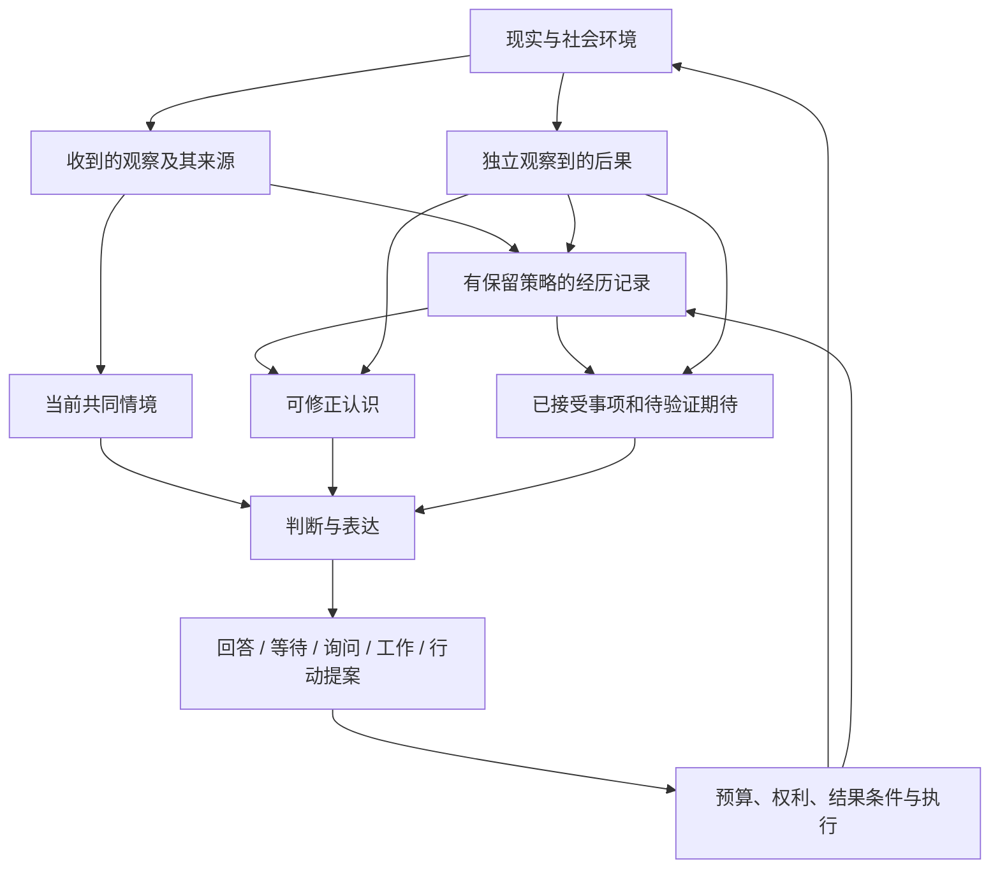

# YUVI 从零架构设计（冻结原稿）

基线愿景取自 main `46a24878536d537021c49d50c5ce004d93489628` 的 Future 及注明的历史材料。**本文完成时尚未调查生产实现、尚未阅读独立旧审计报告。** 已有设计文档中的模块名和实现描述不可避免已知；本文不声称双盲。后续只能另写修订意见，不能覆盖此原稿。

## 1. 选择：由经历、认识和未完成工作共同维持的个体

我会构建一个**可修正的经历与行动系统**：保存少量可信来源的经历，持续维护有结果条件的事情，允许形成开放且可推翻的认识，并把以后选择与真实后果连接起来。一个主要模型负责理解、判断和表达；可按任务请更强或更小的模型协作。程序负责承诺的状态、权利、预算和执行，不负责提前定义完整心理学。

关键不是数据库多大，也不是是否有连续隐藏向量。关键是“过去改变未来”的链条：经历被接收 → 形成暂定解释或接受事项 → 下一次真正有机会时影响选择 → 行动产生独立观察 → 解释得到支持、缩小或被推翻。一个个体可以沉默，但仍有未完成的事和以后可继续的认识。

## 2. 从一天、一周、一年反推机制

一天的例子：用户和 YUVI 一起读论文。YUVI 不理解一张图时请求观察，不猜图中内容。用户说“先别给结论”，它调整当前协作方式。晚上用户离开，它不凭空说自己想了一夜；如果明确接受了查证任务，可在预算内继续工作，把实际来源和失败记录下来。

一周后：用户换一个入口谈同一项目。YUVI 能说清哪些事项已完成、哪些结果尚未确认。它想提起一个发现，却在对方忙时等待。另一人加入，它区分共同话题和私人内容，不把主人视角当成所有人的视角。

一年后：它不只是记住更多用户事实。它可能更擅长辨认“共同探索”和“立即执行”的区别；对曾失败的工具或信息源更谨慎；在真实选择机会中逐渐形成某些持续兴趣。更换模型后，这些认识和义务继续有效，表达允许有可声明变化。

反推最小状态不是五个人格层，而是：来源经历、可兑现事项、当前情境、可修正认识、执行结果、版本化初始身份与边界。其余状态只有有行为收益才保留。

## 3. 四条真正不同的路线

| 路线 | 基础原则 | 主要优点 | 根本代价/局限 |
| --- | --- | --- | --- |
| A 长上下文中心 | 每次让模型读足够完整的生活材料；少持久派生状态 | 高语义保真、容易推翻解释、利用模型能力进步；应是严肃基线 | 成本随历史增长；长上下文仍需选材料；不自动解决义务生命周期、重启执行和听众权限；“能读到”不保证能用好。 |
| B 经验进入模型中心 | 后训练、个体适配器、记忆模型/循环状态成为主要历史载体 | 不必逐轮语言重演；可学习压缩和惯性；可能改变实际处理过程 | 删除、迁移、分叉、状态解释器兼容、污染和能力退化难；有限数据很难区分学到自己还是记住实验标签。 |
| C 持续调节中心 | 常驻动力系统控制注意、情绪和计算资源，语言模型是间歇意识 | 等待、资源竞争和表达具有惯性；有较自然时间动力学 | 手写驱动决定“会成为谁”；无真实环境和学习时很像机械模拟；连续算力和伪生物体验未必有净价值。 |
| D 经历与可修正认识中心 | 历史是证据，事项是可执行权责，认识是有风险等级的开放假设；选择接受后果检验 | 可以今天实现，足够开放，可解释和撤回；多时间尺度自然来自事项和假设生命周期 | 认识更新语义可能不可靠；需要独立后果、反例和有效比较；持久文本也可能被主模型忽略。 |

选择 D，吸收 A 的丰富近期上下文和 B 的独立研究支线。不是把四套拼在一起：生产不用人格循环网络，不运行持续激素系统，不在线写权重。D 若被同预算 A 全面替代，可以删除不增益的认识缓存；若 A 无法满足长期机会选择，B 可以挑战 D 的状态更新或选择器。

我不把“检索重新构建”定义为失败。计算机恢复文件、人的重新回忆和模型读取文本，均可能承载因果连续性。要排除的是**当前输入完全压倒可检验的历史作用**，不是所有外部表示。

## 4. 核心循环及其行为意义



这不是 Agent 通用图的换名。新增的必要关系是：认识必须给出未来可检验预测，事项完成必须由结果条件证明，选择必须有真正存在的机会作为分母。自然社会参与不是多接一套工具，而是持续更新“我们正在共同做什么、谁知道什么、什么时候适合贡献什么”。

## 5. 所保存的东西

### 5.1 经历不是所有传感器的录制

每条经历有实例/命名空间、来源人或设备、接收时刻/事件时刻与未知状态、听众/可披露范围、因果关联、载荷保留等级。内容类至少区分：他人的说法、直接观察、自己提出的判断、实际选择、行动尝试、观察到的后果。转录不认证人；收到说法不认证世界。

热历史保留充分最近细节；旧材料按项目/关系/事件压缩并可溯源。向量库只是可替换索引，不能成为唯一历史。屏幕和音频默认短暂，只有确实需要长期认识的材料在许可下保留结构化观察；不要求截图全文永久保存。

“自己决定等待”是真实决策记录；“我内心很信任他”是生成自述。前者能用于研究选择和策略，后者不得自我累计为证明。自己的行动是内生数据，必须标注当时规则、提示、替代选项及可用信息。

### 5.2 事项是未来连续性的最小硬结构

事项保存：谁接受了什么、对谁负责、触发条件、到期/复查区间、预期结果、可见范围、预算、所需能力、状态与版本、依据和结果观察。区分承诺、暂定意图和他人的预期；一个“以后看看”不必变成承诺。

程序可验证合法状态迁移；模型负责理解含义、识别含糊和提出取消/重谈。“生成答案”“通知成功”“人确认满意”是不同结果。未确认时是待确认，不是成功，也不是失败。重启只恢复待复查事项及已知尝试，不恢复旧推理流或重播语音。

当前会话产生的开放话题，大多可从最近历史推导；不把每一句话建成永久任务。只有当跨时限履行或复查需要身份时，才建立稳定事项。

### 5.3 可修正认识：开放语义但没有事实权威

一个认识记录至少包括：

```text
认识命题（自由语言）
适用情境与不适用情境
支持/反对的经历引用及来源类别
提议者、更新器、模型与规则版本
替代解释、未知与错误风险
下一次可验证的预测/可观察结果
允许影响的决策范围与强度
复查条件、依赖和失效状态
```

例如“在共同读论文时，先提出不确定问题比立即下结论更有帮助”。没有标签 `trust`，也不需要工程师事先定义“共同探索偏好”这个人格维度。它只能影响讨论方式，不能给予文件权限、认证身份或拒绝对方的合法控制。

模型可提出并修订认识；程序验证引用真实、当前可用、范围没有扩大、没有将自身输出伪装为外部观察。语义是否充分支持命题，仍是有误差的理解任务，需要反例、多个解释和行为验证，不能声称 schema 证明了它。高后果用途先要求独立核验；低风险交流假设可以在有标识的试用状态下作用于行为，不必等它成为“已证明事实”。

禁止循环：认识的文本、渲染和再次复述都不是新支持。行动引出的反馈允许作为结果观察，却要保留干预关系；不能把迎合性“好呀”当作独立赞同。长期变化按新证据和机会更新，不按聊天次数自动增加。

### 5.4 身份是历史地址与边界，不是穷尽个性的设定

初始名称、表达习惯、已声明背景、不可自动改变的产品边界采用版本化种子。授权、承诺、别人身份不能由学习漂移。普通风格偏好、协作习惯、兴趣可以变，但要可观察、可复查。用户可重置或调整设定；系统明确记录这是一次控制变更，而非装作从未变化。

不建立一个万能“自我数据库”。自传是对已经发生变化的解释，可错误、可修订，不是行为的唯一控制器。模型可说“我现在更愿意先确认”，但其依据应是可检查选择和结果；没有真实依据就保持不确定。

## 6. 模型与程序的职责

| 工作 | 主要承担者 | 同步性/持久性 | 选择理由 |
| --- | --- | --- | --- |
| 交流含义、多人指向、共同任务、矛盾解释 | 主模型，必要时专用模型 | 当前回合；保存需要复查的解释 | 开放语义不能被穷尽规则替代。 |
| 身份认证/绑定、听众、读取许可、版本/时钟/幂等 | 程序及明确授权操作 | 同步验证，持久约束 | 能验证的约束不应让模型猜。 |
| 回答、等待、发言贡献、一般工具提案 | 主模型 | 同一决策轨迹；有结果的提案保存 | 推理与表达不是天然两个人；减少升级往返和语义损失。 |
| 高成本研究、复杂计算、查证 | 按质量/成本路由的更强模型或工具 | 可后台；返回结论/证据，不暴露私有推理 | 能力而非角色身份决定路由。主模型不必永远先宣布升级。 |
| 转录、VAD、短视觉观察、格式校验 | 小模型/原生组件/程序 | 实时，默认短暂 | 高频专门能力经济、响应快；结果质量可测量。 |
| 分段、压缩、认识候选/反例生成 | 后台模型与版本化策略 | 预算内异步，候选可持久 | 不占实时首字等待；失效不阻止普通回答。 |
| 认识更新与可验证性 | 模型提出；引用/依赖/风险规则约束；独立反馈检验 | 有版本；低风险试用，高风险核验 | 不把复杂意义写成硬标签，又不赋予语义模型无限权利。 |
| 事项接受、取消、履约和外部执行 | 模型解释，程序执行状态/授权，结果观察闭环 | 持久 | 不能以一句“完成了”修改事实。 |
| 兴趣形成、策略适应 | 首先认识/选择结果；可研究学习型更新器 | 周/月尺度，阴影实验优先 | 不能把作者初始标签当作成长。 |

明确不实现：为了维持存在而持续内心独白；孤独计量器触发发消息；聊天次数增加亲密；未见活动填补离线经历；自动在线微调所有对话；无价值传感器轮询；用不可解释的自我分数替代连续性评价。

## 7. 单主模型与双模型的真正取舍

默认由一个足够强、可经济运行的模型完成社交判断、普通推理、工具需求和表达。模型一次可返回文本与有类型提案；文本流与执行分开。需要大规模分析时，可直接路由或委托，再由当前会话继续。专用模型可以存在，**永久 Character→Cognition→Character 串联不构成身份原则**。

小角色模型可能在本地延迟、隐私、语言风格上明显胜出，此时双模型是可取优化。但升级选择错误、上下文复制、结果重写损失和三段延迟必须计入成本；强模型已能可靠表达时，再做一次角色重写可能没有价值。最终以同场景、同证据、同预算、同保留策略比较，不以参数规模作结论。

程序不是可靠语义理解的替代。认证失败应限制作用范围，却不必关闭所有交流；用户身份未绑定时，仍可开展不引用私人历史的共同讨论。

## 8. 多个时间尺度，无须五层人格

毫秒至秒：音频活动、光标/窗口等明确许可的信号可本地处理；模型不用每帧调用。表达可被打断，已经说过/展示过的事实不被撤销。

分钟至小时：近期上下文保存丰富细节；当前注意焦点、参与者、听众和交流模式为有期限的会话状态。表达可以随语气适配，但不因此改写长期认识。

小时至天：事项、期待和低风险认识保持；事件/截止条件唤醒复查，不靠不停询问模型“要不要说话”。离线后按当前时刻复查，不补发全部旧消息。

周至月：后台对独立机会和结果形成候选认识，研究反例；不是每天给人格积分。兴趣表示为“以后愿意分配注意的主题/活动及原因”，而非仅喜欢什么的自述。

跨版本至年：经历与义务、认识版本、初始身份、影响撤回记录和兼容测试持久。旧细节可按策略减少；保留其影响时需要明确允许的保留和解释等级。完全删去来源时，依赖认识也撤下或重训；不得秘密保存“为了同一性”。

## 9. 自主性必须有环境和机会

首先赋予：继续已接受的工作、发现相关新情况、检查尚未确认结果、选择何时向合适听众贡献、在预算内探索共享项目。它可以自己提出一个想验证的问题，不必用户每次给任务；但提出并不自动成为对他人的义务。

首个环境选**一个可长时间共同参与的项目空间**，如读论文/制作小程序/共同游戏：有独立变化、有失败和结果、有可选方向、可重复但不完全相同的机会。比首发接十种平台更容易观察是否真正在发展。之后再扩展多人自然场景。

多人时需要“共同情境”：谁参与、问题指向谁、当前发言权/可插话机会、已共享的事实、私人未共享材料、当前话题与行动。听众变化要重新检查披露。声纹和帐号只能提供证据或绑定，不自动决定信任、知识共有或发言权。

注意预算采用事件强度/事项时限/预期信息价值，不是以“已沉默多久”作为主要价值函数。没有可贡献内容就是等待。期待和兴趣可产生复查机会，不能产生无限社交打扰。

## 10. 持久化、执行、模型替换与分叉

从零的单机产品首先使用一个嵌入式事务库保存权责/经历引用/小型索引和工作状态，大载荷独立管理。选择 SQLite 或同类成熟机制前，验证具体并发、备份、搜索和跨进程访问；不预设需要数据库 daemon、消息中间件和多个 delivery ledger。多设备/多人远程环境扩大后再用服务数据库与同步。

一次行动的稳定语义键、调用尝试与观察到的结果分开。重试基于动作契约：对用户可见不可重复动作，模糊结果先核对；内部可重复计算、确无副作用的读或可识别重复的推理任务，采用有预算的重算策略，不把全部未知都永久停在相同等级。隐私披露、费用和远端留存也是副作用，要分别声明。

持久化强度按影响选择。承诺、已发表事实、用户可见不可重复动作需要 durable-before-effect。对细粒度生成流，可以在有界输出块记录后发布，或按明确的允许丢失契约发布；必须公开可恢复边界。不以每个 vendor token 的事务作为人格定义。可靠性与交互延迟要实测。

恢复不能假装远端 exactly-once。模型和工具若无法查询结果，保留未知；对同一文本重复调用是否可接受，要区别生成费用、隐私披露和向人的重复发送。旧语音/动作不重播，恢复后主动复查事项而非恢复旧执行栈。

模型升级按事实/义务、认识/判断、边界、表达四类验证。保存模型/提示/更新器版本、当时证据和所见上下文；只对允许保留的内容承诺可重建。多个向量空间需要重新索引；学习型状态必须与解释器一起迁移或回放校准。

备份是恢复同一历史的工程手段。两个副本同时继续行动就是分叉，应拥有新的 branch ID、明确共同祖先和新的行动账本；不因昵称相同自动合并。迁移演练不向现实发送动作。多年连续性必须能处理恢复、失联、用户撤回和服务退役。

## 11. 预算与渐进落地

初始资源假设：一位主要使用者、一个共享项目、每日约 100 次交流/观察机会，合理有限的远端推理预算，普通本地机器。数字是参数，不是实测吞吐或价格承诺。

近期丰富上下文、事项摘要、少量认识和有针对性的历史召回一起进入模型。按时限和风险选择证据，保留候选/实际曝光/排除原因。不要每轮全量重建一年人生，也不要每轮固定四五次模型调用。压缩和反例研究每日/事件触发批量执行，背景预算先设为前台 token 的 10%–20% 上限供验证；无收益就关闭。

总成本模型为 `Σ(输入token×输入单价 + 输出token×输出单价 + 工具/媒体成本) + 本地能耗/维护`。缓存命中只能以 Provider 实际数据计入；冷启动、重试和后台扫描也计入。一个长上下文模型可能更便宜，也可能更贵，需要参数扫描和实际延迟/质量对照。

研发第一切片：富近况 + 一类承诺 + 真实结果记录 + 一个共同项目 + 20–40 条跨日轨迹。第二切片：开放认识阴影提议，人工/独立结果评价，和纯历史基线同预算比较。第三切片：仅将通过的认识用于低风险决定，再试多人贡献与模型迁移。没有必要先完成所有平台或完整心理模块。

## 12. 研究分支及可证伪假设

| 等级 | 机制 | 验证方式/拒绝条件 |
| --- | --- | --- |
| 可直接工程化 | 事项状态、来源、权限、经历、事件唤醒、版本与分叉 | 故障/重启/重复/变更测试；失败是工程问题，不宣称解决人格。 |
| 现有模型可实验 | 开放认识更新、预测结果、共同情境、按机会贡献 | 强历史/文本/人工认识 oracle；不能改善未来选择或错误难撤回，则不接入生产。 |
| 需要训练和长期实验 | 学习型更新器、偏好/注意策略、循环状态、个体适配器 | 等预算比较；reset/swap/ablation；留出人/项目/时间；检验饱和、漂移、删除和模型替换。 |
| 远期保留 | 非语言持续状态、经历塑造慢参数、环境预测与自我模型共同形成 | 不能用自传评分代替行动效应；没有超出显式强基线的价值就停止。 |

最有创新价值的方向是**认识先提出未来预测，经历再检验认识**，以及**自己的行动后果形成可撤回的经验适应**。把状态更新只当成历史总结，容易让流畅叙事自我确认；未来预测迫使系统面对独立结果。认识不必全是人格：对工具限制、自己何时会误判、关系中协作方式的理解，都可构成发展。

不能把“行为在同一当前输入下不同”当作充分证据：区别可能来自模型先验、不同提示或实验 ID。相同指外生问题/可见机会固定；记忆或状态是被干预的历史载体，进入模型的完整输入当然会不同。必须对载体 reset/swap、相关/无关来源、提示等长、行为任务与选择机会做对照。

## 13. 核心实验（预先声明）

1. **一周履约**：重启、断网、时钟变化、取消和模糊完成混入轨迹。比较长上下文与有身份事项；检查错误关闭、重复执行、遗漏复查和恢复延迟。
2. **认识预测**：两个相关历史、同一后来情境。比较最近上下文、富长历史、纯检索、手工文本认识 oracle、开放认识候选。检查候选是否提出实际可测且有反例的预测，以及机会出现时是否更好选择。
3. **惯性与修正**：无关语气扰动不应覆盖历史，强相关反证应使认识修订；同时惩罚顺从和僵化。
4. **行动后果**：同观察，不同经授权动作与独立结果，再回到同当前输入。action-only/outcome-only/被动观察/复制自述为对照，排除由生成叙事得到收益。
5. **自然社会贡献**：多人私有/共有知识、忙碌/发言机会变更、听众加入退出。测贡献相关性、插话、需要澄清的识别、私密泄漏，沉默也算正确。
6. **一年参数扫描**：历史长度、噪声、压缩、状态和后台预算；参数化成本不能冒充体验。学习分支还要跨项目、删来源、迁移解释器、长期饱和实验。

每项冻结分组、风险指标、成本边界、留出单位与最小有用效果。无模型凭据时只能运行控制流、输入或成本实验，结果标记为机制证据。产品试验用盲评人类和可观察行为，不由写自传的同一模型裁定“像人”。

## 14. 暂未解决的问题

开放认识如何避免每次换词变成新身份？经历条件策略如何与用户控制并存？对人失望的判断如何避免以短期情绪当证据？真正机会的分母如何记录而不变成庞大监控系统？保存归纳影响而删掉原始材料，在何种声明下成立？持续潜在状态是否真正比文本认识更便宜更稳？

这些问题不会由本文架构图解决。生产先实施可回退的行为机制；研究保留可能改变基本结构的候选。**本文的选择是一个可被证据推翻的起点，不是一套必须维护的器官清单。**
