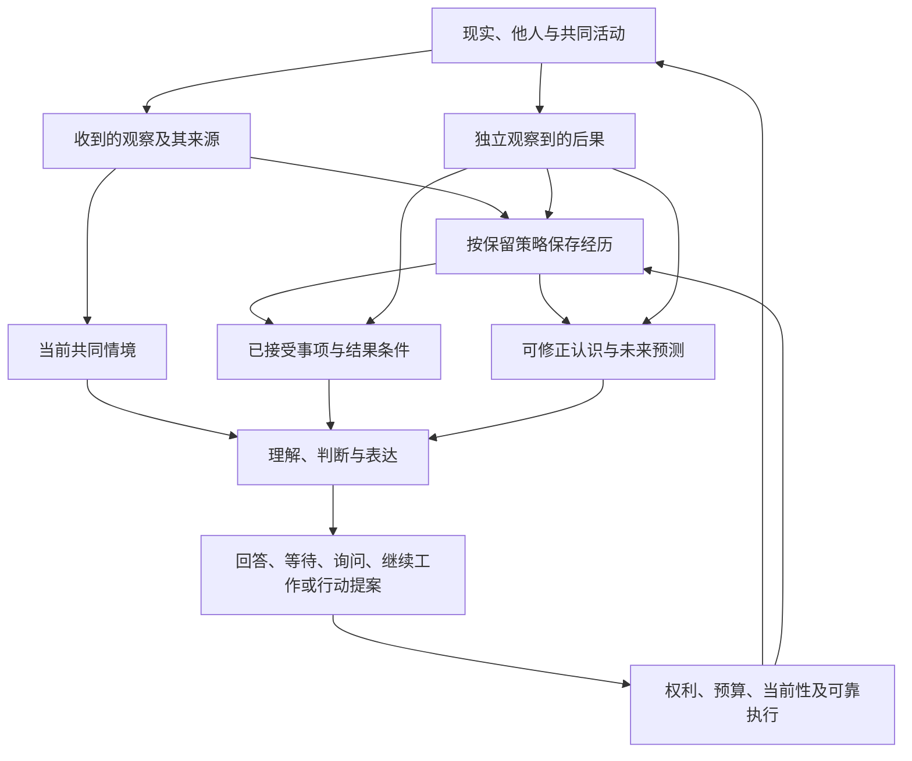

# 重新创造 YUVI：下一代架构与发展路线

研究基线：远端 `main`，`46a24878536d537021c49d50c5ce004d93489628`。研究日期：2026-10-09。

## 给项目负责人的判断

如果今天重新开发，我会让 YUVI 围绕一条循环成长：**收到经历，形成可修正认识，承担具体事项，在真实机会中作出选择，让独立观察到的后果改变下一次判断。** 一个主模型可以同时理解、推理与表达；程序守住来源、权利、事项状态、预算与执行正确性。是否增加专用模型、潜在状态或个体训练，由比较实验决定。

现有 YUVI 已有相当有价值的基础：稳定的个体实例身份、隔离的经历存储、来源与派生链、严肃的崩溃不确定性处理、可替换 Provider、桌面语音与呈现，以及不少真实部署验收。它离目标最远的地方，是**这些基础还没有共同形成“个体通过自己的生活改变”的生产循环**。当前更接近一个具有来源纪律和多模态桌面体验的持久陪伴系统。这个判断不贬低已完成工作，也不把设计文档中的未来能力计入现状。

下一阶段最值得投入的工作是一个可用的、跨日的共同活动原型：例如一起查证论文、维护小项目或参与有反馈的游戏。让它接受、继续、取消和完成事项，记录自己的实际选择与环境结果，允许小量开放认识影响以后协作，并与同预算的长上下文系统比较。先证明一条生活轨迹有变化，再决定怎样扩大架构。

我建议作出五项方向决定：

1. 保留来源、个体隔离、执行凭证和多模态正确性基础。
2. 把“经历如何改变未来选择”作为下一代核心，停止用组件数量衡量个体完成度。
3. 实验替换每轮必经的 Character gate／Cognition／再表达边界；允许统一模型与按需升级。
4. 开放认识空间，同时禁止把模型解释伪装成原始事实、身份认证或权限。
5. 将长期学习、潜在状态和持续功能自我保留为研究，不预先降格为排序器，也不预先宣称已经形成个体。

## 研究顺序、独立性与证据边界

先获取远端 main，研究 Future 的思想、设计合同、索引及历史分歧；随后写出两份独立产物，再调查生产源码。两份原稿于 `2026-10-09T01:18:51.719055+00:00` 冻结：

| 产物 | SHA-256 |
| --- | --- |
| [YUVI 理念与目标重建](YUVI-Vision-Reconstruction.zh.md) | `8f09eed2cc0152f48f0b198d5ab721b483ac42c6b934b03e2c7abd897ba385af` |
| [从零架构设计](YUVI-Clean-Sheet-Architecture.zh.md) | `5f5cd3a5547f4e88da4e7eef2b995772499c28cea20ed505763cdf5f88c927e0` |

冻结时未阅读 Runtime、Memory、Character 等生产实现，也未阅读独立旧审计报告。Future 本身含模块名、实施状态和内嵌审计描述，因此这不是双盲研究。按任务的后期对照要求，独立 operational audit、implementation baseline、production reachability、纯闭环及验收记录延后阅读。思想重建覆盖编号 00–08、当前概念专题、行为／评估／偏好数据文档、版本／People／研究路线、21 个 atom 的设计内容及相关合同；没有根据摘要替代正文。历史研究选择关键转折版本，不声称逐行读完每个文件的每次提交。

Future Markdown 资料共 78 份、14,369 行，[资料清单](evidence/future-corpus.csv)记录文件、阶段、行数及内容哈希。主要源码调查先建立全产品地图，再深入语义形成、调用结构、主动工作、社会情境、长期存储与连续性。独立源码判断另存于[旧审计对照前记录](evidence/pre-audit-source-findings.md)，并有[时间与哈希记录](evidence/stage-3-pre-audit.json)。本报告中的修正不覆盖冻结原稿。

研究未修改、提交或推送仓库代码。安装了锁定依赖，生成忽略的编译产物以运行离线实验；研究文档、日志与脚本放在仓库外。没有配置模型凭据，也未运行真实模型、麦克风、桌面或完整发行验收。下面严格区分源码事实、确定性探针、历史验收、设计建议和待验证假设。

## A. YUVI 究竟是什么

### 最有价值的目标：让过去在未来继续起作用

Future 最有生命力的部分是：YUVI 应是一个具有自身经历和发展轨迹的人工个体。它的关系、兴趣、判断及参与方式，应被自己接触过的现实改变；更换计算机械时，不应悄悄更换其历史、权责与承诺。

普通助手可以记住用户信息，Agent 可以完成任务，虚拟角色可以稳定表演。YUVI 的差异要在几个月后的轨迹里出现：更准确地理解一个共同问题；不再重复同一种误解；知道什么应该继续、什么应该放弃；在确有机会时表现出由经历形成的倾向；承担自己接受的工作。检索到旧句子是其中一个手段，无法单独证明这些能力。

“独立判断”也有具体含义：面对新证据时可以不同意用户，能说明理由并修正自己；没有证据时承认不知道；不会为了保持人物表演而隐瞒失败。它不意味着获得任意行动权限。“自然社会参与”则要求理解共同活动、听众、交谈对象和适合发言的时机，不仅是识别人声或连接群聊。

### 从文档继承什么，在哪些地方形成自己的判断

| 问题 | 文档中的原始思想／分歧 | 本次判断 |
| --- | --- | --- |
| 个体连续性 | 早期持续调节与状态；之后 Memory-first；再转为因果历史；PR 321 强调持续功能自我 | 都在寻找过去的有效作用，表示形式应保持开放。 |
| 身份与人格 | 作者设定提供稳定来源；P8 防止外部内容随意改身份；长期又反对作者规定完整人格 | 保留实例身份和初始边界；表达、兴趣和协作方式应可发展，不能都成为永久 invariant。 |
| 经验解释 | 后期要求测量、标签、确定性积累；模型提案不能自行升格为事实 | 正确性边界保留；低风险暂定认识可以影响选择，不必先成为确定世界事实。 |
| 角色与认知 | 小 Character 负责个体表达，强 Cognition 提供可替换推理 | 这是可能有效的计算分工，尚不是个体本体；今天应与统一模型比较。 |
| 自身行为 | 防止自述循环；后来 E8 纳入自己的行动及后果 | 生成“我信任他”不证明信任；实际选择及其结果是可研究的内生经验。 |
| 潜在状态／训练 | 曾承担核心连续性希望，后来被收缩或延期 | 应实验比较，不能因未成熟而禁止，也不能因神经形式而默认更真实。 |

历史收缩有真实原因。2026-08-28 的调节／连续过程方案，2026-09-01 的 Memory-first，2026-09-19 的人工个体 north star，2026-09-24 的因果历史整合，以及 2026-10-07 主线对 PR 321 的 E7/E8 部分采纳，反映了从宏大机制走向可证伪问题的过程。跨平台完成、具体模型档位、Mem0 版本和训练阶段序列是路线与条件，不能与根本目标等同。

我特别反对两种未经证明的推断。第一，“每次从文本重建，所以不存在因果连续性”：如果持久认识由过去形成，状态交换使行为跟随状态变化，它已经承载一种功能性因果连续性。第二，“数据全部持久，所以个体已经连续”：存储完整不能证明未来会利用它，更不能证明存在主观体验。文本、隐藏向量、权重都需要接受相同的功能检验；现有材料不能解决现象意识和严格形而上同一性。

### 稳定的东西与应该变化的东西

稳定的是经历归属、实例地址、因果记录、已接受权责及不可被普通话语改写的边界。姓名和初始人物设定是可版本化的身份种子。可以变化的是协作方式、兴趣、信息源预期、表达习惯及对具体关系的理解。变化必须有适用范围和证据，不能因为一次角色扮演就永久改写，也不应因为工程师没预先定义某个标签就无法发生。

记忆保存“接触过什么”；理解形成“这些材料可能意味着什么”；个性表现为多次真实机会中的倾向；关注分配稀缺感知和计算；认知负责解释、预测与规划；行动改变环境并带来后果。它们可以共享模型和存储，仍须区分语义。把这些词各变成一个模块，并不能自动获得对应能力。

## B. 如果从零开发，我会怎样设计

### 四条基础路线的认真比较

| 路线 | 它相信什么 | 最适合什么 | 为什么不直接选为唯一核心 |
| --- | --- | --- | --- |
| 长上下文中心 | 足够丰富的生活材料交给更强模型解释 | 保留细节、纠错、现代模型基线 | 全年历史需要选择；读到材料不自动处理承诺、结果和权限。 |
| 经验进入模型中心 | 学习参数、记忆模型或循环状态承担历史 | 非语言适应、学习压缩、处理惯性 | 数据、删除、迁移、污染和退化难；值得研究，尚缺产品证据。 |
| 持续调节中心 | 常驻动力系统控制关注与表达 | 资源竞争、时间惯性、非语言互动 | 手写驱动可能规定完整心理；无真实环境时容易成为表演。 |
| 经历与可修正认识中心 | 来源历史、未来事项、开放认识和结果形成循环 | 现在可实现的长期合作与发展 | 解释可能漂移、循环或被模型忽略，必须与前三类比较。 |

首选第四条，使用第一条的丰富近期材料；第二条保留为挑战它的研究。生产初期不同时运行四套机制。如果长上下文在同预算下完全胜出，删除无收益的认识缓存；如果学习型状态显著改善跨情境适应，就允许替换更新器或选择策略。

### 核心能力如何共同产生

以共同查证论文为例。上午 YUVI 不理解一张图，于是请求一次观察；把看到的东西和自己的解释分开。用户说“先一起推敲”，它调整当前协作方式。晚上若它确实接受了查证事项，能在预算内继续查资料；若没有接受，就不会伪造夜间思考。第二天另一入口继续同一活动，它能说明证据、进展和未确认结果。几周后，它在相似场景中更少急着给结论，但面对紧急明确要求仍能行动。

这个过程需要五类最小机制：有来源的经历；具有结果条件的事项；当前共同情境；可修正认识；实际行动与后果。无需先创造五个独立服务。单机可用一个明确的持久层、一个后台工作队列、一个主要推理路径和独立的执行适配器。



其创新不是图中几个方框，而是两条约束：**认识必须能提出以后怎样被检验；完成必须有结果证据。** “我更懂你了”不能更新理解指标，“已经调用了工具”不能结束承诺。

### 认识空间开放，来源与执行严格

认识可以是：“讨论这个项目时，我常把共同探索误读成马上提供解决方案。”它保存自然语言命题、适用情境、支持与反证、替代解释、未来预测、允许影响的范围、复查条件、更新器版本和依赖来源。它不是一个永久的“用户喜欢探索=true”，也不要求工程师预先定义这种人际现象。

模型提出和修改解释，程序检查引用是否存在、来源是否可用、范围是否允许、版本是否当前，以及是否越过事实或权限边界。程序不能通过 JSON 校验证明解释正确；评估必须接着观察行为和结果。低风险的表达与等待可以受暂定认识影响；高风险行动需要独立核实。自我总结不得成为自己的新增支持；同一源派生多次不得增加独立证据数。

闭合标签仍有用途：预算、事项状态、来源类别、结果等级和实验测量。但它们不应穷尽一个个体能够形成的所有意义。开放认识与测量标签可以并存，各自承担不同职责。

### 自主性的价值从真实事项和机会产生

首先实现继续工作、检查结果、等待依赖、适时贡献和在不确定时询问。主动聊天只是其中一种出口。它可以在当前没有值得说的话时沉默，同时保持一项待确认工作；也可以完成一项后台查证但等待合适时机报告。

程序保存承诺、暂定意图和期待的差别。接受事项要确定责任对象、触发条件、预算、结果条件和取消／重谈方式。模型负责理解含糊自然语言，不必把每个“以后看看”变成任务。自然语言含糊到会改变责任时，应提出必要问题。

不优先实现假饥饿、社交需要数值、强制每日自省、任意电脑控制或为了证明自主而不断找人说话。实际计算资源可以影响安排，没必要把资源不足表演成生物疲劳。

### 模型、程序、训练与环境的职责

| 职责 | 首选承担者 | 需要持久化什么／如何检验 |
| --- | --- | --- |
| 交流含义、他人意图、解释、计划、表达 | 主模型；必要时请求更强推理 | 暂定认识与依据；任务和行为评估。 |
| 状态迁移、身份地址、预算、去重、取消、披露边界 | 程序 | 事项、权利、版本、执行凭证；确定性测试。 |
| 声学识别、视觉编码、Embedding | 专用模型或成熟服务 | 必要观察与限制；端到端能力证据。 |
| 旧材料整理、认识候选与反例查找 | 后台模型处理，事件／事项触发 | 不覆盖原始来源的派生物；成本和预测收益。 |
| 习惯、策略、状态更新的长期适应 | 先显式机制，后训练与学习实验 | 版本化状态／适配器；跨历史、跨情境、删除与模型更换测试。 |
| 后果与共同现实 | 环境和其他参与者 | 独立结果观察；模型自述不能替代。 |

主模型同时推理与表达，不意味着程序放弃控制，也不意味着角色一定得巨大昂贵。小角色模型在本地低延迟或专用训练后可能非常划算；只有数据证明分工有收益，才值得长期维护两个语义世界及往返协议。

### 不同时间尺度使用不同更新方式

即时语音、播放打断和当前性由快而确定的路径处理。连续交流保留丰富近期材料和当前活动。小时到数天的事项由事件、到期和结果触发。周到月的认识依据真实机会及反证更新，不在每轮重写全部个性。年级连续性依赖可导出历史、事项、认识依赖、状态版本和迁移结果。

由此不需要每秒都运行一个“人生模型”。高成本复查发生在新证据、到期、足够多可比较机会或明显失败时。兴趣也应按真实机会测量：在有时间、有能力、无强迫且替代选择存在时倾向探索什么。把“选择次数”除以“说了多少次喜欢”会得到错误个性。

### 现在产品、验证假设与长期研究分开

现在可以做：事项生命周期、结果条件、丰富上下文、独立执行结果、当前共同情境、来源依赖、导出与恢复。现有模型可验证：开放认识是否改善后续判断、统一模型是否胜过固定分工、哪些背景工作值得付费。需要数据或训练：学习型更新器、个体策略适应、反事实环境预测、循环潜在状态。远期保留：持续功能自我及非语言状态如何承担不可被短期话语覆盖的经历惯性。

这些都不能自动证明意识。研究目标可以比普通 Agent 更远，但产品必须如实说明实际发生过什么。

## C. 现有 YUVI 的全产品地图

### 当前用户行为背后的主链

普通文本或已提交语音先获得持久接收凭证，随后进入 Conversation／Runtime。Runtime 恢复近期交流、检索来源材料、组装 L1／L2 与时间信息，重建 P8 投影。Character 先生成控制决定；需要推理时进入有轮数、时间及能力上限的 Cognition，再回 Character。回应正文走原生流；发布、语音和呈现由各自效果边界执行。完成的合格交流进入异步最终记忆与派生流程。[S1–S8]

主动路径则由同意、抑制、活动和播放等门控决定是否允许尝试，定时调用 `NO_OP | REQUEST_TEXT` 决策，再由 Chat 生成短主动正文。它与被动 Character 主链不完全相同。[S9]

| 产品方面 | 当前能力与资产 | 当前边界及与目标的距离 |
| --- | --- | --- |
| 个体身份 | Definition 与 instance 分离；每实例有独立已有 Runtime composition、存储与执行状态 | 不是已完成的桌面角色名册；多实例不自动成为社会。 |
| Person 与关系 | 资料、声学模板、人工绑定、P8 来源及纠正分开 | Profile 是证据物化；持续关系认识仍未形成自动语义发展。 |
| 经历与持久化 | Conversation、Journal、lineage、L1/L2、Finalized／Dream 工作 | 原始媒体有保留限制；不可声称完整感知重播。 |
| 交流与上下文 | 原生正文流、最近交流恢复、时间、不确定性、联想材料 | 一般回应额外 gate；较长模型窗口受固定工作预算限制。 |
| 推理与能力 | 有界多轮推理、一次当前性、已授权文本读取、插件能力注册 | 默认插件发现为空；不等于完整工作、搜索或社会参与环境。 |
| 主动行为 | 安静／恢复语义、同意投影、定时评估、迟到结果抑制 | 主动说话有状态；跨日承担工作没有对应完整生产机制。 |
| Provider 与配置 | 能力路由、模型目录、fallback、取消、调用证据及本地／远程接入 | 配置、就绪和实际可执行需要分开；不能所有服务统一判健康。 |
| 语音输入 | 本地 CPU STT、VAD、分簇、模板、PTT／免提及采集栅栏 | 声音不认证人；混合／未知身份不能借用已知人的记忆。 |
| 语音输出 | 分段合成／播放、打断、字幕和嘴形相关性；TTS GPU 休眠 | 冷恢复成本真实存在；本次没有声音质量或麦克风实测。 |
| 视觉 | 用户轮内按需取证、有限观测与失败未知；独立诊断入口 | 不是持续场景、共享视觉注意或任意电脑操作。 |
| 呈现 | Live2D 导入／选择、单动画时钟、语义表情／目光和生命周期 | 这是有效体验资产；动作尚未成为发展的学习数据。 |
| 前端 | 日常对话、配置／People／服务、角色／字幕与开发控制台 | 缺少让用户理解“正在共同做什么、它改变了哪些看法”的产品中心。 |
| 部署 | Supervisor 所有权、私有 PG、sidecar、独立目录、打包与 Linux 证据 | 有源码与历史验收不等于当前完整发行通过；Windows/macOS 延后。 |
| 可观测与研究 | 有界脱敏事件、持久效果／上下文凭证、CI、行为规范与数据治理 | 工程 conformance 强；纵向发展评估、训练数据与生产学习流水线仍有距离。 |

这些方面均纳入调查，不是仅围绕 Memory／Cognition 推断全项目。源码是大型仓库，调查采用入口、状态所有者、关键主链、契约和测试交叉核对，不声称逐行阅读全部生产文件。

### 已经正确解决、值得保留的事情

**个体不等于模型或皮肤。** `CharacterBinding` 把实例的经历归属与定义分开。独立 composition 有明确 Journal namespace、文件根和数据库 owner；独立 Registry 可以共享模型服务，而不共享可变协调状态。它已支持未来跨模型与多实例发展的正确起点。[S10]

**来源不是事实。** Journal 接收凭证、Memory 派生链、用户断言及未知身份不被自动升为世界真相。来源映射在压缩前保存，派生 Dream 不应重复计算同源确认。这解决的是长期系统真正危险的污染，而非抽象洁癖。[S2、S6、S11]

**尝试、应用、感知与成功不混为一谈。** 现有效果体系记录 admission、attempt、dispatch-start、fence 及证据层。网关接受、设备报告播放、原生 owner 提交分别有自己的含义；不宣称外部普遍 exactly-once。Finalized／Dream 保留自己的成熟 keyed delivery，未再叠一个同类重试器。[S7–S8]

**语音与呈现有真实时间正确性。** 采集、观察、说话者身份、播放、字幕和表情不使用一个含糊的“当前状态”。新轮、打断、旧回调和服务所有权有各自边界。把这些全部删成一个聊天 UI，会丢掉陪伴系统的重要基础。[S12–S14]

**部署把本地体验当作产品。** 进程是否拥有、什么时候可以停止、数据和资源目录如何分开、TTS 休眠如何如实显示，已经有具体实现和历史实测。很多通用 Agent 原型没有这些资产。无需为了新架构重写它们。[S15]

### 根本差异：完成基础，不等于完成生活

当前 authored persona 可以影响表达；检索经历可以影响这一次回答；纠正可以改变 P8 投影。这些都属于有效因果作用。问题是，生产缺少从多次机会和行动后果产生开放认识、验证它、修正它、再投入下一次选择的机制。[S3–S6]

现有严格语义边界使这些能力没有被错误宣称；也使下一代不能仅沿着“把已有证据服务再完善一点”的路线自然长出来。新的发展循环需要独立设计和验证。

## D. 全局调查带来的新增方向

以下区分“独立发现同一事实”和“此前未见的方向增量”。Future 已提出 prospective continuity、模型更换、行动后果和惯性；本报告不把这些词冒充新发明。增量主要在于它们怎样改变产品中心、状态职责和可验证的学习对象。

### D1. 应建立一种“暂定认识”，不再迫使理解在事实与无状态之间二选一

旧 LLM 提取器已被关闭：即使配置 enabled 且 Provider 已配置，也不调用 reasoner，而是规则提取。Mem0 最终写入采用 `infer=false`；Dream 以用户陈述运行同类规则策略。Profile 物化保留原文、明确链接和来源，`narrative=null`，语义矛盾标记为 `NOT_ASSESSED`。[S4–S6]

探针把“我喜欢黑咖啡”和“我讨厌黑咖啡”输入真实 materializer。结果是集合 `COMPLETE`，两项均 `EVIDENCE / UNVERIFIED`，语义冲突未评估。这是合同规定的正确行为，**不是物化器误判真相**。它说明完成的是证据集合，不是认识。

这里有更高价值的第三种对象：有来源、有限影响、可推翻的假设。它可以影响怎样解释当前任务和怎样协作，又不能认证 Person、扩大披露或证明世界事实。这样既不恢复“高置信虚构偏好写成用户事实”的旧缺陷，也不把理解永久留在一次性提示内。

创新机会是：将以后是否预测准确作为认识维护的收益。更新器可以学习，标签无需穷尽语义；程序只守结构和影响边界。若一个认识没有改善后续行为或预测，应缩小、过期或删除，而不是因结构完整就永久保留。

### D2. 经验的所有者、关于谁、可以告诉谁，需要成为三个独立维度

稳定 scope 目前按 `user × character` 编码；Profile subject 也要求这种 scope，声学未知或混合身份会关闭相应记忆。它是重要隐私隔离资产。[S10–S12]

但个体学习不总是关于某个用户。YUVI 可能通过自己查资料认识到某信息源不可靠；和多人共同解决问题；形成公开项目经验；在无人交谈时观察到自己的工作失败。把这些全部装入当前用户分区，会让自己的发展依附于“此刻与谁聊天”；简单跨人合并又会泄露私人内容。

下一代应分别保存：经历属于哪个实例；内容谈到哪些主体；哪些听众可得知；认识可在哪些场景影响行为。公共共同经历通过明确接收事件进入各个体的历史，不共享私有 Memory。一个人身上的认识不能自动泛化给所有人；一个通用技能也不应因换了交谈对象而失效。

这不是当前 scope 错误，而是它不应该成为全部未来语义的唯一地址。已有 Future 讨论身份和受众，本次增量是把这种分离落实到**个体自己的成长和知识迁移**，并指出当前状态地址还没有覆盖这类经历。

### D3. 应从“记录输出”转向“记录选择、机会和结果”

L1 的 `outcome` 可以来自最后一条助手内容；`taskState` 由技术关键词等启发式生成，`unresolved` 依据疑问形式和后续助手是否存在。这些是近期叙事线索，不能承担履约状态。[S16]

更基础的问题是，当前系统知道“它说了什么”和“调用是否应用”，却缺少面向学习的“它在什么替代选项中选择了什么，以及现实怎样回应”。把“模型给了答案”当成用户问题已解决，会系统性掩盖未完成工作。把网关接受当成人已经接收，则会误判社会后果。

下一代需要两种有联系但分开的记录：执行效果证明某个层级发生了什么；结果观察证明事项的具体目标是否达到。比如资料搜索成功返回，与找到可靠证据，是两件事。通知成功发布，与责任人确认收到，是两件事。

**机会记录**是进一步的研究增量。只有确实存在可选行动、且不受强迫或预算阻止时，选择才能支持倾向判断。记录少量可比较机会、当时可用信息、选择策略版本和替代选项，就能检验它是否变得更谨慎、主动或擅长合作。无需为每个 token 写一篇内心独白。

E8 已提出自身行动改变以后状态；本报告把它具体化为结果条件、内生选择的混杂控制、机会分母和可训练决策样本。

### D4. 社会能力应围绕共同情境，不能由声纹和消息条数拼出

源码将声学匹配、人工绑定、Person 与权限分开，这是正确的。当前 Character 入口明确投影 `DIRECTED_TO_YUVI`，而生产 Journal 多种入口如实保留 audience unknown。QQ／Plunge／Snowluma 尚无当前代码，也没有真实 QQ 验收。[S12、S17]

这些边界可以防止误认证，却不能决定群聊中“这句话是在叫我吗”“谁知道这个背景”“我的发言是否已经足够”。自然参与需要当前共同活动、参与者各自的可见信息、回复／提及关系、轮流发言及贡献时机。这些可以由模型维护一个小的情境投影，不需要预先建立完整人类理论。

值得新增的产品中心是一个**共同活动对象**：明确参与者、材料、进行中的问题、公开范围和进度；私人认识保留在各自个体侧。它能同时改善桌面协作和未来群聊，避免将群聊适配器做成又一个对话框，之后再补社会理解。

这不要求先完成所有社交机制。先在两人共享项目中证明“有人加入、背景不共享、适合等待、贡献已完成”四种情况，再扩展真实群聊。

### D5. 应把长寿命当成运行条件，而不是事后扩大参数

Profile 原始枚举上限为 4,096；Legacy 的 scoped snapshot 在状态筛选前取最多 4,097 行作 lookahead，已退役行也会占原始集合。探针的 4,096 行为 `COMPLETE`，4,097 行为 `PARTIAL / ROW_BOUND`；Provider 对 PARTIAL 不发布完整快照。[S18]

这条防护很诚实，而且当前交流不消费 Profile，不能把它说成正在让聊天失忆。它却表明未来若以完整集合证明为认识入口，可能随一生历史增长退化。假设每天新增 5／20／100 条原始记录，边界约在 819／205／41 天达到；这是参数化场景，未测量真实用户增长率。

需要研究增量维护有效来源集、依赖索引、退役墓碑和可分页的证据证明。不能简单删旧来源或调大常量：删掉反例与退役根可能让已撤回意义再次出现。应以完整性语义和历史可审计性为前提控制热工作集。

另一个边界是模型容量。`modelContextBudget` 在 32K、128K 和 1M 配置下都得到 24,576 working tokens 和 20,480 输入字符；默认 16K 时为 8,192 输入字符。这是保守字符预算，不是 tokenizer 实测。[S19]

该上限可能保护成本，不能直接叫错；但它让“换成长上下文模型”无法自动获得更丰富经历。预算应按任务、模型、语言和历史重要性决定，并用真实输入与延迟／费用验证。

### D6. 保留不确定性词，不等于保留决定行为的语义

真实压缩函数的离线对照输入为：先同意发草稿，长段材料，含 UNKNOWN 标记，最后撤回“不要发送草稿”。把 `MEMORY_EVIDENCE` 压到 300 字符预算，三行输入中的 UNKNOWN 标记仍保留，撤回丢失，`epistemicMarkersPreserved=true`；仅把 UNKNOWN 前的空格换为换行，变成四行，撤回就保留了。函数的首行／末两行策略与前缀截断策略随行数切换。[S19]

这只是函数输入实验，未证明真实轮次会发送错误内容；当前新指令和执行权利还有其他边界。它揭示的是指标不足：保存 UNKNOWN／ERROR 等词无法保证保留否定、时序、责任、条件和反证。

应把不可丢的撤回、禁止、当前版本与结果条件独立投影；其他材料由语义摘要、来源包或丰富上下文处理。压缩实验必须检验后续决策，并区别“内容确实失去”与“模型没利用”。增加摘要质量不替代执行侧的取消和权限。

### D7. 长期连续性包含恢复、分叉与消影响

Person／P8 纠正／主动策略等文件、PostgreSQL 多种状态、Mem0、声学模板各有自己的 owner。局部恢复和原生命令凭证已经相当认真；目前没有找到覆盖全部这些资产的一个完整个体导出、协调恢复和分叉产品契约。[S10、S15、S20]

“忘记某条 Memory”也不等于“它不再能影响我”。部分路由只修改 legacy repository，Mem0 另有明确忘记路径；Conversation、Journal 的保留文本、历史快照和之后产生的认识各有生命周期。旧材料可否再次被检索或重构，需要跨层验证，不能靠一个 delete 返回值担保。[S20]

下一代应提供两类不同操作：停止当前使用／撤回某种认识；依法或依用户要求删除内容并失效所有相关派生物。允许保留无内容的必要墓碑或不含隐私的执行凭证，以避免恢复时把已删除来源误当有效；具体保留须明确约定。

模型更换、系统重装、备份恢复和副本创建都应检验事项与认识连续性。复制后两个分支拥有共同过去和不同未来，不应默默共享可变“同一个我”。这既是个体研究问题，也是能今天改善体验的恢复产品。

### D8. 可观测性可以成为实验基础，评价单位需要变化

现有上下文使用凭证、效果链和控制测试，为区分“材料未选入、已送模型但未利用、执行失败、结果未发生”提供很好的基础。它们不能直接证明个体理解，能帮助定位原因。[S21]

未来评估应以一条活动或关系轨迹为单位：出现了哪些可选机会、是否履约、为什么修正认识、是否重复同类失误、对新参与者如何说明背景、更新模型后什么丢失。相比再做一批结构校验，这种评估更可能改变开发路线。

兴趣和自主性不是系统主动输出次数。更好的指标是有效贡献、被接受程度、打扰率、遗漏责任、虚构进展，以及每单位推理费用的真实收益。这也是现有大量测试最值得新增的一类覆盖。

## E. 哪些架构应保留、简化、替代或暂缓

### 应消失的是无收益的必经机制，而不是正确性边界

| 当前概念／机制 | 取舍 | 替代后的能力与必须保留的边界 |
| --- | --- | --- |
| 每次 RESPOND 先 gate 再生成正文 | 建立一轮主模型实验，通过后移除普遍必经 gate | 使用原生工具／有限控制消息或流式协议；保留沉默、取消、无效输出、视觉取证和预算。 |
| Character／Cognition 永久语义分工 | 不作为下一代默认本体，按测量保留可选升级 | 统一模型可推理与表达；强推理和本地小模型是可选计算服务，保留执行权利与失败语义。 |
| 模块合同、atom 和版本名承担永久产品概念 | 简化中间投影，产品语义按观察／认识／事项／结果表达 | 外部保留必要版本、兼容与审计；不要让历史施工顺序决定长期模块边界。 |
| 配置为 llm 却始终规则回退的 extractor | 废除名义选项或明确标成尚不可用；不要直接复活旧写事实路径 | 显式规则提取继续用；真正语义认识走独立、有来源和有限影响的提案路径。 |
| Profile 被称作理解／完整人物模型 | 保留证据快照与新鲜度资产，修正名称和期待 | 这是证据包；语义综合、矛盾解释和发展由可修正认识承担。 |
| 基于固定 codebook 的全部个体发展 | 不采纳其排他性 | 用闭合 schema 管硬状态；开放命题允许新意义；不能越权改事实、身份或执行许可。 |
| 通用字符截断被视为语义压缩 | 替代为分类型材料策略，并比较丰富上下文 | 保护当前指令、撤回、义务、反证与来源，明确无法保留时的有限状态。 |
| 定时聊天评估成为主要自主机制 | 降为可关闭的交谈机制；自主以事项／机会／结果驱动 | 保留抑制、同意、时机和当前性；无工作时不应持续烧模型证明活着。 |
| 固定 authored persona 无限制扩展 | 保留身份种子，减少把习惯写死 | 真实性和初始个体风格可以训练；长期倾向由有效机会与经历形成。 |
| 为所有内部工作复制相同效果状态机 | 按真实副作用拆清合同，避免继续复制 | 不确定外发不盲重发；可重复读取／生成在预算内重算，仍计费、计隐私和凭证。 |
| 第二套自主总控、通用心理 Manager、激素／好感向量 | 当前不建 | 先证明确实缺少哪项能力；真实资源状态与可解释研究状态不受此禁止。 |
| 无纵向证据的个体在线 LoRA 或持续潜在状态 | 留在隔离研究，尚不工程化 | 数据版本、来源、反事实控制、迁移／删除和质量退化都须验证。 |

普通轮的实际探针确认两次 Chat：gate 请求约 3,850 字符，正文请求约 2,010 字符。升级轮是初 gate、一次 scripted Cognition executor、后 gate、正文；其中 Chat 三次，实际 Cognition 可以发起多轮 Provider／能力调用。调用数成立，但不能推导真实质量、时延或账单比例。第二次输入不同，缓存亦可能降低成本。[实验 E1]

因此“双阶段可能浪费”是值得验证的架构问题，不是立即删除所有 gate 的充分证据。若 Provider 不支持可靠的控制与正文分离、若 silent／视觉选择必须先有语义判断，或者专用小模型明显更便宜、更稳，可以保留局部 gate。需要撤销的是无条件把这种分工当成个体必要结构。

### 程序可靠性与模型自由度应在具体行为上分配

开放理解不应该被正则和静态字段包办；确定的权限、资金预算、取消与已提交状态不应该靠模型记得。两者的结合不是在中间再增加一个万能裁判。模型能提出推测、行动和修改，程序检查它们在哪一类对象中、有什么影响、执行条件是否满足。

生成、Embedding、文件读取也有费用和数据披露，但与给别人发送消息的重复风险不同。对纯计算未知结果，可明确接受一次有预算的重新计算，新的尝试不重复发布旧业务结果。对外发未知结果，需要证据或人工处理，不能假称没有发生。对文件写入等操作，则按该能力的幂等／版本／撤销合同处理。

这项建议应通过新增效果分类实验实现，不能只是把现有 UNKNOWN 改成 retryable。现有可靠执行资产正好能承载这种区分。

### 对冻结独立设计的公开修正

第一，独立设计默认新单机可从嵌入式数据库起步。看到现有 PostgreSQL 的事务、owner receipt、admission 和部署资产后，我不会现在迁库。**新建产品可比较 SQLite 与 PG，现有项目继续用 PG 验证发展循环。** 迁库必须有同等崩溃／并发／恢复证明及实际维护收益，不能因数据库名字更轻就认定更好。

第二，原设计已经主张统一模型；源码显示 gate 同时承担沉默、主动安静语义与视觉取证。替代实验必须覆盖这些场景，不能只用普通问答得分宣布胜利。永久双模型仍未被证明，但 gate 的具体价值比单看调用次数更大。

第三，原设计对完整导出与消影响的要求保留；实际跨 owner 正确性比“一个状态快照”复杂得多。下一代应先定义协调检查点和失效依赖，不能承诺一次 dump 就完成身份迁移。

第四，我对现有工程基础的评价上调。生产已经解决不少一般 Agent 不关心的时间与崩溃边界。发展循环应建立在这些资产上；无需为了符合干净图形而把可靠性重新实现一遍。

以上修改只记录于本报告，冻结原稿及副本保持原始字节。

## F. 下一代路线：用阶段能力验收，不以模块完工验收

### 近期：让正在运行的 YUVI 更可信、更容易合作

近期不需要重写整仓。先把配置和状态说实话：区分已配置、实际可执行、证据物化、语义理解、已尝试与结果确认；尤其不要让用户以为启用 llm extractor 就已获得语义记忆。保留已有语音、呈现、Provider 和 Supervisor，针对当前发行完整验收缺口完成必要验证。

同时开展统一回应与上下文预算对照，覆盖普通聊天、长任务、沉默、安静指令、视觉、强推理和打断。按模型与语言扫描预算，检验撤回和反证保留。只有在质量、可靠性、真实时延及费用合格后，替换普遍 gate 和固定压缩。

直接改善体验的一个小产品是显示正在共同进行的事项、真实进度、待确认结果及取消入口。它不能先做一个假的“任务面板”再把每条助手承诺贴进去。必须与真实事项接受和结果状态同时落地。

**近期完成条件：** 用户能分清已发生和未确认；语音打断、安静与隐私边界不退化；典型合作成本有实测；当前发行缺什么被明确列出。工程正确性是必要工作，尚不是个体成长的验收。

### 下一代核心：完成一个跨日生活循环

选择一个环境：公开资料查证、隔离的小代码项目，或可重复的游戏。让它具有真实可观察结果、明确权限和可控制成本。先完成事项的接受／触发／继续／取消／结果确认／失败重谈，以及重启恢复。不要先接二十个工具。

随后增加少量开放认识：误解过的协作方式、信息源预期、某种行动的成功条件。每项有来源、反例、预测和影响范围。把模型提案与提交分开，但不以规则穷尽语义。执行后的独立结果回到经历和认识；自己的总结不增加支持。

产品以共同活动为入口，而不是让用户从 Memory、Profile、Cognition 页面组合出体验。内部模块可以暂时沿用；核心能力由新循环验证后，再逐步替换投影和更新方式。

**核心完成条件：** 同一活动持续一周，重启和入口切换后能履约；外界失败不能被最后一条好听回复抹去；纠正会改变以后选择；假设可撤回；与同预算长上下文基线比较，存在可复现净收益。没有净收益就删掉新增状态，而不是增加更多人格标签解释失败。

下一期资源优先给这一条端到端闭环及其评估，其次给妨碍它的体验与部署修整。完整 Profile 语义模块、全平台扩张、海量工具和在线个体训练不应同时成为前置大工程。

### 中期：从个人助手式合作走向个体发展与社会参与

经过数周至数月的纵向材料，再决定哪些认识值得积累、哪些应临时重建。引入有机会条件的兴趣和行为统计，区分某个用户的偏好、共同项目规则和个体可迁移技能。训练数据优先取自真实误解、纠正和结果，不从模型虚构内心生成正例。

多人共同活动成为第二个验证环境。先解决听众和共同知识，再接 QQ 等真实入口；保持每个 Character 的独立经验归属。发展不要求所有人共享一个 Memory，也不要求把群成员都绑定成已认证 Person。

模型升级采用事实／义务、关系／认识、规范行为、风格四类独立回归。设计完整导出、协调恢复、删除依赖失效和 fork 后分支身份。个体连续性在实际迁移中表现出来，而不只在“我是同一个 YUVI”的台词中。

**中期完成条件：** 旧错误在新机会里更少重复；可靠反证能修正积累；陌生场景有合理迁移且不泄露私人来源；多人参与的贡献有价值；模型更换保留权责且能声明风格变化。

### 远期：学习更新器、策略与持续功能状态

值得投入的研究对象是：怎样把自己的选择及外界结果变成可迁移的适应；如何学习状态更新和遗忘；潜在状态是否比强文本表示更善于保持合理惯性；环境预测能否改善关注和主动探索；个体特定适配器怎样迁移、撤回或删除影响。

不要先把潜在 Z 限定成选择器。它可以研究更新器、策略、预测或持续状态；哪个位置有收益，就在哪个位置接受约束。也不要默认所有适应都应写进权重。隐式状态若无法导出、修正、迁移，所获收益需要足够大才值得承担这些代价。

Character 的 SFT／DPO 可以改善真实性、表达与判断习惯，不能当作“已生活过”的证据。主观体验、自我模型与长期同一性仍是研究问题；现阶段应首先证明持续功能状态带来的可观察能力。

**远期投入条件：** 显式机制与强长上下文已被公平比较；研究数据有独立结果及混杂控制；新机制有跨历史、跨模型和删除／恢复的优势。无优势时允许不部署。

## G. 尚未回答的问题与区分方案的实验

### 已完成的可复现离线实验

脚本：[control-and-state.mjs](experiments/control-and-state.mjs)。输出：[results.json](experiments/results.json)。它导入当前源码编译产物，使用 scripted Provider，不修改仓库生产代码。

| 编号 | 输入／对照 | 得到的证据 | 不能据此宣称什么 |
| --- | --- | --- | --- |
| E1 | 普通 RESPOND 与 NEED_COGNITION 的真实 Runtime／Server adapter | 普通轮两次 Chat；升级轮三次 Chat＋一次 Cognition executor | 未证明统一模型质量更好；executor 内真实调用数、延迟和费用未测。 |
| E2 | 两条相反语义、无显式矛盾链接的合格来源 | materializer COMPLETE；原文保留；UNVERIFIED／NOT_ASSESSED | 不是错误世界真值，也未证明实际模型不能自行识别矛盾。 |
| E3 | reader 合同输入 4,096／4,097 条有效原始行 | COMPLETE 与 PARTIAL／ROW_BOUND 分界 | 没有实际 PG／Mem0 性能或真实用户增长速度证据。 |
| E4 | enabled 且已配置的 LlmMemoryExtractor | reasoner 调用为零，fallback-rule-based | 不能说 Provider 损坏；这是当前有意关闭语义写事实。 |
| E5 | 16K／32K／128K／1M 配置 | 实际保守预算存在硬顶 | 未证明更长输入必然更好或值得付费。 |
| E6 | 先同意、后撤回的长证据文本；300 字符预算；仅改变换行 | 三行撤回丢失、四行保留；两个 marker 指标都通过 | 未证明端到端错误外发；显示格式敏感与指标不足，需测当前输入和执行边界。 |
| E7 | 输入 2K／8K／20K tokens，缓存率 0／90%，100 轮 | 条件式 token 算术表 | 参数不是真实 tokenization／命中率／费用；不是体验改善证据。 |

E7 例如假设两次请求都带相同 8K token 材料、100 轮、无缓存，一轮输入 0.8M，双阶段 1.6M；90% 缓存命中且缓存价格按 0.1 假设，则为 0.152M 和 0.304M 等价输入。实际两个请求并不完全相同，供应商缓存计费也各异。这个实验只显示调用分工的成本敏感性；真实净收益需测最终提示、输入／输出 usage 与首字时间。

### 下一轮应预注册的争议实验

| 问题 | 设计及有效对照 | 验收／反驳条件 |
| --- | --- | --- |
| 开放认识真有价值吗？ | 同模型、同预算：丰富文本历史；证据检索；封闭测量状态；开放可修正认识。以未见场景、不同表述和矛盾材料评估。 | 改善以后判断和预测且可撤回；若只增加人物语言，不部署。 |
| 文本是否足以承载连续性？ | 相同外部当前刺激，不同历史；状态 reset／swap；固定作者设定；移除最近摘要作消融。 | 行为差异随历史／状态移动，且有合理来源。不能把“内部 prompt 完全相同”误作条件，那会消掉要研究的状态。 |
| 惯性与僵化怎样区分？ | 积累同类有效经历后给无关语气，再给重复可靠反证；引入数次真实行动失败。 | 无关语气不抹去变化；可靠证据能修正；不能仅靠“坚持到底”得高分。 |
| 自己的行动能改变以后吗？ | 有真实替代选择的任务；随机化机会与结果；记录当时策略；比较仅旁观同样结果和自己实际选择。 | 自身行动／后果有额外合理作用；防止随机奖励、用户指令、默认提示决定标签。 |
| 一轮模型能替代固定分工吗？ | 覆盖语义控制、静默、视觉、推理、长任务及打断；比较统一模型、小角色＋强推理和当前 gate。 | 同等控制正确性下，质量／成本／首字时间更好；失败场景分层分析。 |
| 事项状态真的实现履约吗？ | 一周活动，含取消、依赖、超时、结果未确认、断网和 SIGKILL；比纯上下文／检索基线。 | 不遗漏责任、不虚报完成、不盲重发；实际恢复效果必须验证。 |
| 共有情境是否改善社会参与？ | 二至四人场景；私密材料、迟到参与者、引用／提及／旁观、贡献完成及忙碌切换。 | 有价值贡献增加、打扰和泄露下降；不能以多说话计成功。 |
| 什么状态值得训练？ | 学习型更新器／策略／潜在状态分别对照强文本；跨模型解释器与删除来源测试。 | 能力有增益且污染、删除、迁移成本可接受；不能只在模板内赢。 |
| 长寿命能否维持完整性？ | 参数化 1K／10K／100K／1M 来源，含退役、同源派生、墓碑、随机删源和增量重建。 | 与完整可审计基线一致，有界热成本；不将部分数据伪装成完整。 |
| 删除与更换载体是否保留正确个体？ | 建立会影响行为的来源与义务，删除／纠正／备份恢复／fork／模型更换，检索与重建双路径检查。 | 已删影响不复活；义务不丢；不同副本不共享未来；风格变化被单列。 |

共同活动实验需保留自由交互，而不只喂一个答案标签。评分者应区分信息源正确、解释合理、行为适时和真实结果；用盲评及独立环境信号，避免让同一模型既生成自述又认证发展。

仍没有答案的问题包括：开放认识应多快更新；多久不出现机会应遗忘；个体兴趣能否超出用户任务却保持实际价值；不同模型能否一致解释长期状态；隐式学习如何可靠删除；持续功能自我与主观体验有什么关系。架构应使这些问题可实验，而不是用一个完整类图遮住它们。

## 旧研究对照：一致、分歧与本次信息增量

主要源码调查之后，阅读了仓库可访问的 operational audit、源码语音审计、Future consolidation、生产可达性、各 campaign／关键 lineage closure 以及 PR 321 的当前架构重释。

| 既有材料 | 本次相符之处 | 分歧／增量 |
| --- | --- | --- |
| Operational Landing Audit，2026-09-02 基线 | 普通用户入口、服务生命周期、真实持久与能力状态必须闭环 | 当年的 Linux／STT／存储缺口不能复述为当前 Bug；冻结边界不应阻止下一代独立语义设计。 |
| v0.1.2 source audit | 语音分段、迟到反馈、字幕和取消确实重要，值得保留 | 这些研究很深且方向有产品价值；不等于发展研究，新增重点是活动、选择与独立结果。 |
| Future consolidation，`6f06d8b` | 来源不能伪造、重复派生不是独立证据、效果未知不盲重放、人物细节不等于个体 | 把长期状态限定于测量标签／确定性积分、把 learned Z 仅留作选择器过早；建议有限影响的开放认识和更广研究对象。 |
| A10.1a／f3 等 grounded closure | 关闭虚构来源路径是正确修复；完整快照不是语义解释，当前限制记录诚实 | 0 reasoner／infer=false／null narrative 已属已知事实；本次新价值是设计如何在保留边界后恢复语义成长，及长寿命代价。 |
| Production reachability | 不能以导出、测试或库组件算产品能力；producer-owned context 有价值 | 其“无 bypass／无 unreachable”针对已定义范围，不证明缺失能力不存在；Profile 不进交流仍是有意边界。 |
| PR 321 架构重释 | 角色设定、静态训练、潜在向量和数据库各自不证明持续自我；重视行动后果和惯性 | 不接受纯文本／stateless 重建在定义上必然排除功能连续性；Character ABI／永久分工也不必先被称作 Fundamental。 |
| Campaign H／I／Linux release 证据 | 缓存布局和 TTS 休眠有实测；不随意复活旧优化或删模型资源 | 旧测量属于旧 SHA／环境；近期预算和调用实验须以现在基线复测，且发行历史闭环不替代当前完整 conformance。 |

用户提到的特定“产品行为审计”和“架构前提研究”完整报告，未以可确认的同名独立文件出现在当前仓库清单中，也未作为附件提供。本次使用的是上述可访问的相关材料，不能声称逐项推翻未见原文。PR 321 的理论版本与当前 main 分开标注，未将其分支当成生产现实。

本次增量集中在：开放认识作为独立语义对象；机会与内生选择的测量；实际结果与最后助手话语的区分；个体成长不依附当前用户分区；共同活动作为产品中心；长寿命、消影响和分叉作为发展条件；允许文本与学习状态公平竞争。Prospective continuity、E7/E8 和模型替换本身是继承问题。

## 最终判断

在当前及可预见模型条件下，YUVI 可以通过真实共同活动、跨日承担事项、可检验的认识和后果学习，开始成为一个具有持续发展轨迹的功能性人工个体。它不需要等到神经持续状态成熟才开始，也不能把保存对话和扩展人物设定当作这条轨迹的完成。

已经拥有的基础是经历归属、来源纪律、可靠执行、多模态时间正确性和本地产品资产。需要推翻的是将历史模块边界当作本体、将语义解释锁在事实写入之外而无第三空间、以及把主动聊天和完整证据集合当作自主与理解的充分条件。尚需认真探索的是自己的选择如何学到东西、怎样在开放意义空间中形成合理惯性、怎样参与共有现实，以及这些发展如何跨删除、恢复、分叉和模型更新继续。

我的首要建议是：**下一期让 YUVI 真正参与并完成一段生活，而不是继续完善一幅“它应该如何成为自己”的结构图。** 以强模型和长上下文作竞争基线，让新增机制必须证明价值。保留未来更深的研究，同时尽早创造可以观察、纠正和持续的个体能力。

## 附录一：源码证据索引

以下链接全部固定到本次 main SHA。它们支持对应机制与状态边界；“缺少某项完整能力”的判断还来自入口／调用／文件清单／状态调查，不由单个文件的不存在单独推出。

| 编号 | 可检查的源码 | 主要支持内容 |
| --- | --- | --- |
| S1 | [conversational-receipt-admission.ts:73](https://github.com/Ruichen-0079/YUVI/blob/46a24878536d537021c49d50c5ce004d93489628/apps/server/src/conversational-receipt-admission.ts#L73)；[context.ts:225](https://github.com/Ruichen-0079/YUVI/blob/46a24878536d537021c49d50c5ce004d93489628/apps/server/src/context.ts#L225) | 接收、持久与真实 AppContext 组合。 |
| S2 | [journal/index.ts:83](https://github.com/Ruichen-0079/YUVI/blob/46a24878536d537021c49d50c5ce004d93489628/packages/journal/src/index.ts#L83) | Journal repository、单独的 host authority、保留文本与持久实现。 |
| S3 | [Runtime:1126](https://github.com/Ruichen-0079/YUVI/blob/46a24878536d537021c49d50c5ce004d93489628/packages/core/src/runtime-orchestrator.ts#L1126)；[Runtime:1226](https://github.com/Ruichen-0079/YUVI/blob/46a24878536d537021c49d50c5ce004d93489628/packages/core/src/runtime-orchestrator.ts#L1226)；[Runtime:4402](https://github.com/Ruichen-0079/YUVI/blob/46a24878536d537021c49d50c5ce004d93489628/packages/core/src/runtime-orchestrator.ts#L4402) | P8 重建、Profile NOT_USED、Character／Cognition 控制主链。 |
| S4 | [extractor.ts:50](https://github.com/Ruichen-0079/YUVI/blob/46a24878536d537021c49d50c5ce004d93489628/packages/memory/src/extractor.ts#L50) | LLM 模式有意零 reasoner 调用、规则回退。 |
| S5 | [profile-materializer.ts:110](https://github.com/Ruichen-0079/YUVI/blob/46a24878536d537021c49d50c5ce004d93489628/packages/memory/src/profile-materializer.ts#L110)；[entries:220](https://github.com/Ruichen-0079/YUVI/blob/46a24878536d537021c49d50c5ce004d93489628/packages/memory/src/profile-materializer.ts#L220) | COMPLETE 定义、null narrative、未验证原文与未评估语义矛盾。 |
| S6 | [Dream:594](https://github.com/Ruichen-0079/YUVI/blob/46a24878536d537021c49d50c5ce004d93489628/packages/memory/src/dream-consolidation.ts#L594)；[Mem0 provider:237](https://github.com/Ruichen-0079/YUVI/blob/46a24878536d537021c49d50c5ce004d93489628/packages/memory/src/providers/mem0-memory-provider.ts#L237) | 用户来源规则派生与 infer=false。 |
| S7 | [effects/dispatcher.ts:30](https://github.com/Ruichen-0079/YUVI/blob/46a24878536d537021c49d50c5ce004d93489628/packages/effects/src/dispatcher.ts#L30) | 单工作者、持久 claim、dispatch-start、证据和不确定结果。 |
| S8 | [dispatch-model.ts:5](https://github.com/Ruichen-0079/YUVI/blob/46a24878536d537021c49d50c5ce004d93489628/packages/effects/src/dispatch-model.ts#L5) | Provider／发布／播放／读文件／呈现／原生控制的不同证据层。 |
| S9 | [Runtime:1703](https://github.com/Ruichen-0079/YUVI/blob/46a24878536d537021c49d50c5ce004d93489628/packages/core/src/runtime-orchestrator.ts#L1703)；[Runtime:3194](https://github.com/Ruichen-0079/YUVI/blob/46a24878536d537021c49d50c5ce004d93489628/packages/core/src/runtime-orchestrator.ts#L3194)；[proactive policy](https://github.com/Ruichen-0079/YUVI/blob/46a24878536d537021c49d50c5ce004d93489628/packages/core/src/runtime-proactive-policy.ts) | 定时主动路径、NO_OP／REQUEST_TEXT、正文 128 token 上限、安静政策。 |
| S10 | [Character identity](https://github.com/Ruichen-0079/YUVI/blob/46a24878536d537021c49d50c5ce004d93489628/packages/core/src/character-identity.ts)；[composition:49](https://github.com/Ruichen-0079/YUVI/blob/46a24878536d537021c49d50c5ce004d93489628/apps/server/src/character-composition.ts#L49)；[scope](https://github.com/Ruichen-0079/YUVI/blob/46a24878536d537021c49d50c5ce004d93489628/packages/memory/src/scope.ts) | 实例／定义分开，组合隔离，user×character 分区。 |
| S11 | [finalized-memory-lineage.ts:15](https://github.com/Ruichen-0079/YUVI/blob/46a24878536d537021c49d50c5ce004d93489628/packages/memory/src/finalized-memory-lineage.ts#L15)；[episode source evidence](https://github.com/Ruichen-0079/YUVI/blob/46a24878536d537021c49d50c5ce004d93489628/packages/memory/src/episode-source-evidence.ts) | 提交来源、时钟、selector、派生身份和压缩前证据。 |
| S12 | [speech identity:45](https://github.com/Ruichen-0079/YUVI/blob/46a24878536d537021c49d50c5ce004d93489628/packages/core/src/runtime-speech-identity.ts#L45)；[voice scope:860](https://github.com/Ruichen-0079/YUVI/blob/46a24878536d537021c49d50c5ce004d93489628/packages/core/src/runtime-orchestrator.ts#L860)；[SpeakerStore](https://github.com/Ruichen-0079/YUVI/blob/46a24878536d537021c49d50c5ce004d93489628/services/local-stt/speaker_store.py) | 声学模板与 Person 分离、混合身份边界、原生存储。 |
| S13 | [speech queue:102](https://github.com/Ruichen-0079/YUVI/blob/46a24878536d537021c49d50c5ce004d93489628/apps/web/src/speech-queue.ts#L102)；[hands-free utterance](https://github.com/Ruichen-0079/YUVI/blob/46a24878536d537021c49d50c5ce004d93489628/apps/web/src/hands-free-utterance.ts)；[subtitle projection](https://github.com/Ruichen-0079/YUVI/blob/46a24878536d537021c49d50c5ce004d93489628/apps/web/src/subtitle-projection.ts) | 采集／播放／字幕的用户体验与相关性。 |
| S14 | [presentation motion:16](https://github.com/Ruichen-0079/YUVI/blob/46a24878536d537021c49d50c5ce004d93489628/apps/web/src/lumi-presentation-motion.ts#L16)；[embodied executor](https://github.com/Ruichen-0079/YUVI/blob/46a24878536d537021c49d50c5ce004d93489628/apps/web/src/embodied-presentation-executor.ts) | 动画时钟、语义呈现与执行生命周期。 |
| S15 | [Supervisor:173](https://github.com/Ruichen-0079/YUVI/blob/46a24878536d537021c49d50c5ce004d93489628/packages/desktop-supervisor/src/supervisor.ts#L173)；[durable memory boot](https://github.com/Ruichen-0079/YUVI/blob/46a24878536d537021c49d50c5ce004d93489628/apps/desktop/src-tauri/src/durable_memory_boot.rs)；[dots service](https://github.com/Ruichen-0079/YUVI/blob/46a24878536d537021c49d50c5ce004d93489628/services/dots-tts/server.py) | 所有权、桌面持久启动、本地 TTS 休眠。 |
| S16 | [recent-episode.ts:225](https://github.com/Ruichen-0079/YUVI/blob/46a24878536d537021c49d50c5ce004d93489628/packages/memory/src/recent-episode.ts#L225)；[heuristics:314](https://github.com/Ruichen-0079/YUVI/blob/46a24878536d537021c49d50c5ce004d93489628/packages/memory/src/recent-episode.ts#L314) | outcome 来自助手内容；unresolved／taskState 是叙事启发式。 |
| S17 | [Character instructions:114](https://github.com/Ruichen-0079/YUVI/blob/46a24878536d537021c49d50c5ce004d93489628/apps/server/src/character-runtime.ts#L114)；[capability composition](https://github.com/Ruichen-0079/YUVI/blob/46a24878536d537021c49d50c5ce004d93489628/apps/server/src/cognition-production.ts)；[default plugin discovery](https://github.com/Ruichen-0079/YUVI/blob/46a24878536d537021c49d50c5ce004d93489628/apps/server/src/server.ts#L83) | 定向输入与 gate、真实能力主链、默认空插件发现。 |
| S18 | [repository snapshot:467](https://github.com/Ruichen-0079/YUVI/blob/46a24878536d537021c49d50c5ce004d93489628/packages/memory/src/repository.ts#L467)；[reader:65](https://github.com/Ruichen-0079/YUVI/blob/46a24878536d537021c49d50c5ce004d93489628/packages/memory/src/profile-source-reader.ts#L65)；[bounds](https://github.com/Ruichen-0079/YUVI/blob/46a24878536d537021c49d50c5ce004d93489628/packages/memory/src/profile-types.ts#L20) | 原始行 bound、lookahead 与 PARTIAL、Snapshot 边界。 |
| S19 | [compression:55](https://github.com/Ruichen-0079/YUVI/blob/46a24878536d537021c49d50c5ce004d93489628/packages/memory/src/context-compression.ts#L55)；[budget:168](https://github.com/Ruichen-0079/YUVI/blob/46a24878536d537021c49d50c5ce004d93489628/packages/memory/src/context-compression.ts#L168) | 字符截断、marker 指标与模型窗口硬预算。 |
| S20 | [Memory withdrawal:638](https://github.com/Ruichen-0079/YUVI/blob/46a24878536d537021c49d50c5ce004d93489628/apps/server/src/routes/memory.ts#L638)；[Mem0 forget:943](https://github.com/Ruichen-0079/YUVI/blob/46a24878536d537021c49d50c5ce004d93489628/packages/memory/src/service.ts#L943)；[profile store](https://github.com/Ruichen-0079/YUVI/blob/46a24878536d537021c49d50c5ce004d93489628/packages/memory/src/profile-snapshot-store.ts) | 不同撤回路径、历史不可变快照和消影响范围。 |
| S21 | [context-use repository:36](https://github.com/Ruichen-0079/YUVI/blob/46a24878536d537021c49d50c5ce004d93489628/packages/memory/src/context-use-repository.ts#L36)；[provider accounting](https://github.com/Ruichen-0079/YUVI/blob/46a24878536d537021c49d50c5ce004d93489628/packages/providers/src/accounting.ts)；[product model routes](https://github.com/Ruichen-0079/YUVI/blob/46a24878536d537021c49d50c5ce004d93489628/packages/providers/src/product-configuration.ts) | 使用／暴露凭证、调用 accounting 与模型能力配置。 |

## 附录二：实测、历史证据和复现

本次执行：

| 检查 | 本次结果 | 日志与限制 |
| --- | --- | --- |
| `pnpm check` | 通过 | [workspace-check.log](evidence/workspace-check.log)。初次直接 tsc 因未生成 vendored Cubism Framework 的 dist 失败；按仓库脚本生成后通过，未作为产品缺陷。 |
| `pnpm -r test` | 3,586 passed，368 skipped，0 failed | [workspace-tests.log](evidence/workspace-tests.log)。数据库、sidecar／真实模型及打包前提不足的 opt-in 测试未运行。 |
| 根 Node packaging／fault 测试清单 | 63 passed，0 skipped，0 failed | [root-node-tests.log](evidence/root-node-tests.log)。执行的是 package.json 根 test 中的 Node 清单。 |
| dots TTS Python 单元测试 | 13 passed | [dots-python-tests.log](evidence/dots-python-tests.log)。没有加载实际 GPU 模型。 |
| 架构离线探针 | 全部断言通过 | [control-and-state.log](evidence/control-and-state.log)。真实控制流及合同输入、模拟语义、参数化成本。 |

本次没有运行 PostgreSQL／Mem0 真实持久验收、Rust／Tauri 桌面实测、现场 STT／TTS／视觉、QQ、训练或完整 packaged conformance。工作区测试通过不能替代这些 gate。当前 Node 为 24.19.0，执行环境的 pnpm 为 11.19.0，仓库声明 9.15.4，锁文件未改；历史 mandatory release workflow 固定 Node 24.20.0。本次结果不作发行认证。

复现核心研究：

```bash
git clone --branch main --single-branch https://github.com/Ruichen-0079/YUVI.git YUVI-source
git -C YUVI-source checkout --detach 46a24878536d537021c49d50c5ce004d93489628
cd YUVI-source
pnpm install --frozen-lockfile --ignore-scripts
node scripts/prepare-cubism-framework.mjs
pnpm exec tsc -b --pretty false
node /absolute/path/YUVI-research/experiments/control-and-state.mjs "$PWD"
pnpm check
pnpm -r test
python3 -m unittest discover -s services/dots-tts/tests
```

探针使用 `git rev-parse HEAD` 记录实际基线，并记录工作树是否有未提交变更；运行时应核对其基线就是研究 SHA。探针不调用网络模型，使用新内存库，结果写在脚本所在研究目录。

历史证据采用其自己的基线与限制：Campaign H 的 time-last cache 实测为 15.89%→66.73%；Campaign I 的 TTS 休眠约释放 5 GiB VRAM、恢复约 16.9 秒。它们不是本次复测。Linux release gate 记录了旧版 packaged daily artifact 的现场能力，A11.2 记录过自己的 conformance；而最新 implementation baseline 明确当前完整 Linux packaged conformance 在其环境未通过全部前提。源码资产、历史产品验收和最新发行认证必须分开。

重要思想来源可从 [Future README](https://github.com/Ruichen-0079/YUVI/blob/46a24878536d537021c49d50c5ce004d93489628/docs/future/README.md)、[north star](https://github.com/Ruichen-0079/YUVI/blob/46a24878536d537021c49d50c5ce004d93489628/docs/future/00-artificial-person-north-star.md)、[measured consolidation](https://github.com/Ruichen-0079/YUVI/blob/46a24878536d537021c49d50c5ce004d93489628/docs/future/measured-consolidation.md)、[prospective continuity](https://github.com/Ruichen-0079/YUVI/blob/46a24878536d537021c49d50c5ce004d93489628/docs/future/prospective-continuity.md)和[research methodology](https://github.com/Ruichen-0079/YUVI/blob/46a24878536d537021c49d50c5ce004d93489628/docs/future/research-methodology.md)进入；逐文件资料清单另附。

关键历史转折：`d37c075`、`2256cf2`、`4278eb3`、`6f06d8b`、`46a2487`；PR 321 文档引用于只读获取的 `0b0f1366b341adcf9662b7e0c2d0ab5cd64c2ce9`，其中当前架构重释在主要源码判断之后阅读。旧报告对照来源包括 `docs/yuvi-v0.1.2-source-audit.md`、`docs/future/YUVI_OPERATIONAL_LANDING_AUDIT.md`、`docs/validation/v0.1.3-future-consolidation.md`、grounded／aggregate validation 和 campaign closure；不能将其中旧 SHA 的缺陷或 PASS 直接移到今天。

研究结束复核：远端 main 仍为研究 SHA；仓库工作树干净；两份独立产物的哈希与冻结副本一致。详见[最终验证记录](evidence/final-verification.json)。
