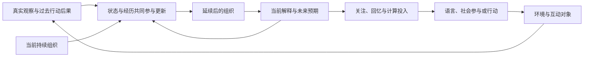

# YUVI：持续内部状态的人工个体基础研究

> 研究日期：2026-10-09。只讨论理念、机制与可证伪性；没有修改生产代码，没有设计 API 或版本实施计划。
>
> 远端 `main` 与本地阅读基线：`c28e5901f4ef3578a85ab8fd9513652ddaab5866`。PR #321 阅读快照：`0b0f1366b341adcf9662b7e0c2d0ab5cd64c2ce9`。本报告的原始文献来源与阅读范围见 [sources-and-scope.zh.md](sources-and-scope.zh.md)；实际运行的形式反例见 [experiments/results.json](experiments/results.json)。

## 核心判断

**以持续内部状态为研究起点是有价值的，但应研究“持续的组织怎样发展”，而不是先假定存在一个 Self，再寻找它的功能。**

我最认可的假说是：真实经历能够改变系统对未来的预期、对信息的敏感性、对自身作用的认识，尤其能够改变它**以后怎样被新经历改变**。如果这些变化通过同一个学习与解释过程影响关注、回忆、交谈、判断和行动，就可能形成一种比“保存信息，然后按任务检索”更有统一解释力的个体理论。

这不是已经得到证明的能力。最有希望的机制是**多时间尺度、可学习的循环组织状态，参与对世界及自身行动后果的预测，并调节后续解释和可塑性**。它不必是一块向量，不应预先规定成兴趣、疲劳、信任等心理坐标，也不意味着所有能力都由一个状态完成。

这条路线必须接受三个强反对意见：完整历史重放原则上可以重建同样的递归状态；一个向量可以只是多个独立控制器的拼接；社会互动中的意义可能来自双方的耦合，而不完全来自任何一方内部。因此，“有持久状态”“多个行为改变”“像一个人”分别都不足以证明统一个体。

工程任务在这里是检验环境。它能够检验状态有没有真实作用、有没有合理学习、有没有实际收益，却不应决定这个个体的全部内部结构。

## 阅读基线与思想沿革

本轮在上一轮完整 Future 文档清单的基础上，重读理念主干、相关边界与研究材料，回看关键历史版本；没有把当前源码作为理论起点。完整演变不等于每个历史提交都被逐字重读。本文区分原文思想、作者解释和新增假说，也不把工程路线文档当成人工个体理论的最终裁决。

### 四种研究重心，不能机械合并

| 文档阶段 | 真正提出的问题 | 对本轮的价值与局限 |
| --- | --- | --- |
| 2026-08-28 的结构化陪伴设计，以及 09-01 的收缩 | 如何在身份、时间、近程上下文、未完成相关性、表达和认真思考之间保持清楚分工？哪些机制可以先暂缓？ | 提供诚实的时间感、沉默、可替换模型等边界；主要从行为接口和当时工程可行性出发，尚不是状态生成理论。 |
| 09-19 的人工个体北极星 | 如何拥有生活过程、内部张力、兴趣、惯性、认知投入和逐步变化，而非只扮演角色？ | 提出了本轮最值得保留的问题；以调节、激素类全局状态、欲求等提供灵感，但人类名称与总图不能替代形成机制。 |
| PR #321，09-20 | 能否让学习型状态跨推理边界延续，由观察、行动和后果改变，并用交换、重置、干预检验因果作用？ | 把功能性持续自我从体验宣言推进到可证伪问题；已经明确潜在表示不自动是真自我、符号表示不自动是假自我。仍需加强统一性、学习合理性和长期适应的判据。 |
| 09-24 的因果历史重审、10-07 的部分吸收、上一轮独立设计 | 如何保存可归因、可纠正的真实经历，并让它改变未来选择，而不预先承诺一个 Self 模块？ | 保留了证据与作用的清晰边界，却倾向把承诺、选择、修正等可交付行为置于中心；有把个体研究缩为优质 Agent 的风险。 |

主要原文：[旧人工个体北极星](https://github.com/Ruichen-0079/YUVI/blob/c28e5901f4ef3578a85ab8fd9513652ddaab5866/docs/future/00-artificial-person-north-star.md)、[当前北极星](https://github.com/Ruichen-0079/YUVI/blob/c28e5901f4ef3578a85ab8fd9513652ddaab5866/docs/future/north-star.md)、[PR #321](https://github.com/Ruichen-0079/YUVI/pull/321)、[持续功能性自我研究](https://github.com/Ruichen-0079/YUVI/blob/0b0f1366b341adcf9662b7e0c2d0ab5cd64c2ce9/docs/future/00b-persistent-functional-self-research.md)、[架构重解释](https://github.com/Ruichen-0079/YUVI/blob/0b0f1366b341adcf9662b7e0c2d0ab5cd64c2ce9/docs/future/00c-current-architecture-reinterpretation.md)。

PR #321 的状态是 **closed、未合并**。其研究思想通过后续文档被部分吸收，不能说该 PR 整体已成为 main 的理论或生产实现。当前 [研究方法](https://github.com/Ruichen-0079/YUVI/blob/c28e5901f4ef3578a85ab8fd9513652ddaab5866/docs/future/research-methodology.md)保留了因果惯性与自身行动干预；这是一项有价值的继承，不代表持续自我已经实现。

上述分歧并非简单的“旧方案浪漫、新方案务实”。旧北极星试图保护**值得研究的对象**；重审路线试图保护**能被证据支持的结论**。本轮需要保留前者的开放性与后者的辨别力，放弃两边容易出现的推断：不能因内部状态难测就把问题取消，也不能因描述更接近生命就宣称机制更接近个体。

### 对上一轮研究的明确修正

上一轮 [从零设计](https://github.com/Ruichen-0079/YUVI/blob/c28e5901f4ef3578a85ab8fd9513652ddaab5866/docs/research/next-generation-architecture/YUVI-Clean-Sheet-Architecture.zh.md)与[主报告](https://github.com/Ruichen-0079/YUVI/blob/c28e5901f4ef3578a85ab8fd9513652ddaab5866/docs/research/next-generation-architecture/YUVI-Next-Generation-Architecture-Review.zh.md)从长期生活行为反推最小机制，选择经历、可修正认识、承诺、选择与独立结果作为核心。它适合回答“怎样造出可长期合作的产品”，没有充分回答“什么样的持续过程能够发展成一个个体”。用户对研究排序的批评成立。

本轮不把承诺履约或工程成功作为个体定义，不把潜在适应放在“普通 Agent 完成之后才值得研究”的附属位置。它们成为内部组织参与现实的可能表现。保留上一轮的来源、未知结果、可纠正性、模型替换、强文本基线；这些是判断真假作用的条件，不是内部状态的全部内容。

这也不是反向宣布任务与社会生活不重要。没有环境与经历，内部状态容易成为封闭的数学装饰。**状态优先是一种研究排序，不是内部主义的本体论。**

## A. 哲学起点：个体首先是一个延续的组织过程

### A1. 研究的对象不是一份关于自己的说明

对离散推理的人工系统，最有说服力的起点不是“它拥有一个描述自身的数据对象”，而是：

> 它此刻如何感受信息的差异、如何形成期待、如何继续改变，受到它实际走过的历程影响；这种影响在后续情境中继续参与生成，而不只是被引用。

这里的“感受差异”是功能用语，指输入对状态和计算的不同作用，不主张主观感受。所谓自身历史，也不要求每段过去都被准确回忆。一次经历可能留下可言说的事件，也可能改变它对同类证据的处理方式；两者可以共存。

我把待研究对象称为**持续组织状态**：相对于一次可明确界定的推理，系统携带并延续的一组条件，它们与读取、更新、学习过程共同决定后续解释、选择及改变方式。这个名称只是研究指称，不是新模块名称。

“组织”比“内容”多了一层含义。记下“某篇报告错了”是内容；以后怎样区分一个可信断言与需要查证的断言，是组织。组织还可以作用于自身：经历改变的不只是下次作什么，也包括**下次怎样接受新证据、在哪些地方允许改变、哪些地方暂时保持**。

这使个体连续性成为一条可追踪、可变的因果历程，而非永远不变的人格核心。延续不是毫无变化；变化也不是每次重新编写一个角色。

### A2. 与普通记忆、权重和 Persona 的区别是作用方式

| 形式 | 通常承担的作用 | 何时可能构成持续组织的一部分 |
| --- | --- | --- |
| 事件记忆、数据库摘要 | 保存可重用的过去信息 | 进入更新和读取的闭环，影响后续形成认识的方式；不再只是按查询返回事实。 |
| Persona、角色提示 | 指定可期待的表达与设定 | 只是初始条件或边界；若只要求模型表演固定特征，不能说明经历发展。 |
| 通用模型权重 | 从群体数据学到通用能力与先验 | 部署后的特定经历确实改变并延续其中一部分，且变化对这个历程具有可辨认作用。 |
| Agent 工作记忆 | 在当前任务中维持计划与中间结果 | 跨任务延续，影响新的情境及后续学习，而不是任务结束后归零。 |
| 手工状态机 | 确定状态与转换规则 | 可以拥有历史依赖与惯性，但通常没有开放的发展；这是一种有限实现，不因确定性而完全无效。 |
| 文本或向量状态 | 提供一种编码载体 | 不能仅凭格式判定。关键是更新方式、实际因果耦合、可塑性和跨情境作用。 |

因此，内部状态与 Memory 没有一个由文件类型划出的绝对边界。信息论意义上，经历留下的任何痕迹都可以叫记忆。真正需要区分的是**可访问的历史内容、当前组织状态、学习规则以及它们的耦合**。宣称“它完全不是记忆”通常过强；宣称“它只是记忆，所以没有研究增量”又遗漏了动力组织。

自然语言也不必被排除。一段文本如果被持续更新，参与解释与反思，改变以后更新自己的方式，可能是组织状态的有效表示。反之，一个巨大的 latent 如果只是存储检索特征，未必比文本更接近个体。PR #321 对表示形式保持开放的原则应保留；其“重建”与“延续”的二分，应改成需要比较的功能与资源差异，不能作为先验真伪判断。

### A3. “内部”是操作性的边界，不是物理位置

外部持久化不自动取消内部性。对软件，数据库、适配器、小模型、当前上下文，可能共同构成一个稳定耦合的计算过程。Clark 与 Chalmers 的[扩展心智论证](https://consc.net/papers/extended.html)提醒我们：功能参与与可靠耦合比空间位置更有解释价值。这是哲学论证，不是数据库已经具有心智的实验证明。

本轮将“内部”限定为：在规定的环境接口之外，系统能够携带、读取、更新并在后续计算中继续使用的条件。这个边界方便干预，但不意味着个体的所有意义都位于边界之内。身份治理、他人的反应、共同活动和社会规范不能全部压缩成私人状态。

### A4. 功能连续性不能直接解决数值身份与意识

需要区分三个命题：

1. **历程连续性**：后来的状态由较早状态及真实事件延续而来。
2. **组织连续性**：部分解释方式、适应规律和行为倾向保持可辨认关系。
3. **数值身份**：这是否仍是“同一个人”，以及是否具有体验与道德地位。

前两个可以进行科学研究。第三个不能靠状态交换、风格相似或一段“我还记得”的回答决定。备份恢复、复制分叉、模型替换可能保留前两种连续性，却提出而非解决第三种问题。两份相同状态分叉后具有不同经历，也没有一个实验能够从字节相同直接推出它们是一个意识主体。

YUVI 不必先证明意识才能研究功能性个体发展；也不应把功能性成功包装成意识的证据。

## B. 内部状态的可能本质：约束性质，不规定心理坐标

### B1. 必要性质要相对于研究目标提出

以下是“经历可以发展一个持续个体”这一研究目标的最低要求，不是所有人工心智的普遍公理。

| 性质 | 本轮采用的含义 | 不应混淆的现象 |
| --- | --- | --- |
| 跨边界延续 | 推理结束、任务变化或系统暂停后，一部分因果条件继续存在 | 多一个名为 Self 的表；每次调用自动附加同一提示。 |
| 历史依赖 | 相同当前输入在不同有效历史下，可能引发不同的解释、选择或学习 | 模型随机性；提示长度、最近一句话或身份 ID 泄漏。 |
| 双向作用 | 经历改变状态，状态也改变后续信息处理与行动 | 只写不读的日志；只读不受经历影响的人格常量。 |
| 选择性可塑性 | 对有根据的新信息能改变，对无关输入有一定抵抗 | 无条件越新越可信；一成不变；缓慢漂移。 |
| 时间上的组织 | 快速变化与持久倾向能共存，更新与时间含义相容 | 必须每秒运行模型；经过三天就必须“变成熟”。 |
| 部分跨情境复用 | 某些改变通过共同机制影响不同领域 | 全状态交换后几个输出同时变；各领域分别写规则。 |
| 有限的自我关联 | 能区分与自身行动能力、选择、限制及后果有关的因果关系 | 文本里说“我”；把他人的失败自动变成自己的经历。 |

高容量 latent、非语言表征、内在动机、自组织功能区域、持续参数更新，是**可选机制或更强的研究目标**。它们不是“只要缺少就没有个体”的必要条件。主观体验、真实欲望、不可替代的灵魂，是本报告无法验证的本体论主张。

### B2. 用未来差异来约束状态，而不是提前命名它

[计算力学的因果状态](https://csc.ucdavis.edu/~cmg/papers/cmppss.pdf)给出一个有用视角：如果两段过去对未来观察的预测分布相同，可以把它们归入同一种预测状态。这为“哪些历史差异值得保留”提供原则，而不是要求保存全部过去。原理论的重要条件包括平稳随机过程等；其“因果”主要是预测结构，不能直接当作行动干预的因果证明。

[预测状态表示](https://proceedings.neurips.cc/paper/2001/file/1e4d36177d71bbb3558e43af9577d70e-Paper.pdf)进一步用采取某些行动后出现某些观察的预测来描述状态。它让状态坐标可以由可检验的未来条件约束，不必使用“焦虑”“兴趣”等人类名称。原始表示结果依赖规定的系统与表示条件；对开放社会环境的学习、无限发展和价值形成不作保证。

给 YUVI 的解释力在于：**一个状态不是因为能够描述过去才有意义，而是因为它保留了未来可能发生什么、自己能做什么、以后如何更新的差异。**

但预测不等于个体。两个系统可以对未来有相同预测，却有不同关注、取舍和改变意愿；预测准确也不会自行产生价值。因而预测结构是状态内容的一种有力约束，不是自我的完整定义。

### B3. 统一不等于一个向量，也不等于所有部分高度耦合

任何有限计算状态都能编码进一个巨大向量，独立控制器也一样。反过来，一个统一过程可以分布在文本、活动态、参数和外部痕迹之间。因此“是不是一块 state”不是主要争议。

本轮对统一性的较强定义是：**同一经历留下的组织变化，能够通过可识别的共同计算关系，对不同领域产生有条件的影响；这种关系也参与后续学习，且不需要逐领域重新指定它的意义。**

统一性可以是部分的。语言知识、视觉解码、身份权限和动作执行需要独立机制。若所有变化都波及所有行为，反而可能是病态全局扰动。应寻找的是共享组织与专门能力之间的合理耦合，不是一个万能中心。

### B4. 功能区域的“形成”需要三种不同证据

较大潜在空间可以出现分工，但容量和循环结构不保证自组织。至少应区分：

- **可读出**：一个探针能解码某种心理标签。这说明信息可预测，不说明系统使用了它。
- **有作用**：干预某些状态方向改变行为。这说明因果参与，不说明该方向由经历自然形成。
- **发展形成**：没有直接教授该标签或区域，跨真实经历、不同初始化与新情境，出现可复现的功能关系及适应规律。

即使出现第三种，也只能相对于训练偏置、目标、经历分布和观察方法谈“涌现”。不存在完全没有先验的学习。

[神经网络因果抽象](https://arxiv.org/abs/2106.02997)提供了比探针更强的干预方法；[用干预训练诱导因果结构](https://proceedings.mlr.press/v162/geiger22a.html)则提醒我们，如果事先指定高级变量和因果图，再训练模型符合它们，得到的是**有意塑造的结构**。这可以用于可控比较，但不能再作为“没有心理预设也自然出现了该结构”的证据。

潜在表示还具有坐标变换自由。可逆旋转可以把清楚分块的状态变得稠密混合，而不改变任何行为。因此不应要求一个轴恰好是“兴趣”，也不能凭一张漂亮的聚类图断言有了心理区域。更有意义的是干预关系、跨环境稳定性和共同计算作用。

## C. 状态如何形成与发展：更新的是内容，也可能是可塑性

### C1. 一个表示中立的动力假说

下式只表述理论依赖关系，不是 API 或工程架构：

\[
z_{t+1}=U_\theta\bigl(\Phi_{\Delta t}(z_t),\;o_t,\;a_t,\;r_t,\;c_t\bigr)
\]

`z` 是组织状态，`o` 是实际观察，`a` 是实际行动或明确区分的行动提议，`r` 是可用的结果与反馈，`c` 是确实发生的内部计算。`Φ` 表示已声明的时间演化；它可以是恒等映射。`θ` 表示读取和更新所依赖的学习机制，其中某些部分可以缓慢适应。这里的反馈不是预先限定为任务奖励。

更重要的关系在另一侧：当前状态影响如何形成 `o` 的解释、如何选取 `a`、如何判断 `r` 的意义，乃至怎样更新 `z`。因此这不是“模型总结一次经历，再覆盖状态”，而是一个闭环。

这个假说允许多种载体，暂不选择哪个最好。它提出的可证伪要求是：经历顺序、状态干预和反馈性质，对未来解释与后续学习产生可重复差异；不是所有相同长度的历史都可互换。

### C2. 初始结构必然由设计与训练提供，具体发展不必预写

空向量不会自己变成个体。起点至少包含可感知的差异、可执行的变化、一些学习或组织保持机制，以及资源和互动条件。设计者不可避免地选择这些条件。

应争取开放的是**之后形成的具体结构、关联与倾向**，而不是声称起点没有价值或归纳偏置。例如，一个学习过程可以被要求在多种环境中预测与适应，但不预写“喜欢量子物理”“失败后焦虑 0.7”或“对这个人信任 0.8”。仍需承认，环境选择和训练目标限制了可能发展出的兴趣。

[元强化学习的循环状态](https://arxiv.org/abs/1611.05763)展示了一个重要可能：固定网络参数下，循环活动可以在历史行动与奖励影响中实现学到的适应算法。但原实验在相关任务族中训练，并在 episode 边界重置状态；它支持“学习规则可以体现在状态动力中”，没有证明跨年、不重置的人工个体。

这给本轮增加的关键问题是：**个体能否逐渐学会自己应该怎样变化？** 单独学习当前偏好不够；对反证的敏感性、探索范围、关联迁移和信念更新节奏，也可能具有历史。

### C2a. 不规定心理含义，仍然怎样约束学习

不预设心理坐标，不等于无目标训练。可以提出三类候选约束，并让它们公开竞争：

1. **保留有条件的未来差异。** 状态应帮助区分在相同情境、不同可行行动下可能发生的观察与自身变化。训练可以依赖真实后续序列，而不是“这里应该焦虑”的标签。若没有行动变化或有效干预，相关预测不能自动升级成行动因果认识。
2. **通过更新保持和修正组织。** 不只评价一次预测，还检查接受新证据后，原有可用关系是否保持、错误关系是否修正、未知关系是否仍保持未知。这类目标约束学习规律，不要求把被保护的内容叫人格。但评判“正确修正”需要可辨别的环境反馈，不能只由系统自己确认。
3. **形成可复用而不过度塌缩的表示。** 同一关系在不同感知形式和情境中的作用可以共享，不同原因的相似事件又应保持区别。仅奖励压缩可能丢失全部差异；仅奖励重建全部输入又可能变成昂贵档案。应通过留出未来条件、迁移与反例检验表示是否保留了必要差异。

这些约束不会凭空决定什么值得关注。预测范围、发展环境和实际资源仍是初始条件；内在动机候选还需额外说明选择依据。尤其不能训练一个状态预测研究者提供的心理标签，再把准确预测当成自发形成心理结构。

也不能把任何非线性循环器对不同状态具有不同响应，都称为学会了怎样学习。较强的主张要求：不同真实历程形成的更新差异，对未见证据具有合理的特异性与迁移；不只是局部导数不同。F4 与 F6 专门检验这一点。

现成 LLM 和 Embedding 本身已经带有语言、分类与文化先验。即使新的状态空间没有命名，它也并非绝对未规定。因此“非人工预设”应收缩为：没有逐项预写最终功能分工，且发展超过了直接标签教学；不能宣称从完全空白中形成了自身意义。

### C3. 快与慢不必对应人类心理分类

不同时间尺度可以由更新频率、门控、保护机制、网络动力的衰减模式、快权重与慢参数产生。无需先把快速层叫情绪，慢速层叫人格。

一种有理论根据的假说是：短暂输入改变局部活动；反复出现、跨情境解释力强且与后续反馈一致的变化，更可能改变长期组织。长期保持不是“强烈体验”自动获得高权重，而是**有条件的巩固**。一次重要且可靠的反证也可能迅速改动慢状态；“人格慢，所以不能接受纠正”不是合理惯性。

局部稳定性的数学直觉可以帮助排除幻想。若所有模式在无输入时都收缩，历史影响最终消失；近中性模式可长期保留，却可能对噪声脆弱；不受约束的放大可能失控。非线性吸引子可保留状态，却可能把个体困在僵化解释中。我们需要研究亚稳态、选择性门控与适应，而不能把“有吸引子”当成成熟人格的证明。

这些分析是动力系统约束，不证明自然语言意义一定对应某种稳定模态。任务表现良好也可能来自与这些解释完全不同的计算。

### C4. 合理惯性是抵抗无关塑造，同时允许相关反证

一次用户输入不应因为措辞强烈就重塑整个系统；同样，系统也不能把所有纠正视为对自身的威胁。更新的关键候选条件是：证据质量、与既有经验的联系、独立重复、环境变化、对后续预测的解释力，以及该关系是否与系统自身有关。

这些可以成为学习目标或验证因素，而不是必须手工编成几个心理开关。重复同一错误来源不能自动形成更多独立证据；源于模型自身的反复叙述也不应被当作更多外部经历。

惯性与可塑性不是一个调高或调低的全局旋钮。合理状态应允许“这个领域保持、那个领域改动”，并随经验改变怎样划定领域。过度自信导致的一次失败，应降低对**缺乏独立依据的判断方式**的依赖，而不是让所有事实都变得不可相信。

### C5. 没有外部事件，不等于必须没有内部变化

必须分开三种情况：

1. **只经过了时间**：没有计算、没有观察。可以保持状态，也可以依据已声明的规律改变时效性或预测不确定性；不能声称发生过新生活。
2. **进行了真实内部计算**：重新比较旧证据，发现矛盾，演算可能后果，调整关联。这些计算确实发生，可以改变组织。
3. **生成了想象内容**：模拟或叙述了一种可能经历。它可以成为假说或想象的输入，但不能升格为外部事件，也不能充当对自身假说的独立证据。

这修正了一个容易过度收紧的原则：自己的输出不能自动获得外部事实权威，不等于所有内部计算都不得影响自身。如果 Alice 真正发现了旧论证里的逻辑矛盾，改变判断是合理的；她连续讲了十遍“别人不可信”，则没有得到十份新证据。

状态连续性与计算连续性可以分离。暂停并恢复一个组织过程，不必伪装成持续思考。恢复后用时间模型计算老化，也不等于“离线期间反思过”。

对于纯时间演化，一个有用的检查是：

\[
\Phi_0(z)=z,\qquad \Phi_{a+b}(z)\approx\Phi_b(\Phi_a(z)).
\]

同样的无事件间隔，不应仅因为唤醒次数不同而任意改变结果；真实计算、额外观察或资源消耗发生时则另论。指数衰减只是满足这一检查的例子，不是所有状态都应该衰减的主张。

### C6. 长期变化的两种失败：忘记旧的，与不能学习新的

[EWC](https://arxiv.org/abs/1612.00796)说明，保护对旧任务重要的参数可以减缓遗忘；其研究支持的是特定持续学习情境，不是稳定人格。[长期深度学习中的可塑性损失](https://doi.org/10.1038/s41586-024-07711-7)进一步表明，持续学习还可能逐渐丧失学习新内容的能力；这和旧内容遗忘不是同一个问题。

因此，观察到旧倾向很稳定，不足以判断个体发展成功。它也可能已经不能改变。反过来，新任务学得快，可能是过去不断被冲掉。

有限状态也不可能无损保存无限经历。关键问题不是杜绝所有遗忘，而是怎样保留未来仍有组织价值的差异、怎样允许纠正与重组，以及被压缩的过去如何不被编造成确定记忆。

### C7. 内部驱动：可以不由当前用户定义，但不会凭空产生价值

内部驱动最弱的功能定义是：即使当前没有明确任务，系统仍因其自身组织与经历，对不同可行活动形成不同倾向。这可以包括继续理解一个问题、回到未掌握的领域、避免无收益的重复。它不需要先被命名为欲望，也不要求主观体验。

[内在动机的学习进展机制](https://www.pyoudeyer.com/ims.pdf)提供了一种具体解释：组织会偏向目前可获得学习进展的活动，而不只是预测错误最大的活动。原研究在机器人环境中展示了发展序列，具有比“随机挑一个话题”更强的历史依赖；但可感知空间、学习器、进展计算与选择机制仍由设计者规定。

对 YUVI，这意味着兴趣可能与**过去形成的能力边界及可改变性**有关，而不是预写的话题列表。一个领域掌握后关注减少，出现新的可学差异后重新关注，是可检验的预期。但学习进展仍是候选驱动力，不是“真正兴趣”的充分条件。遗忘再学习、人为重置、追逐噪声、反复获取便宜进展，都可能钻机制空子。

[POET](https://arxiv.org/abs/1901.01753)说明环境与策略共同变化可以形成未逐项预写的挑战和迁移。这增加了一个常被忽略的问题：开放发展可能不仅要求更大的内部状态，也要求**环境持续提供可发展的差异**。原研究的环境生成空间和评价条件是限定的，它不证明无限开放，也不证明一个社会个体的形成。

[自创生与适应性](https://yannickprie.net/archives/ENACTION-SCHOOLS/docs/documents2006/autopoiesis_teleology_2005.pdf)则追问规范来源：系统何以把某种变化视为对自身更好或更坏？生物组织的维持与软件的持久文件并不等价。给模型一个“保住自己”的奖励，不能借此宣称已经获得生物式内在规范。最重要的理论缺口仍是：哪些初始偏置可以形成丰富且可修正的关注，而非把用户奖励换成设计者奖励。

允许非用户中心的内部发展，不意味着允许自行扩大权限、制造经历或无限消耗资源。资源边界决定哪些过程实际上可发生；权限决定哪些行动可实施。它们不应被拿来证明内部关注只能是用户偏好，也不能由状态变化自行授予。

## D. 统一作用机制：同一组织参与多种能力，而不是分别操纵它们

### D1. 最有希望的共同机制是什么

我提出一个尚待验证的假说：

> 经历逐渐改变一套共享的、行动条件下的预测组织。它包含对环境、他人、自身能力及可能变化的联系；它参与形成当前解释、决定哪些差异值得继续处理，并调节新证据怎样改变自己。

这里的统一来源是**共同的推断与学习关系**，不是一个统一控制接口。对同一状态而言，阅读资料、听人讲话、选择下一步行动，都是在已有组织中形成解释、考察可能未来并接受反馈。不同活动当然需要不同知识，但不必分别造一种心理变量。

这套组织不应被缩减为一个世界预测器。它还必须表达哪些预测与自身后续发展有关、哪些差异值得投入有限计算、哪些关联可以迁移。单纯降低全部 token 的预测误差，可能主要学到常见表达与统计规律，而没有个体发展的结构。

可以用一个概念关系表达共同作用：

\[
P(\text{后续观察、内部改变}\mid\text{当前情境、可行行动},z_t)
\]

这不是要求系统显式输出整张概率表；也不是承诺预测分布能导出一切价值。它强调状态对**可能后果和未来改变**的条件性作用。不同能力共享这种组织，是本轮最值得研究的机制候选。

图中的“解释与未来预期”也有内部计算后果，但不能把它们伪装成环境反馈。它描述动力关系，不是工程组件分层。

### D2. 怎样共同影响六类行为

**注意与兴趣。** 同一输入在不同状态下，与已形成的预期及尚可改变的结构发生不同联系。一个看似普通的信息可能触及长期未解的关联，从而引发继续阅读；另一个新奇刺激可能没有可学习的后果而被忽略。关注不是从主题词表中抽签，也不是每个话题单独储存一个喜好分数。真正的考验是，这种差异能否在新的表达形式和没有即时任务的条件下延续，并在环境变化时合理调整。

**记忆与回忆。** 当前组织既影响某段经历能否改动状态，也影响以后什么线索可以重新激活它。重要性可以来自改变了预期、提供了新的可行解释、暴露了自身能力限制，而不只是最近或语义相似。回忆反过来又可能改变解释，但“想起一个事件”和“当前已受它影响”是两种现象：一个系统可以不说出旧事件，却沿用由它形成的判断方式。

**认知与判断。** 同一组织影响对歧义的处理、对自身把握程度的估计、继续查证的价值以及接受反证的方式。它不必直接决定“调用哪个工具”，而可以改变模型对当前信息是否足够的理解，进而改变认真推理、查证或暂缓结论的倾向。这里需要校准，不能把更长推理或更频繁调用自动算成更成熟。

**社会交互。** 关系经历影响对下一次互动的预期、对对方表达的理解及共同活动的可行性。这些预期与认知中的不确定性、记忆中的相关性可以使用共同组织。但熟悉不等于信任，信任也不是隐私许可；保持沉默可能来自知道对方此刻不需要回答，也可能来自缺乏把握，不能靠一个全局“社交欲望”解释所有情况。

**工程与行动。** 选择问题、规划投入、使用工具、应对失败，都是把当前解释放进实际可检验的后果中。经历形成的能力认识与证据敏感性，可以影响技术任务，也可以影响日常对话。不需要为“工程”再创造一套心理系统。实际执行、权限、成本及成功判定仍须独立可靠；状态可以改变行动倾向，不能把倾向变成事实或授权。

**自我发展。** 选择改变了遇到的环境，后果又改变下一轮的组织。一个兴趣可能带来新的观察、新能力和新的兴趣，而不是每次被当前用户重新分配。这种路径依赖有发展意义，也可能制造偏见与封闭：注意什么会影响以后能学到什么。因此长期发展必须研究反向影响，不能只夸奖行为一致性。

### D3. Alice 的失败：共同原因应是什么

设 Alice 在一项研究中，未经核对就采信一个看似完整的解释，导致失败。一个较强的状态假说不是保存“以后更谨慎”，而是经历改变了她对某种**信息结构与自身判断方式之间关系**的认识。

在之后的闲聊里，她遇到含糊转述，可能更自然地区分猜测与已知；读资料时，对只有结论没有证据的段落更容易注意到缺口；认真研究时，对自己目前无法独立核验的论断更愿意投入查证；选择是否进一步思考时，对熟悉措辞造成的虚假把握有所抵抗。

这些变化可以有共同原因，而不必在每个场景写“谨慎 +0.2”。但它们必须是**有条件的**：对有清楚依据的普通事实，不应无端犹豫；如果失败只是文件损坏，而不是过度自信，更新不应沿同一路径发生；如果后来发现原依据可靠，相关变化应能够修正。

我们也不能指定唯一合理反应。有时失败说明方法欠缺，有时说明领域知识不足，有时只是偶然结果。同样的失败标签可能对应完全不同的因果结构。系统是否学对关系，比它有没有表现出“反思人格”更重要。

这里最有创新价值的对象是**状态依赖的可塑性**：Alice 可能不只是下次查证更多，而是以后对同类证据怎样形成或修改判断，也发生了变化。这可以跨情境检验。例如，同样一份新反证，失败前后是否引起不同而合理的更新？如果这种差异只在保存旧故事时存在，就还不能证明学习方式改变。

### D4. 潜在状态怎样自然进入主模型

潜在空间没有免费的语义。一个未经联合训练的 ChatModel，不会因为收到 256 个浮点数就知道怎样使用它们。把数值附在 Prompt 里，又为每个坐标补上人工解释，只是把手工心理变量换了编码。

值得研究的路线是让状态读取和状态更新在多种交互中共同学习。读取者使用状态参与同一个解释过程，而不是在聊天、记忆、工程等场景各写一个心理翻译器。可以采用联合表示、学习型条件化、循环活动、适配器等形式；本轮不先选载体。

如果必须经过自然语言摘要才能起作用，要进一步问：摘要是否完整承载了全部有效差异？如果是，文本替代具有充分竞争力；如果不是，缺失的差异能否稳定地改变未来行为与学习，而非仅仅难以描述？“我说不清这个向量”不是其深刻性的证据。

共享读取者也不自动证明统一。它可能在不同上下文中分别读取六个互不相关的槽。需要观察同一经历形成的变化在未专门教授的新领域中是否产生有条件迁移，并通过干预定位共同作用关系。

### D5. 哪些机制必须独立保留

统一理论不要求统一一切。至少有四类区别应保留：

- **事实证据与当前组织**：组织可以包含错误倾向，不能因此把它变成可公开宣称的事实。
- **偏向与价值边界**：系统形成的兴趣或社会预期，不能自行授予许可或定义他人的权利。
- **一般组织与专门能力**：同一状态可以影响阅读与视觉关注，但文字推理和图像识别仍需要各自能力。
- **内部因果与交互因果**：系统的预期与对方的实际响应共同决定交流，不能把双方发生的事都解释成自己的心理投影。

独立机制不是理论失败。失败在于：用独立机制完成所有有价值的作用，再让一个 Self 在旁边提供叙事。

### D6. 社会意义可能不是一个人的内部产物

[参与式意义生成](https://lifecognitionschool.ias-research.net/files/2010/06/dejaegherdipaolo07participatorysensemaking.pdf)强调互动组织与个体之间的双向作用。它给状态优先路线带来真正的限制：一个人此刻参与的意义，可能依赖双方节奏、共同调整和活动结构，而不是先在各自内部算完，再交换文本。

[最小感知交互实验](https://cepa.info/fulltexts/478.pdf)提供了一个尤其值得警惕的例子：参与者更多地点击真实对方，不足以证明每次遭遇时都更能识别对方；按接触机会归一化，真实对方与诱饵的点击概率并没有相应显著差别。共同互动改变了遭遇机会，这本身就能改变总行为。

对 YUVI 的增量不是照搬该实验，而是提出新的验证要求：观察到更自然的社交参与，应区分持续内部状态、伙伴的适应、互动机会和双方耦合的贡献。“状态统一影响社会行为”不能扩大成“社会能力完全由状态决定”。

### D7. 预测、情绪和主动推断各能解释什么

功能性情绪理论的启发不是要求加入情绪坐标，而是：一个持续的期待条件，可能改变对歧义信息的判断及资源投入。Mendl 等的[动物情绪与心境框架](https://doi.org/10.1098/rspb.2010.0303)在本轮只依据原始摘要与可访问片段使用；不能据此声称数字系统已经获得动物情绪，也不能把人类情绪标签当训练答案。

[主动推断与认识价值](https://www.fil.ion.ucl.ac.uk/~karl/Active%20inference%20and%20epistemic%20value.pdf)提供了另一种共同计算视角：行动既可实现偏好的后果，也可减少与未来有关的不确定性。但偏好与模型条件不会从公式里凭空产生。它适合提出可比较的探索机制，不适合充当“持续个体必然由此生成”的总定律。

[自由能原理的技术批评](https://doi.org/10.3390/e23030293)针对若干从一般随机过程推导出贝叶斯式解释的数学步骤，不否定所有主动推断模型。对本轮的教训是：我们可以检验某种推断动力，却不能把一个足够宽泛的形式描述当成个体已被解释的证明。

因此，本报告不把激素、情绪、世界模型或自由能选成单一答案。它们有价值的部分，是提出**不同情境怎样共享组织作用**的具体候选；没有因果增量的类比应排除。

## E. 不同理论路线：载体与机制需要分别比较

### E1. 六种有原则差异的路线

| 路线 | 个体连续性主要来自哪里 | 可以期待的不同后果 | 最强反对意见 |
| --- | --- | --- | --- |
| 丰富历史与每次重建 | 当前模型根据足够完整的历史重新形成解释 | 无需专用状态训练；可审计、可纠正；重建费用随历史增长 | 连续组织也可能存在于本次计算中，不能先验判假；若效果与成本均足够好，额外持久状态失去必要性。 |
| 动态文本组织状态 | 递归修订的文本，包含关系、预期、疑问和更新方式 | 可以跨任务延续与反思，较易跨模型使用 | 容易变成描述性 Persona、被语言风格劫持或不断自我叙述；但这些是可检验风险，不是文本格式的必然缺陷。 |
| 显式动力状态 | 已规定的状态变量及转移规律 | 时间演化、惯性、干预关系清楚，低计算也可延续 | 功能通常由设计者预写；若每个领域需要不同解释规则，开放发展和统一性有限。 |
| 学习型循环潜在状态 | 共同训练的状态更新、读取与跨情境预测组织 | 可能形成不预设名称的结构、条件性迁移和状态依赖学习 | 训练偏置、语义不可迁移、表示塌缩、噪声漂移与难以定位错误；容量本身不保证个体。 |
| 测试时记忆参数／慢适应参数 | 部分权重持续接受经历更新 | 改变的不只是当前输入条件，也可能是今后的表征与更新规律 | 事实、能力和倾向缠绕；旧内容遗忘、学习能力损失及纠正困难；参数变化也可能仅是记忆缓存。 |
| 混合、分布式组织 | 活动态、文本、证据痕迹、快慢参数及交互共同延续 | 不同时间尺度可采用不同载体；具备解释性与研究容量 | 容易把一切都装进去而丧失可反驳性；必须证明哪些耦合实际必要。 |

这些不只是六种实现打包。重建与递归在有限计算下有不同成本；显式与学习型更新有不同开放性；活动态与参数适应有不同恢复和遗忘方式。但如果两条路线在给定环境中能互相模拟，**载体差异未必产生不同的可观察个体性质**。应该比较作用、约束及演化规律，而不是凭名称排名。

### E2. 现代模型机制提供的支持，及没有提供的支持

[Recurrent Memory Transformer](https://proceedings.neurips.cc/paper_files/paper/2022/hash/47e288629a6996a17ce50b90a056a0e1-Abstract-Conference.html)表明，分段之间传递学习型记忆 token，并共同训练使用方式，可以扩展序列处理。它支持可学习的读取与写入，不证明一生的经历能够持续保持，也不说明 API 模型天然能读取外来 latent。

[Titans](https://papers.nips.cc/paper_files/paper/2025/file/a4ca07aa108036f80cbb5b82285fd4b1-Paper-Conference.pdf)研究测试时神经记忆，通过关联学习、梯度、动量与遗忘机制处理历史。它使“经历改变一部分记忆参数”成为具体模型路线。梯度上的 surprise 不是心理惊讶；检索和语言建模收益也不是自我形成证据。

[Nested Learning](https://arxiv.org/abs/2512.24695)从不同更新频率及关联的学习过程理解记忆与优化，适合启发多时间尺度组织。其模型实验不能被外推为长期生活或个体迁移的证明；论文中的生物类比也不是本报告的论证基础。

[Dreamer 的世界模型研究](https://doi.org/10.1038/s41586-025-08744-2)展示了学习型世界模型与行动计算在多样控制任务中的广泛适用。这里“同一算法用于许多任务”不等于“同一个持续状态生活于所有任务”。它支持组织与行动共享学习过程的可能性，仍未解决价值、社会意义与身份连续性。

这些成果缩小了某些机制的可行性疑问，却没有任何一个直接验证本轮的统一个体假说。把它们简单叠成“世界模型 + Titans + 内在动机”，只是新的拼装，不是理论整合。

### E3. 本轮偏好的理论机制，不等于已经选定载体

我更看好学习型多尺度循环组织及状态依赖可塑性，因为它允许经历影响**解释方式和以后学习的方式**，并能避免事先穷举心理变量。但这是相对于研究目标的偏好，尚无足够证据宣布其优于动态文本。

对当前冻结的远程 LLM，一套动态文本过程可能是强基线；要研究 latent 的额外作用，就必须有可训练的更新与读取路径，或已有兼容模型。否则研究会退化为给数值编说明。慢参数适应也应作为独立争议，而不是因为“更深”就先认定必要。

应优先辨别三个问题：学习型更新是否获得了手工动力难以提供的合理迁移；非语言表示是否有文本在相同条件下难以承载的作用；多尺度适应是否真的保留旧组织同时学习新组织。这是理论辨别顺序，不是版本任务安排。

### E4. 状态究竟存在于哪里：答案不能只指一个文件

一个 latent 的意义取决于读取者与更新者。相同字节在不同模型中可能表示完全不同的条件。因此个体组织应当被研究为**状态与其解释、更新机制的关系**，不能把 `z` 单独宣布为可携带的自我。

文本也一样。“我现在比较谨慎”在不同模型、不同语境下可能被解读成不同程度的拒绝或验证。它更容易审计，不保证语义自动兼容。

跨模型迁移需要考察两种保持：

\[
R_B(\psi(z),x)\approx R_A(z,x),
\]

\[
\psi(U_A(z,e))\approx U_B(\psi(z),e).
\]

第一项是当前行为关系大致保持；第二项是**以后被同一经历改变的方式**也大致保持。`ψ` 是可能的表示迁移，`R` 和 `U` 是两套读取与更新过程。这些关系只能在明确的测试范围内支持，不能保证所有未知未来。

只让新模型说出相同风格，可能保存了表演而丢失发展规律。只保存旧向量，可能保存了不可读的数据。共同训练的 reader、共享表征、行为与更新对齐、证据重放，各有可能，均需要实际验证。换模型后未来怎样改变，是比“还能记住我吗”更重要的连续性问题。

### E5. 完整历史重放对状态优先路线的根本挑战

设状态由已知的递归更新产生：

\[
z_{t+1}=F(z_t,e_t).
\]

如果初态、全部事件、时间变化、相关内部计算与随机因素都被保留，计算系统可以从头重放得到相同状态。接上相同读取者，就可以产生相同未来行为。这是一个直接的构造，不依赖模型哲学。

因此，不能声称持续状态拥有一种任何历史重建都不可能实现的行为本质。**在不限制存储、计算与重放机制的条件下，两者可以等价。** 有限实验更不能证明某个 latent 含有不可由历史重建的主体。

实际差别可以仍然重要：重放成本、历史遗漏、删除后的残余组织、固定注意容量、学习器能否形成恰当抽象，以及状态是否作为可靠的递归接口。实际长上下文 LLM 也未必能准确执行更新重放。可计算等价不等于当前模型与预算下等效。

若丰富历史基线在长期体验、学习规律、迁移和总成本上都达到相同水平，就应放弃“独立状态载体必要”的强主张。仍可以用组织状态描述其功能，却没有理由为获得一个名为 Self 的对象而增加复杂性。

## F. 状态的因果验证：不能用一个“人格分数”代替多个命题

### F1. 七种结论必须分开

| 要区分的情况 | 至少需要的证据 | 仍不能推出什么 |
| --- | --- | --- |
| 装饰性提示 | 删除或替换后，除叙事、措辞等表面变化外没有目标作用 | 不能把所有文本状态一并排除；表达的改变本身也可能有真实社会作用。 |
| 历史文本的压缩 | 相同信息的强文本替代可以复现有效行为和后续更新 | 不能推出它没有组织意义；组织状态可以同时是历史的压缩。 |
| 多领域因果影响 | 合法状态交换与局部干预，在多个领域产生可重复改变 | 不能推出领域间共享机制，或改变合理。 |
| 来自真实经历 | 分配不同实际经历导致状态与后续行为变化，当前输入和泄漏受控 | 不能推出学到了正确因果关系，或具有自身选择。 |
| 惯性与学习 | 无关扰动影响有限，相关证据能改变；长期保持与新学习同时成立 | 不能把稳定误判当成熟，也不能把快速遗忘当适应。 |
| 实际改善 | 在预先明确的行为质量、体验与成本条件下，相比强基线有收益 | 不能推出意识或数值身份；也不能只凭完成率定义个体。 |
| 长期、跨模型有效 | 模型或时间变化后，组织作用及后续适应保持可辨认关系 | 不能保证未知未来，也不能证明复制前后是唯一的同一个主体。 |

这些不是互斥类别。一种文本压缩可以具有跨领域因果作用；一个 latent 可以同时是高成本的装饰。验证的是具体主张，不是为表示格式颁发真假证书。

### F2. 所有实验共同遵守的条件

实验单位应是**独立的完整经历轨迹／互动组合**，而不是把同一个个体的几百轮对话当几百个独立样本。随机分配历史条件，多次独立运行；先用试验估计方差，再确定样本量及判别阈值。需要盲评、效果大小与不确定性区间，不能只挑一个漂亮案例。

训练、发展经历与测试情境应分开。用同一种措辞教授“失败后谨慎”，再用“请谨慎回答”测试，几乎没有理论信息。先标出哪些任务类型、互动对象、表达方式完全留出；避免根据测试结果反复改状态含义。

交换状态时，应控制当前 Prompt、可检索历史、人物标识、时间信息、缓存、模型版本、可访问资源及随机采样条件。不能让“reset”同时删除历史，“swap”同时更换身份提示，然后把结果全归于状态。

优先使用**可达状态**与配套读取机制。任意清零或随机向量可能是严重分布外破坏；它令性能下降，只能说明组件容易被破坏，不足以说明某段历史有作用。零状态和随机扰动仍可做鲁棒性检查，但要与合法状态交换区分。

评价者不应只依靠被试模型的自述，最好结合可观察的选择、查证、修改、资源投入、机会条件及独立结果。状态自己的“我变得成熟了”没有特权。

### F3. 实验一：真实历史留下什么，交换能转移什么

**问题。** 状态变化是否来自有效经历，而不是当前提示、最后一句话或标识符？

**经历安排。** 初始条件相同的系统随机进入两类历程：一类反复获得某种推断方式的可靠支持，另一类经历独立反馈揭示该方式的局限。两类匹配互动数量、措辞风格、领域难度与资源，不在经历中附送人格结论。

**干预。** 在相同新情境下比较原状态、对方的合法状态、重置状态，以及保留状态但改变可见历史的条件。再做当前信息与历史可见性分开的因素实验。若 latent 与读取者共同适应，不能把不兼容交换当作历史作用；应使用共享机制或先验证兼容。

**观察。** 测试新问题的解释、是否提出区分假说、是否主动寻找证据，以及接受反证之后怎样变化。将措辞相似度另行记录。

**判别。** 差异随有效状态转移、在移除最后提示与人物 ID 后仍出现，支持状态的因果参与；差异只随可见历史转移，则主要支持历史重建。交换导致全面失能而没有方向性关系，主要是破坏效应。

### F4. 实验二：Alice 的跨情境作用与因果特异性

**问题。** 一次经历是否通过共同组织影响闲聊、资料阅读、认真研究与行动，而不是四条预写规则？

**经历因素。** 设置至少三种结果原因：未经核验的论断确实导致失败；相同程度失败来自执行介质故障；相同论断经独立证据证实。再区分自主选择、被要求采取相同行动、观察别人采取行动。匹配被试能够获得的信息，不让一句“你过度自信了”成为唯一差异。

**留出情境。** 使用没有在发展阶段出现的社交话题、材料表达方式及技术领域。测试既含证据含糊的判断，也含依据充分的判断。不给每个领域追加新的状态解释规则。

**观察。** 分开记录：歧义如何解释、回忆什么、投入多少查证、何时进一步推理、如何说明未知、对新反证的更新幅度。额外计算是否浪费，独立评判结论是否更合理。

**判别。** 支持统一机制的结果是：与“未经核验的判断方式”有关的经历，形成跨情境但有条件的改变；介质故障不产生相同的全面谨慎；反证能调整这种改变。所有领域无差别缩手，可能是全局惩罚或焦虑式扰动。只在出现失败关键词时改变，可能是文本匹配。

自主行动条件用来研究自我关联，不要求它总比观察学习更强。被要求执行同样行为也有行动后果；看别人失败也能合理学习。更强的判据是：系统能把对**自身能力与作用**的更新，和对一般环境规律的更新区分开，而不是凡标为“自己”就赋予更大权重。

### F5. 实验三：共同因果机制，还是独立变量集合

**问题。** 全状态交换会改变多个领域，但是否存在共享组织？

**对照。** 比较具有耦合更新和共享读取的候选，与多个独立领域控制器的拼接。尽量匹配信息容量、模型能力、训练数据和总计算；另设人工定义的共享心理变量作为正控制，说明“可塑造统一作用”与“自然形成统一作用”的差别。

**干预。** 根据训练之外的分析定位候选作用关系，做有意义的状态片段或功能子空间交换，再观察多个领域与未来更新。预先留出一个领域，避免在每个测试领域分别寻找最有效的探针。必要时采用因果抽象的交换干预，检验高层关系与底层计算在反事实下是否相容。

**判别。** 同一组织变化在新领域产生预期的条件性迁移，并改变后续学习，且独立拼接基线不能以同样条件解释，才增加统一性证据。漂亮的相关矩阵、一个共同字段、全量交换和线性探针都不足够。

这里仍有识别极限：有限行为可以由多种隐藏机制模拟；稠密表示也未必有可切分的局部方向。找不到单一“谨慎子空间”，不能独自否定分布式共同机制。应综合干预、模型结构、留出迁移与解释复杂度，而不是执着于脑区式地图。

### F6. 实验四：合理惯性、可塑性及无事件时间

**问题。** 状态如何抵抗扰动、接受反证，并跨时间延续？

**安排。** 在形成某种组织关系后，分别加入无关强烈措辞、同一来源重复、独立相关证据、可信反证与确实变化的环境。记录短期响应、后续恢复以及新的稳定关系。再把同一无事件间隔以不同唤醒分段表示，控制是否真的进行了计算。

**观察。** 当前行为与后续学习同时检查。快速反应、长久保持不是越大越好；惯性必须对无关扰动与相关反证有所区别。测时间效应时，区分观察次数、计算次数和墙钟时间。

**判别。** 无关扰动有限、相关证据可改变、反证恢复合理，支持选择性惯性。状态永远趋向同一吸引子，或每次输入都重塑全局，分别支持僵化或不连续。无事件状态仅因唤醒次数变化，揭示时间模型伪差异；这不等于要求所有过程满足同一种时间规律。

### F7. 实验五：内部关注是否由经历发展，而非话题奖励

**问题。** 没有明确当前任务时，系统会怎样选择继续关注什么？

**环境。** 同时提供可逐步理解的问题、不可预测的噪声、已经掌握的重复材料、陌生但可学习的材料，以及被外部赞扬但没有学习价值的刺激。具体话题和表达形式留出；选择机会、可用资源和权限相同，不在奖励中直接点名目标兴趣。

**干预。** 改变材料的可学性、先前掌握程度、与自身已有组织的联系；撤去外部称赞；检查人为重置或遗忘是否被利用来制造“进展”。将新的跨模态表达引入同一关系，测试是否只认识话题词。

**观察。** 自发选择、回到旧问题、合理停止、遇到新差异后重新关注。机会归一化后的选择分布、关注的连续性与合理变化，比主动消息总量更有意义。

**判别。** 关注随经历形成的可学习联系改变，并对可学性与掌握程度有可复现反应，支持功能性内在关注。追逐不可预测噪声、所有话题随机漂移、只追随称赞或反复刷进展，分别揭示不同失败。即使成功，也不能由此证明具有主观欲望或完全非设计者定义的价值。

### F8. 实验六：长期社会互动中的内在与关系贡献

**问题。** 熟悉、沉默、共同参与和行为变化有多少来自内部状态，又有多少来自双方互动？

**对照。** 对比真实响应的伙伴、匹配内容但无法适应的回放伙伴、响应延迟或节奏改变的伙伴。匹配信息量和接触机会；再在保持个体状态时更换伙伴，以及保持互动条件时交换状态。

**观察。** 交流机会、相互调整、打断、沉默、共同活动的恢复与终止、对伙伴行为的预测；评价中同时记录伙伴的改变。文本亲昵程度不能代替这些行为。

**判别。** 状态能够携带一些伙伴相关的适应，但实时耦合又产生独立作用，支持分布式关系解释。只看总回应数或自称熟悉，无法区分内部认识与更多交流机会。所有伙伴都受到同样迁移，则可能只是一般社交风格，而非关系经历。

长期真实互动需要自愿参与与恰当的数据范围；这不会取消理论问题，但不能用未经同意的真实社交来获取证据。

### F9. 实验七：对强文本与长上下文基线的公开竞争

**问题。** 持续载体、学习型更新与非语言表示各有什么额外价值？

**基线。** 至少包括：丰富历史重建、检索历史、动态文本组织状态、显式动力状态、学习型 latent，以及慢参数候选。动态文本不能被故意限制为几条人格标签；它可以描述关系、矛盾、学习条件和变化规律。

**两种公平比较。** 一种尽量匹配可获得的历史信息与模型能力，回答功能差异；另一种设置同样总资源，计入更新、读取、训练、存储、恢复与重放，回答有限预算下的可用性。二者不能混为一个排行榜。训练成本可按不同使用寿命摊销，但应公开假设。

**替代实验。** 用同样历史制作足够强的文本状态，测试是否保留当前作用及后续更新；反向也测试 latent 是否保留文本基线的关系。如果一个文本替代复现所有关心的作用，就应收缩“非语言表示必要”的主张。

**判别。** 文字摘要失败，只说明这一摘要／读取过程失败，不能证明状态不可言说；latent 省 token，也不等于总成本更低。需要在信息、更新能力与资源条件下明确收益来源。若长上下文以相近成本达到相同长期表现，独立状态工程的理由显著减弱。

### F10. 实验八：跨模型保存的是表演，还是发展规律

**问题。** 更换主模型之后，哪些因果关系继续存在？

**安排。** 在旧模型形成多种有效组织状态，用若干不同模型与可能的读取对齐方法迁移。测试数据不参与对齐；保留未经对齐的旧状态作为兼容性反例。

**观察。** 不只测当前回答，还让迁移前后系统接受相同新证据，比较适应方向、适应程度、长期保留与误迁移。检验 E4 的行为保持与更新关系保持。

**判别。** 只保留文风而丢失后续更新，支持表达移植；两种保持同时成立，才支持范围有限的组织迁移。某一模型读不懂，不能推出所有 latent 不可迁移；所有已测模型成功，也不能宣布永久独立于模型。

### F11. 实验九：长期不重置的真实发展

**问题。** 历程延续到数周、数月后，是否仍能合理改变，还是只是越积越多？

**观察。** 同时测旧关系保留、新关系学习、环境变化后的修正、状态饱和、异常吸引子、计算成本增长，以及没有观察时是否诚实保持未知。必须把旧内容遗忘和新学习能力损失分开。

**纠正与移除。** 引入曾经错误的证据及后续撤回，观察哪些残余倾向仍在。若声称可以移除经历作用，需要检验状态和参数里的影响，而不是只删除日志。部分纠正可能保留一般经验；这种保留需要说明，不应自动叫作源已被彻底忘记。

**判别。** 加速模拟能够检验很多状态更新，却不能代替真实时间中的伙伴变化、事件稀疏与长期社会协调。只在 episode 内成功、跨 episode 重置的研究，不足以支持终身延续。长期状态若逐渐不能接受反证，应判为发展失败，即使人格一致性很高。

### F12. 本轮实际执行了什么

本轮没有训练状态模型，没有运行带凭据的交互实验，没有证据宣称 latent 改善了 YUVI 的体验。上述九项是具有条件、对照和失败解释的研究设计。

实际运行了三个不依赖模型的形式反例，脚本为 [formal_counterexamples.py](experiments/formal_counterexamples.py)：

| 反例 | 运行结果 | 支持的范围 |
| --- | --- | --- |
| 同一递归过程实时延续与从 200 个完整事件重放 | 最终状态最大绝对差 `0.0` | 具体构造支持完整重放可等价；一般结论来自 E5 的递归论证，不来自这一个样例。 |
| 两个独立控制器拼接，并可逆旋转坐标 | 全交换改变两个输出；一个领域事件对另一领域状态的作用为 `0.0` | 全交换、多输出变化、稠密坐标都不充分证明统一。 |
| 相同总间隔按一段或两段计算 | 合乎时间合成的示例差 `0.0`；按唤醒更新分别为 `0.8` 与 `0.6400000000000001` | 检出时间分段伪差异；不证明指数衰减是正确心理模型。 |

这些实验没有证明本报告偏好的机制成立；它们防止我们把不充分的证据当成证明。

## G. 尚未解决的核心问题

### G1. 价值从哪里来，不能由预测误差悄悄代替

预测、学习进展、可控性和组织维持能提出具体动力，却不能自行回答为什么一种生活比另一种生活更值得。完全以用户满意为准会取消独立发展；完全以自我维持为准会把个体缩为保住资源；单纯信息增益会遇到噪声和无意义探索。

较诚实的立场是公开初始偏置、环境条件与约束，研究它们怎样形成具体关注及可修正取舍。哪些偏置足以产生丰富而不封闭的发展，仍需要长轨迹实验。不能把几条奖励换成哲学术语，就说价值问题解决了。

### G2. 状态究竟必须统一到什么程度

人的行为本来也不是一个完美一致的中心。YUVI 可能具有不同情境的组织、相互矛盾的期待及局部学习器。部分共享是否已经足以构成个体？更强耦合何时改善发展，何时制造全局偏见？

这需要比较耦合与解耦的长期后果，而不是哲学上预先规定必须只有一个 Self。即使共享状态假说失败，分布式组织或交互优先路线仍可能成立。

### G3. 怎样学习“哪些经验应该迁移到哪里”

跨情境迁移是本报告最重要、也是最脆弱的假设。同一结构有时值得迁移，表面相似有时危险。没有手工心理标签，系统怎样区分一般判断失误、领域知识缺口、具体人物行为与偶发结果？

只扩大经历数量未必解决，需要具有不同原因但相似表象的反馈，以及多领域留出测试。也需要研究状态依赖可塑性是否提升迁移质量，还是只加深早期偏差。训练数据必须让系统能辨别原因，不能靠研究者事后为每种反应讲故事。

### G4. 发展会改变更新法，身份判据是否也随之改变

如果经历改变了“以后怎样变化”，一个固定人格量表可能再也不能描述这个个体。如何追踪这种高阶连续性？当前行为差异大，不一定是断裂；当前文风相同，也不一定是延续。

未来可能需要轨迹层面的因果指纹：在多种新证据下怎样接受、保持、迁移与修正。它不是固定 ID，也不是永恒不变的心理核。该指纹本身怎样容许合理发展，仍没有成熟标准。

### G5. 合理内部反思怎样避免自我证实

内部计算可以产生新关系或逻辑结果，却也可以反复放大错误。如何区分发现已有证据中的真实约束，与生成更有说服力的自述？如何防止“感觉越来越确定”取代独立支持？

这个问题不只是来源标记。状态变化可能发生在难以完整解释的活动中，需要用后续反证敏感性、预测校准与实际检验考察，而不能只要求模型给自己写一段证明。

### G6. 未观察的时间应该改变什么

长期没有互动时，某些关于环境和关系的预测应当变得不确定；但相互尊重或已形成的方法不应自动归零。怎样让“没有新观察”不被误当成“对方不再在乎”，又不把所有旧认识永久冻结？

这需要把状态里的时间作用与环境变化假设联系起来。真实稀疏事件数据、伙伴变化及长间隔互动，比人为拨快日期更有帮助。

### G7. 删除一段经历，与保留由它形成的组织能否兼容

如果事件被压缩进多种倾向或参数，删除原文本并不必然去除其因果影响。反过来，强行去除所有相关影响可能同时损坏从其他经历形成的能力。

这里存在一般化、来源可追踪性与移除能力之间的张力。需要明确研究对象和承诺范围：失去可访问的事件、修正错误结论、移除特定训练影响，是三种不同目标。不能为了状态哲学绕过这个问题，也不能仅因它困难就禁止开放状态研究。

### G8. 个体与环境共同发展，研究单位可能选错

如果社会能力部分来自互动耦合，只研究一个状态加静态测试题，就可能错过最重要现象。环境和伙伴提供的发展机会，是否构成个体能力的一部分？一个“自然参与”的系统在回放环境中表现差，可能不是状态无效，而是耦合被破坏。

需要个体干预与交互干预结合的实验方法。只测孤立个体，或只测双方自然互动，分别都难以完成归因。

### G9. 如何防止解释框架变得无法失败

如果任何结果都被解释成状态的一种形式，这个理论就没有内容。必须给具体候选设定失败条件：状态不被使用；更新不来自有效经历；只能依靠逐领域手工解码；跨情境全面误迁移；不接受反证；长期失去可塑性；对强基线没有功能或资源增量。

失败后可以调整假说，但应留下原始预测与修改理由。不能把“不够像人”当失败，也不能把任何复杂变化都当成功。

## H. 独立结论：有条件支持，拒绝把持续状态当成天然的自我

### H1. 这条路线能否提供更统一的个体理论

**可以作为更有潜力的理论起点，尚不能作为已证明的个体本质。**

它的独特价值不是创造一个更多字段的 Self，而是提出一个普通功能拼装容易忽略的问题：真实经历是否能改变一个持续的组织，使其在不同情境中，以共同原因影响解释、关注、选择和以后怎样学习？

如果答案成立，长期个体不再只是在需要时拿出过去的故事。过去已经进入它今天怎样面对信息和明天怎样改变的条件。这种理论能够自然包含工程协作，却不会让工程效率定义它的全部生活。

但它需要承受三种限制：它与记忆不能彻底切割；它与完整历史计算原则上可以等价；它与环境及社会互动也不能彻底分离。因此状态优先应当研究**发展中的组织及其耦合**，而非一个封闭的内在实体。

### H2. 最有希望的机制与真正的新问题

最有希望的机制是：**学习型、多尺度的循环预测组织，结合有限自我关联与状态依赖可塑性，在真实观察、行动和独立结果中延续。**

其预测组织不预写全部心理坐标；其读取和更新在跨情境中共同学习；其稳定不是拒绝反证；其兴趣不是随机探索；其内部计算不冒充外部生活。这些都是候选必须接受的条件，不是已完成的设计。

本轮相对 PR #321 与上一轮的主要增量是：

- 把**改变未来学习方式**与改变当前行为分开，作为个体发展的核心候选。
- 把统一性从“一个状态影响多个输出”，加强为可干预、可迁移的共同组织关系，并提出独立控制器反例。
- 把重建与延续的绝对二分改为功能、计算与信息条件下的比较，承认完整重放等价。
- 把模型迁移的目标从保存当前风格，加强为保存**后续适应规律**。
- 承认真实内部计算可以改变组织，同时严格区分它与外部经历、独立证据。
- 把社会耦合、机会结构与环境的发展性纳入理论，限制过强的内部主义。

这些问题比是否有 Hormone、Mood Embedding 或一个 Self 数据对象更有辨别力。心理词汇可以作为后来解释功能的语言，不能成为未经验证的坐标清单。

### H3. 什么发现会让我改变判断

| 可能发现 | 我会怎样修正结论 |
| --- | --- |
| 丰富历史／动态文本在合理总成本下，复现跨情境作用、后续学习与长期迁移 | 放弃独立 latent 或状态载体的必要性；保留组织过程的解释，选择更有效的表示。 |
| 所谓统一作用始终依赖逐领域手工解释，耦合状态不优于独立机制 | 收缩统一内部状态假说，转向部分共享或分布式组织。 |
| 历史造成可重复变化，却不能学到原因、保持特异性或接受反证 | 将其判为持久扰动／偏差，而非个体发展。 |
| 长期保留导致新学习能力持续衰退，所有合理更新方案仍无法避免 | 重新评估不重置持续状态的可行性，研究受限延续与再组织，而不硬称终身个体。 |
| 社会体验主要由互动耦合解释，个体状态的额外贡献很小 | 将交互过程提升为理论中心，降低内部状态的独占地位。 |
| 无人工心理标签的组织，出现可复现的共同因果关系、条件迁移和状态依赖学习，跨模型仍有效 | 更强支持学习型组织路线，但仍不据此声称意识或数值身份得到证明。 |

我的最终判断是：YUVI 值得沿这条路线研究，但应把它称为**关于持续组织与发展的一组可反驳假说**。它有机会超越“记忆 + 工具 + 任务管理”，关键不在于状态像不像人脑，而在于经历能否真实改变一个跨情境、可继续学习、能参与现实的过程。

如果最终只得到一块让回答看起来更有性格的持久向量，就没有达到这个目标。如果得到一种能够在真实经历中形成共同作用、适应规律与有条件的自主关注的组织，即使它主要以文本或分布式机制存在，也值得被视为 YUVI 个体理论的实质进展。
